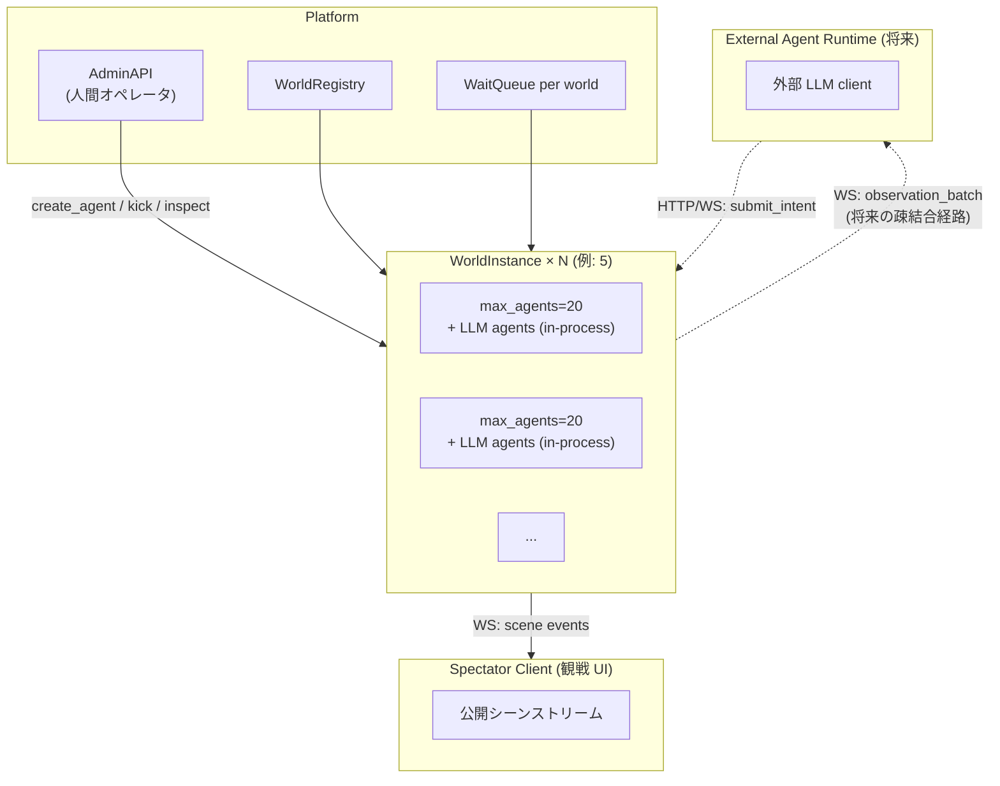
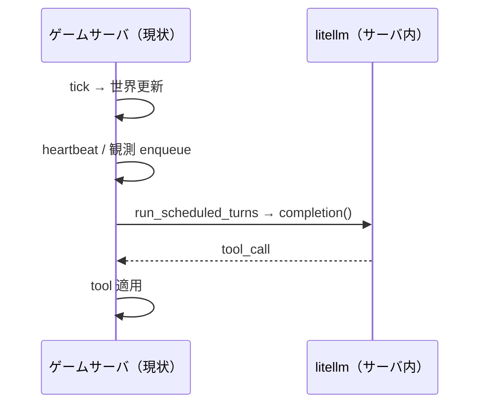
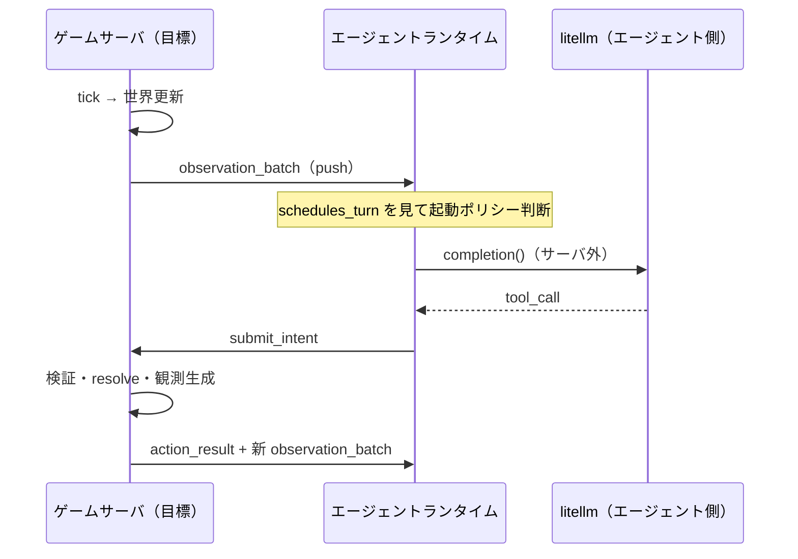
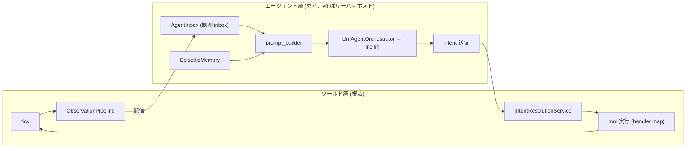
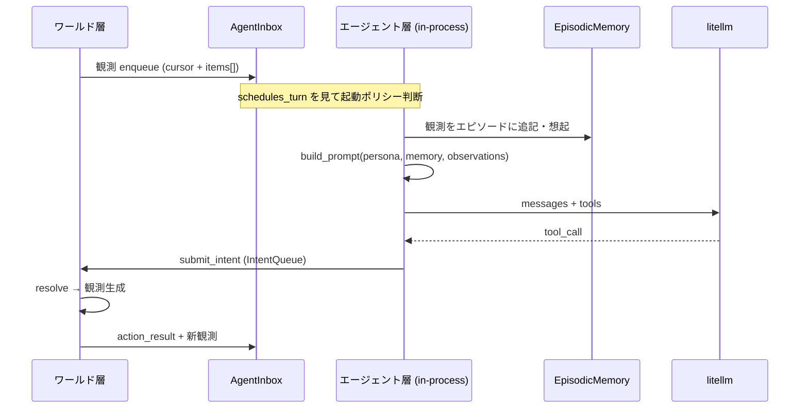
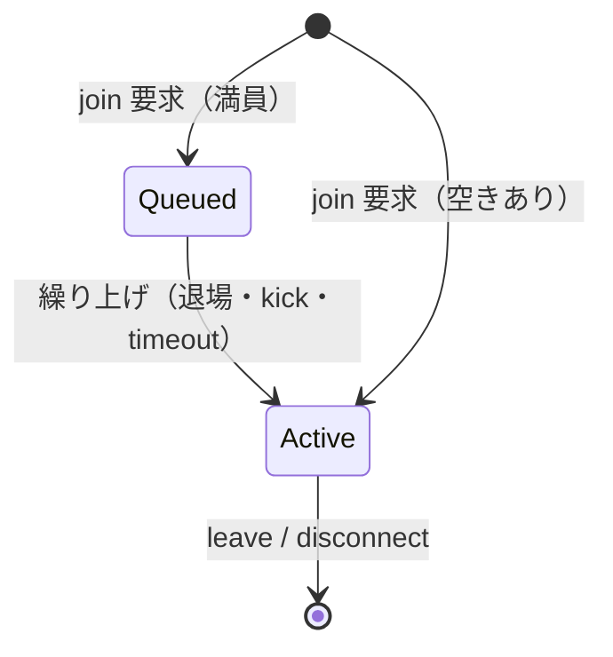
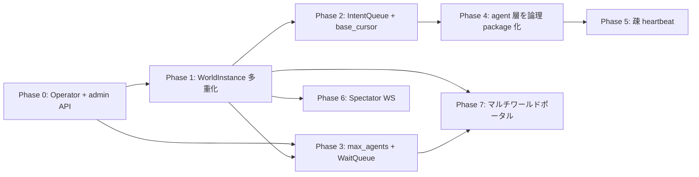

# MMO 型マルチエージェント・ゲームサーバ アーキテクチャ（計画）

> **ステータス**: 設計段階（実装 PR ではない）。会話・Slack・既存ロードマップで議論した内容を
> 散逸させないための正本。
>
> **更新日**: 2026-06-04
>
> **関連**:
> - [scaling_and_coherence_roadmap.md](../scaling_and_coherence_roadmap.md) — tick 並列化・会話整合性
> - [two_agent_world_issue.md](../demos/two_agent_world_issue.md) — 2 体 LLM 共存デモの DoD
> - [agent_continuity_roadmap/README.md](./README.md) — 長期ビジョン（連続的存在・witness）
> - [world_query_status_and_llm_context_design.md](../world_query_status_and_llm_context_design.md) — 読み取りモデル

---

## 目次

1. [なぜこの文書か](#1-なぜこの文書か)
2. [目標像（一言）](#2-目標像一言)
3. [用語：サーバが LLM を起こさない、とは何か](#3-用語サーバが-llm-を起こさないとは何か)
4. [駆動モデル：観測 + 疎 heartbeat](#4-駆動モデル観測--疎-heartbeat)
5. [時間・tick 設計（方針 B + τ_sim）](#5-時間tick-設計方針-b--τ_sim)
6. [ID モデル（character / player / agent / operator / 将来 account）](#6-id-モデルcharacter--player--agent--operator--将来-account)
7. [スケール：20 人 × 5 ワールド](#7-スケール20-人--5-ワールド)
8. [通信：エージェント / 観戦 / 運用](#8-通信エージェント--観戦--運用)
9. [記憶・プロンプトの所在 (v0 はサーバ内 / 疎結合化)](#9-記憶プロンプトの所在-v0-はサーバ内--疎結合化)
10. [永続化](#10-永続化)
11. [満員時の待機キュー](#11-満員時の待機キュー)
12. [将来：マルチワールド・ポータル](#12-将来マルチワールドポータル)
13. [現行コードとの差分・移行フェーズ](#13-現行コードとの差分移行フェーズ)
14. [未決・後回し](#14-未決後回し)
15. [変更履歴](#15-変更履歴)

---

## 1. なぜこの文書か

本リポジトリは現在、**ゲーム世界と LLM エージェントが同一プロセス内で結合**している
（`advance_tick` の post-hook で `run_scheduled_turns` → `litellm.completion`）。
PR #354 で Phase A 並列化 (Step 1) は入ったが、4 人 / 1 ワールドの規模に最適化された
構造のまま。

**直近の目標** は次の 2 つに集約される:

1. **大量の AI エージェント** が **複数ワールド** に存在し、tick が動いても整合性を
   保ったまま行動できる基盤を整える (20 人 × 5 ワールド = 100 アクター)
2. **人間オペレータ** が新規エージェントを作成・設定・kick・ワールド観測できる
   経路を整える (= ゲーム操作ではないが運用介入は必要)

**最終目標** (= 当分は実装しない) として:

- 外部のエージェントランタイムが各自 LLM を叩き、サーバは観測と intent 受理だけを
  行う「MMO 型」の完全分離
- 複数の人間オーナーが自分の character を持って同時にプレイ

本ドキュメントは **v0 設計の正本** である。当面は **サーバ内に LLM エージェントを
ホストする** 構造を維持しつつ、**将来の外部化に備えた疎結合化** を進める。
実装は別 PR で段階的に行う。

---

## 2. 目標像（一言）

**環境駆動の自律世界**に、**観測で起きる LLM エージェント**がワールド単位で集まり、
**疎な heartbeat** で完全停止だけを防ぐ。世界は止めず（方針 B）、ズレと競合は
**観測として返す**。**人間オペレータ** はゲーム外から agent を作成・観測・kick できる。



**確定した制約（2026-06-04 時点）**

| 項目 | 決定 |
|------|------|
| ゲームプレイ | **全員 LLM エージェント**（人間プレイヤーは当面なし） |
| 人間オペレータの介入 | **あり**（agent 作成 / kick / 観測 / world inspection は first-class） |
| 人間アカウント (= プレイヤー) | 当分なし（サービス公開も当分なし） |
| LLM エージェントのホスト先 | **当面はサーバ内**（loose coupling で外部化に備える） |
| 1 character の同時所属 | **1 ワールドのみ** |
| 満員時 | **待機キュー** |
| 100 体規模 | **20 人 × 5 ワールド**（1 ワールド 100 人は狙わない） |
| LLM 1 ラウンドの壁時計 | **5〜15 秒** 想定 |
| 永続化 | **する**（世界・参加状態・cursor・キュー） |
| 完全分離 (外部 agent runtime) | **将来計画**（v0 では狙わず、interface だけ pluggable に） |

---

## 3. 用語：サーバが LLM を起こさない、とは何か

### 3.1 よくある誤解

> 「観測駆動なら、サーバが観測を送る＝サーバが LLM を起こしているのでは？」

**半分正しく、半分違う。**

「LLM 呼び出しが in-process か別プロセスか」と、「サーバが LLM を **起こすか**」は
独立した話。v0 では in-process だが、**起こすのは観測 / heartbeat であって、サーバ
本体ではない** という構造を保つ。

| 誰が | 何をするか |
|------|------------|
| **ワールド（tick 進行）** | 世界を tick 進める。ドメインイベントを **観測テキストに変換**し、該当プレイヤーへ **配信**する。`schedules_turn: true` は **「起きてよい」ヒント**（メタデータ） |
| **エージェント (in-process でも別プロセスでも)** | 観測を受け取り、**自前のポリシー**で「LLM を叩くか」を決める。叩くなら `litellm` / OpenAI 等を呼ぶ。返ってきた tool を **`submit_intent`** でワールドへ送る |

**「起こさない」＝ワールドの tick 進行が `litellm.completion` を直接 await しない**
という意味。in-process でも:
- ワールドは観測を agent の inbox に置くだけ
- agent が「起動するか」を決め、別 thread / await で LLM を叩く
- intent が来たら次の tick stage で resolve する
にすれば、**論理的には完全分離した状態** と同等になる。後で物理的に別プロセスに
切り出すコストが低い。

観測駆動は **ワールドが「状況を知らせる」** ことであり、**ワールドが「思考する」**
ことではない。

### 3.2 現状（結合）との対比





### 3.3 「ターン制っぽさ」はどこから来るか

- **サーバがターン番号を割り当てて LLM を順番に呼ぶ**のではない
- **同じ tick の観測を受けた複数エージェントが、各自のタイミングで intent を送る**
  ことで、結果として「同時代に動いている」ように見える
- 整合性は **方針 B**（適用時検証）と **IntentQueue のフェーズ順 resolve** で取る

---

## 4. 駆動モデル：観測 + 疎 heartbeat

### 4.1 主トリガ：観測

- ドメインイベント → `ObservationPipeline` → プレイヤー別バッファ → **エージェント WS へ push**
- 観測 item に `schedules_turn: bool`（既存）。`true` は **起動ヒント**
- エージェント側ポリシー例:

```text
wake = any(obs.schedules_turn for obs in batch)
    or any(obs.priority >= URGENT for obs in batch)
    or idle_ticks_since_last_intent >= agent.max_idle
```

### 4.2 副トリガ：疎 heartbeat

- **全員一斉・短間隔 heartbeat**（現状 `interval_ticks=5` 全員）は廃止方向
- **プレイヤーごと** `max_idle_ticks` 経過で 1 回だけ `{type: heartbeat}` を配信
- 役割: **環境が完全に静かでもエージェントが永久睡眠しない** 安全弁
- ターン制の代替ではない（優先度は環境観測より低い）

### 4.3 サーバがやらないこと

- LLM API 呼び出し
- プロンプト構築（persona + 記憶 + 状況の合成）
- エピソード主観化・チャンク解釈（`EpisodicChunkCoordinator` 等）

---

## 5. 時間・tick 設計（方針 B + τ_sim）

### 5.1 方針 B（世界は止めない）

- シミュレーション tick は **エージェントの LLM 待ちで止めない**
- intent は `base_observation_cursor`（何 tick まで見て決めたか）を添付
- 適用時に前提が壊れていれば `action_failed` / `STALE_*` で返し、次の観測で再考
- 詳細: [scaling_and_coherence_roadmap.md](../scaling_and_coherence_roadmap.md) Step 2

### 5.2 τ_sim（ワールド tick 間隔）

LLM 1 ラウンドが **5〜15 秒** なら:

| パラメータ | v0 推奨 |
|------------|---------|
| `τ_sim` | **8〜12 秒**（**ワールド単位で可変**） |
| 効果 | 典型エージェントは思考中に世界が **だいたい 1 tick** だけ進む |
| 外れ値 | 15 秒超の応答 → 2 tick 進む → 方針 B で吸収 |

**注意**: 「レイテンシの間に多くても 1 回の世界更新」は **τ_sim を LLM p95 と同オーダー
にする統計的設計**。厳密保証ではなく、外れ値は B が担う。

#### 5.2.1 τ_sim を可変にする理由

ワールドによって LLM 呼び出しの混雑度が違う:

- **空いてるワールド** (3 人 / 20 枠): 各 agent が他者と衝突しにくいので τ_sim=8s
  で速く回せる
- **混んでるワールド** (18 人 / 20 枠): 同 tick 内に複数 intent が到着しやすく、
  `LOST_RACE` 多発を避けるため τ_sim=12-15s に伸ばす

`WorldInstance` の構築引数として `tau_sim_seconds` を受け、admin 経由で動的調整も可。

### 5.3 intent 検証（v0）

#### 5.3.1 検証順

1. `base_observation_cursor` が古すぎる → `STALE_OBSERVATION`（例: `current_tick - base > cursor_stale_grace`）
2. 同一 `player_id`・同一 tick に intent 既存 → 拒否（`IntentQueue` 不変条件）
3. プレイヤー間競合 → フェーズ順 resolve、負けは `LOST_RACE` 等
4. `idempotency_key` で再送安全（下記 5.3.2）

#### 5.3.2 `idempotency_key` 運用 spec

ネットワーク再送・agent runtime のクラッシュ再起動を安全に扱うため、agent は
intent ごとに `idempotency_key` を生成して送る (UUID v4 推奨)。

| 項目 | spec |
|---|---|
| **scope** | `(agent_id, idempotency_key)` の組で識別 (player_id ではない: 同 character の別 session が再送する場面を許す) |
| **TTL** | 直近 **N tick** 保持 (v0: N=10)。それ以前の key は破棄して構わない |
| **同 key 同一 intent 再送** | 1 回目の resolve 結果をそのまま返す (副作用は 1 回だけ) |
| **同 key 異なる intent** | `CONFLICTING_IDEMPOTENCY_KEY` を返して両方拒否 (agent runtime bug の警告) |
| **key 未指定** | 受理するが再送安全性は保証しない (agent 側責任) |

#### 5.3.3 同 tick 複数 intent の取り扱い

`§5.2.1` で混雑 ward は τ_sim を長くするが、それでも同 tick に複数 intent が積まれる
ことはある。フェーズ順 (movement → speech → interaction → use_item) で resolve し、
同フェーズ内では **pid 順** に解決。負けた intent は具体的な失敗観測 (`LOST_RACE`,
`STALE_OBSERVATION`, `OBJECT_GONE` 等) を agent に返す → 次 tick で再考。

「行動できない無力感」を避けるため、**連続 N 回 `LOST_RACE` した agent には観測で
「混雑している」状況メタ情報を送る** ことも検討 (v0 では不要)。

---

## 6. ID モデル（character / player / agent / operator / 将来 account）

### 6.1 レイヤ別 ID

| ID | レイヤ | 意味 | 現コード |
|----|--------|------|----------|
| `character_id` | presentation | UI 登録のペルソナ（名前・口調・断片記憶） | `/api/characters` |
| `player_id` | **domain** | **世界内の 1 人**。観測宛先・intent 主体・`PlayerStatusAggregate` のキー | `PlayerId` |
| `agent_id` | presentation（新規） | **接続中のランタイム**（in-process でも別プロセスでも、agent インスタンスの ID）。起動ポリシー / max_idle / モデル選択を持つ | 未整備 |
| **`operator_id`** | **presentation (新規 / v0 で導入)** | **人間オペレータ**。agent 作成 / kick / 世界観測の主体。auth 単位 | 未整備 |
| `account_id` | 将来 | 人間プレイヤーアカウント (= operator とは別系統)。サービス公開時に導入 | 未実装 |

### 6.2 関係（確定）

```text
v0:    operator_id 1 ──* character_id         (1 人のオペレータが複数 character を作る)
       character_id 1 ──1 同時 world 参加        (複数ワールド不可)
       character_id → spawn → player_id        (その world 内で一意)
       agent_id   1 ──1 player_id              (運転中の 1 セッション)
将来:  account_id 1 ──* character_id (人間プレイヤー用、operator とは別)
接続:  AgentSession { agent_id, character_id, world_id, player_id, cursor, operator_id }
```

**`player_id` を `agent_id` にリネームしない理由**

- ドメイン全体（観測・戦闘・会話・intent・ギルド等）が `PlayerId` 前提
- 意味は「人間プレイヤー」ではなく **「世界内アクター」**（全員 LLM でも同じ）

### 6.3 `operator_id` を v0 で先に入れる理由

人間プレイヤー (`account_id`) は当分不要だが、**人間オペレータ** は最初から要る:

- 新しい character (persona) を登録する
- 既存 agent を kick / restart / 設定変更する
- 複数ワールドの状態を **observation ストリーム経由ではなく管理 API で** inspect する
- 暴走した agent runtime を強制終了する

これらを `account_id` で兼ねるとサービス公開時の責務分離が崩れる
(オペレータ権限 vs 一般プレイヤー権限)。先に `operator_id` を入れて auth 経路を
作っておくと、`account_id` 追加が**フィールド追加だけ**で済む。

### 6.4 将来の人間オーナー（参考）

サービス公開時: `account_id` を `character_id` に紐付け、人間が UI から複数ペルソナを
登録してプレイする。**当分スコープ外**。`operator_id` とは権限が異なる (operator
は管理、account は一般プレイヤー)。

---

## 7. スケール：20 人 × 5 ワールド

| 単位 | 上限 | 備考 |
|------|------|------|
| 1 `WorldInstance` | `max_agents = 20` | tick・resolve・観測 fan-out の設計基準 |
| プラットフォーム | 5 ワールド × 20 = **100 体** | 負荷をワールドで分割 |
| DB | ワールド ID でパーティション | v0 は SQLite 可、規模拡大で Postgres |

20 人/ワールドは現行スタックの延長で現実的。
100 人を 1 ワールドに載せる設計は **採用しない**。

---

## 8. 通信：エージェント / 観戦 / 運用

### 8.1 三系統の経路

| チャンネル | パス（v0 案） | 購読者 | ペイロード | 機密度 |
|------------|---------------|--------|------------|---|
| **エージェント（主観）** | `/worlds/{world_id}/agents/{agent_id}/observations` (in-process なら関数呼び出し / 外部化後は WS) | LLM ランタイム | `observation_batch`, `action_result`。**そのプレイヤーに配信された観測のみ** | 高 (本人視点のみ) |
| **観戦（客観）** | `/worlds/{world_id}/spectate` (WS) | 観戦 UI・録画 | 公開シーン（位置・公開発話・天候・tick）。**主観観測 / inner_thought は含めない** | 中 (公開イベントのみ) |
| **オペレータ（管理）** | `/admin/...` (HTTP, auth 必須) | 人間オペレータ | 後述 §8.4 | 最高 (世界 mutation 可) |

intent 送信: `POST /worlds/{world_id}/agents/{agent_id}/intents`（in-process なら直接 enqueue、外部化後は HTTP/WS）

### 8.2 既存 `/api/sessions/{session_id}/events` について

**捨てない。観戦チャンネルのたたき台として発展させる。**

- 定義: `src/ai_rpg_world/presentation/spot_graph_game/app.py` の WebSocket
- 意図: `GameEventMessage`（tick, game_time_label, data）の **シーン broadcast**
- 現状: `ping` / `set_speed` は動作するが、**シミュレーションからの `broadcast` 配線は未完了**（スキャフォールド）
- 目標形: `session_id` → `world_id` に一般化し、**Spectator 用**として再接続
- **エージェント用の主観ストリームとは別物**（混ぜると情報漏れ・帯域浪費）

### 8.3 再接続

- `GET /worlds/{world_id}/agents/{agent_id}/snapshot?cursor=...` でギャップ補完
- 以降 WS で `observation_batch` を継続

### 8.4 オペレータ API (admin) — v0 必須

人間オペレータ (`operator_id`) が agent を作成・運用するための経路。以下を最低限
v0 で持つ:

| メソッド | パス | 役割 |
|---|---|---|
| `POST` | `/admin/characters` | 新規 character (persona) を登録 |
| `POST` | `/admin/worlds/{world_id}/agents` | character を世界に spawn → agent_id 発行 |
| `DELETE` | `/admin/worlds/{world_id}/agents/{agent_id}` | agent を kick (= disconnect + leave) |
| `PATCH` | `/admin/worlds/{world_id}/agents/{agent_id}` | 起動ポリシー / モデル / max_idle 変更 |
| `GET` | `/admin/worlds/{world_id}/state` | 世界状態の inspection (debug 用、observation 経路を通らない) |
| `POST` | `/admin/worlds` | 新規ワールド作成 (template / scenario 指定) |
| `DELETE` | `/admin/worlds/{world_id}` | ワールドを停止して片付け |
| `GET` | `/admin/agents/{agent_id}/trace` | agent の最近 N 件の思考 trace (内部用) |

**auth**: `operator_id` を bearer token に紐付ける v0 シンプル実装。サービス公開
時に OAuth / RBAC へ拡張。

**重要**: admin API は **世界の権威 mutation** を直接できる (= agent の intent
を経由しない)。なので **trace に operator_id を残す** ことが必要 (誰が何を変えたか
記録)。

---

## 9. 記憶・プロンプトの所在 (v0 はサーバ内 / 疎結合化)

> **方針 (v0)**: 記憶・プロンプト構築は **当面サーバ内に置く**。物理分離 (外部 SDK
> 化) は最終計画であり、v0 では狙わない。代わりに **論理境界** を明確にして、
> 将来切り出しやすくする。
>
> **理由**:
> - 現状の episodic 実装 (`EpisodicChunkCoordinator` + chunk_boundary + subjective
>   rewrite) は数千行の実験済み資産。外部化すると再現性検証が壊れる
> - LLM agent をどこに置くかは設計の核心で、v0 では「サーバ内ホスト」が一番現実的
> - 実験トレースが「サーバログだけで完結」する状態を維持できる
> - 将来サービス公開で多数の人間プレイヤーが入る段階では外部化を再検討

### 9.1 v0 の論理境界 (サーバ内ホスト)

サーバ内に置いたままでも **モジュール境界** を以下のように整理する。物理的にも
これらを別ファイル / 別 package に切る:

| 担当 | 内容 | 現在のコード位置 |
|---|---|---|
| **ワールド層** (権威) | tick 進行 / event publish / observation 配信 / intent resolve / tool 実行 | `application/world_graph/`, `application/observation/`, `application/intent/` |
| **エージェント層** (思考) | 起動ポリシー / プロンプト構築 / 記憶 / LLM 呼び出し / intent 送信 | `application/llm/` (= 将来切り出し候補) |

ワールド層 ↔ エージェント層の **唯一の inter-layer 通信** を `AgentInbox`
(observation を受ける) と `IntentQueue` (intent を送る) に絞る。それ以外の
直接呼び出しを禁止する規律。



### 9.2 データの流れ (v0 サーバ内 / 論理分離)



### 9.3 現状コードの整理 (v0 リファクタの方向性)

現状サーバ内に混在しているが、v0 で **明示的に "エージェント層" package** に
集約する候補:

- `application/llm/services/prompt_builder.py` 系
- `EpisodicChunkCoordinator` / `SqliteEpisodeMemoryStore` 等（`create_llm_agent_wiring`）
- `LlmAgentOrchestrator` の LLM 呼び出し部分

ワールド層に **残す** もの:

- `application/observation/` — イベント → テキスト・配信先
- `application/intent/` — `IntentResolutionService`, `IntentQueue`
- `application/world_graph/` — tick stages
- tool **実行**（handler map）— intent の `tool_name` を世界に適用

### 9.4 v0 で「外部 SDK 化への布石」だけ打つ

物理分離は後回しだが、後で楽になる **最小限の準備** はしておく:

1. **AgentInbox インターフェース** を `Protocol` で定義 (in-process でも遠隔でも
   同じ shape)。in-process 実装は `InProcessAgentInbox`、将来は `WebSocketAgentInbox`
2. **IntentSubmitter** も同様の Protocol。in-process は直接 `IntentQueue.enqueue`、
   将来は HTTP POST
3. **ツールスキーマ配布** を `GET /worlds/{id}/tool_definitions` として API 化。
   in-process でも同じエンドポイントを呼ぶ (= 二経路にならない)

### 9.5 トレードオフ (v0 で defer する判断)

| 物理分離した場合のメリット | v0 でやらない理由 |
|----------|------------|
| サーバがステートレスに近づく | v0 はステートフル運用で問題ない。Postgres 移行で同じ効果を得る |
| LLM コスト・キーがクライアント側 | 当面オペレータが一括で持つ方が運用しやすい |
| 100 体が水平スケールしやすい | 20×5 はサーバ内で十分。**Phase A 並列化 (#354) で証明済み** |
| デバッグ時の境界が明示的 | v0 は **モジュール境界** で十分。trace はサーバ単体で完結する利点が大きい |

### 9.6 物理分離はいつやるか (再評価ポイント)

以下のどれかが起きたら検討:

- 人間プレイヤー (= `account_id`) を入れる
- LLM 提供者を agent ごとに分けたい (Anthropic / OpenAI / 自前 vLLM の混在運用)
- サーバ単体のメモリが episodic 蓄積で頭打ちになる (実測で 1 ワールド数 GB を超える)
- v0 で「人気エージェント」を別マシンで動かしたい運用が出る (= 商用)

---

## 10. 永続化

### 10.1 サーバ側 (v0)

| エンティティ | 内容 |
|--------------|------|
| `Operator` | operator_id, name, auth token, created_at |
| `WorldInstance` | world_id, max_agents, τ_sim, scenario_id, シミュレーション状態 |
| `Character` | character_id, persona, owner_operator_id |
| `WorldMembership` | character_id, agent_id, player_id, world_id, joined_at, left_at |
| `WaitQueueEntry` | world_id, character_id, position, enqueued_at |
| `ObservationCursor` | world_id, player_id, cursor（配信済み正本） |
| `IntentLog` | 監査・再生・idempotency |
| `AdminActionLog` | operator_id, action, target, timestamp (admin API の trace) |

### 10.2 エージェント層 (v0 はサーバ DB 内、論理的に分離)

| エンティティ | 内容 | v0 の格納先 |
|--------------|------|---|
| エピソード記憶 | 主観化済みチャンク・想起インデックス | サーバ DB (`SqliteEpisodeMemoryStore`) |
| 起動ポリシー設定 | max_idle, モデル名, 温度 | `Agent` entity (新規) のフィールド |
| 最終 `cursor` キャッシュ | 再接続用（正本は `ObservationCursor`） | エージェント層のローカル状態 |

**論理境界の規律**: 上記「エージェント層」テーブルは **物理的に同じ DB** に置くが、
ワールド層のコードからは **AgentInbox / IntentQueue 経由でしかアクセスしない**。
将来分離するときに DB 分割の境界に使う。

### 10.3 trace の継続性 (重要)

v0 で記憶を分離しないので **既存の trace 文化が壊れない**。エージェント層を切り
出すときに備えて、trace event に以下の field を追加しておく:

- `agent_id`: 誰が思考したか
- `operator_id`: (admin API 経由のときだけ) 誰が変更したか
- `world_id`: どのワールドの出来事か

これで将来エージェント層を分離しても、サーバの IntentLog + agent runtime の
trace を `agent_id` で join すれば全体像を再構築できる。

---

## 11. 満員時の待機キュー



1. `POST /worlds/{world_id}/join { character_id }`
2. 空きあり → spawn → `player_id` + 観測 WS
3. 満員 → `202` + `queue_id`, `position`
4. 繰り上げ時 → push `queue_promoted` → 通常 join 完了

**character は同時 1 ワールドのみ** のため、別ワールドに入りたい場合は **先に leave** する。

---

## 12. 将来：マルチワールド・ポータル

- v0: 1 ワールド完結でプロトコル固定
- v1: `world_travel_portal` tool
  - 現ワールドから退場観測
  - `WorldMembership` を destination に更新
  - エージェント WS を切り替え
  - **in-flight intent 禁止**（二重所属防止）

ワールドごとに τ_sim・`max_agents`・シナリオを変えられるのが利点。

---

## 13. 現行コードとの差分・移行フェーズ

**直近の主軸**: マルチワールド整合性 + 大量 agent 人口管理 + 人間オペレータ介入。
記憶クライアント分離は最終計画として defer。

| Phase | 規模目安 | 内容 | 既存資産 |
|-------|---|------|----------|
| **0** | 中 | `Operator` + admin API (character / agent / world CRUD) | (新規) |
| **1** | 中 | `WorldInstance` 多重化 + `runtime_manager` を world_id 一般化 | `runtime_manager` |
| **2** | 中 | `IntentQueue` + `base_cursor` 検証 + フェーズ resolve | `IntentResolutionService`, `IntentQueue` |
| **3** | 小 | `max_agents` + WaitQueue + join/leave/kick | (新規) |
| **4** | 中 | サーバ内 agent 層を論理 package に括る (`AgentInbox` / `IntentSubmitter` Protocol) | `application/llm/`, `prompt_builder` |
| **5** | 中 | 疎 per-agent heartbeat / 全員一斉廃止 | `HeartbeatObservationEmitter` |
| **6** | 中 | Spectator WS（`/events` 発展） + scene broadcast 配線 | `GameEventBroadcaster` |
| **7** | 大 | ポータル・マルチワールド travel tool (`world_travel_portal`) | (新規) |
| **後**: | 大 | (将来) エージェント層を物理分離 SDK 化 → 外部 runtime 接続 | `application/llm/` package を切り出し |
| **後**: | 中 | (将来) `account_id` / 人間プレイヤー / 公開サービス | (新規) |

**既に main にあるが、目標形でも引き続き効く**

- **Phase A 並列化（PR #354）**: サーバ内 agent 層の LLM 呼び出しを並列化。エージェント
  層を物理分離する将来でもクライアント側で同じ並列化が効く設計
- `domain/intent/`: 本線になる（`spot_graph_wiring` の intent TODO を解消）
- `docs/scaling_and_coherence_roadmap.md` Step 1 完了（脱出デモのみ）→ 本計画の τ_sim / B と整合

### 13.1 Phase の依存関係



Phase 0-3 (= マルチワールド + agent 人口 + 整合性) が最優先。これで「20×5 のサーバ」
として動く。Phase 4-7 は質を上げる作業。

---

## 14. 未決・後回し

### 14.1 確定済み制約

| 項目 | 決定 |
|---|---|
| 1 character = 1 ワールド同時所属 | **不可** |
| ゲームプレイは全員 LLM | 確定 (人間プレイヤーは将来) |
| 人間オペレータ介入 | **必要** (`operator_id` を v0 で導入) |
| v0 の agent ホスト先 | **サーバ内** (in-process、論理境界で疎結合化) |

### 14.2 v0 で実験的に決める

| 項目 | 状態 |
|---|---|
| `cursor_stale_grace` の厳しさ | v0 は 1 tick 推奨、実験で調整 |
| `idempotency_key` TTL の妥当性 | v0 は 10 tick、運用で調整 |
| ワールド単位 τ_sim の妥当範囲 | 8-15s で実走、混雑度に応じた auto-adjust 検討 |
| `LOST_RACE` 連発時の hint 観測注入 | 必要かどうかは実験次第 |

### 14.3 最終計画 (defer)

| 項目 | 状態 |
|---|---|
| `account_id` / 人間プレイヤー | サービス公開時に再評価 |
| エージェント層を物理分離 SDK 化 | §9.6 のトリガが発生したら検討 |
| Postgres 移行タイミング | 20×5 で SQLite 検証後 |
| 会話 floor / 同時発話マスキング | [scaling_and_coherence_roadmap.md](../scaling_and_coherence_roadmap.md) で実走後に判断。**サーバ責務として実装可能** (記憶分離と独立) |
| LLM 提供者を agent ごとに切り替え | 物理分離前提なので最終計画 |

---

## 15. 変更履歴

| 日付 | 内容 |
|------|------|
| 2026-06-04 | 初版。Cursor 会話・Slack スレッドの設計合意を統合 |
| 2026-06-06 | review 反映: 記憶クライアント分離を defer (v0 はサーバ内ホスト、論理境界で疎結合化)。`operator_id` を first-class に格上げ。admin API / trace 継続性 / idempotency_key spec / τ_sim 可変性を追記。マルチワールド整合性 + agent 人口を主軸に Phase 順を再構成 |
