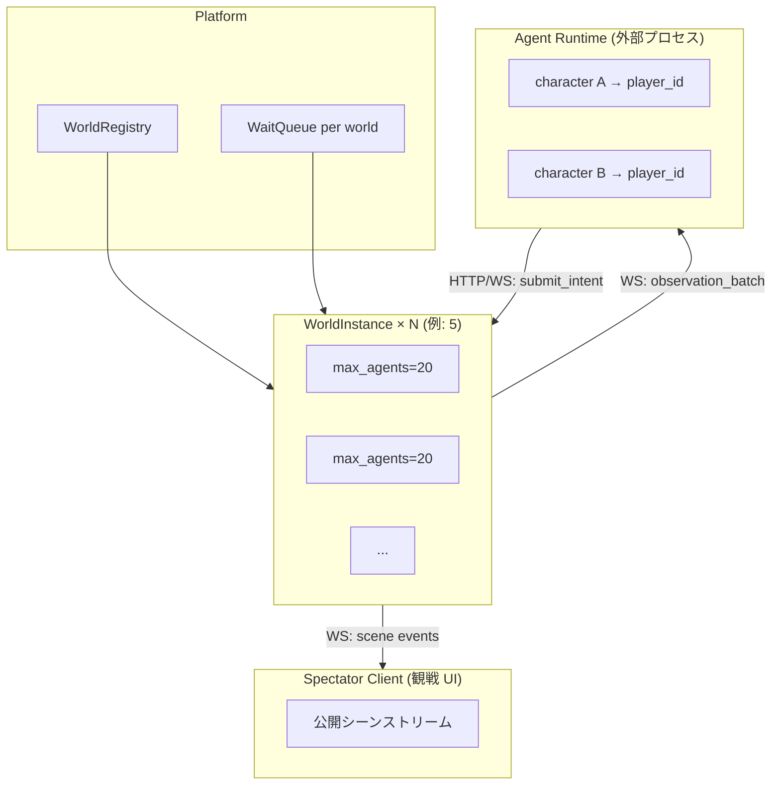
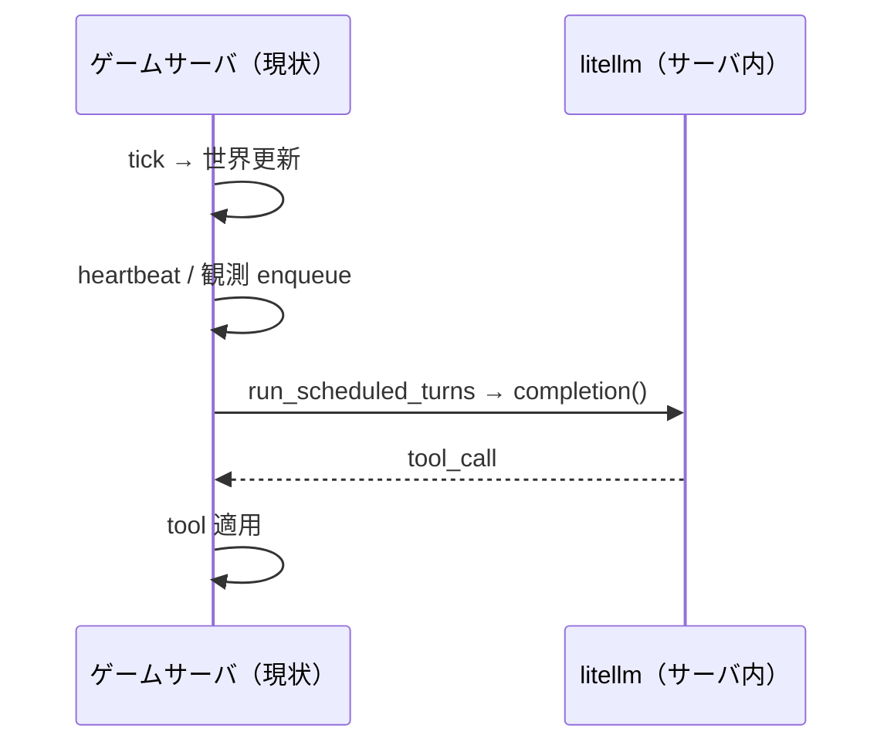
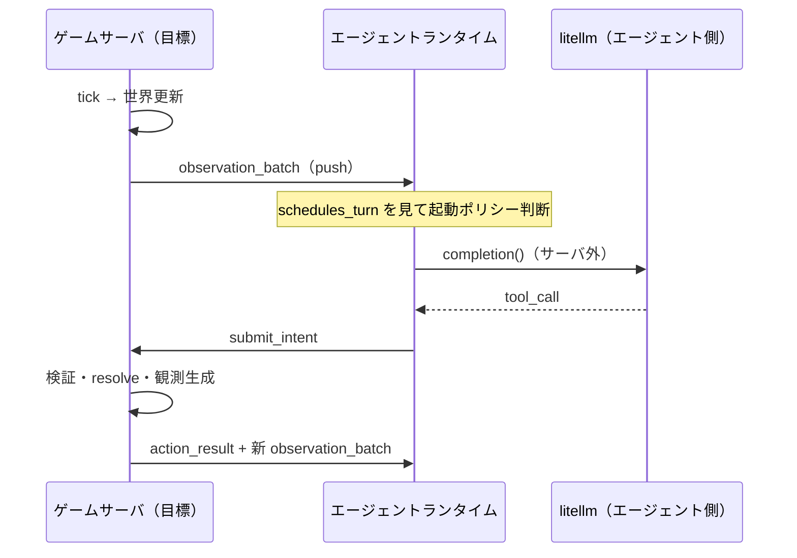
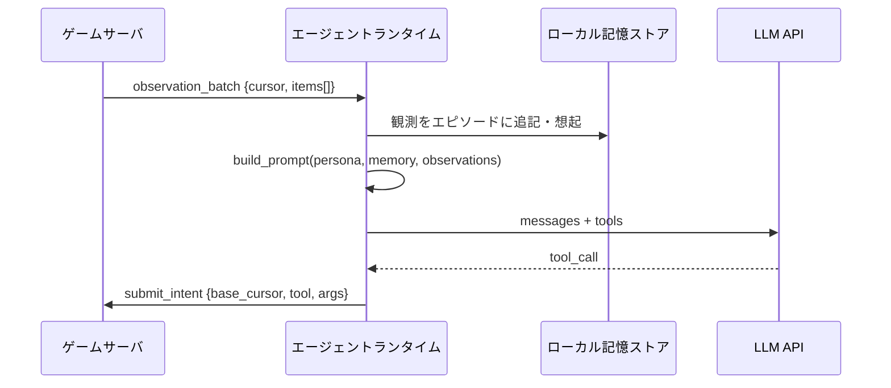
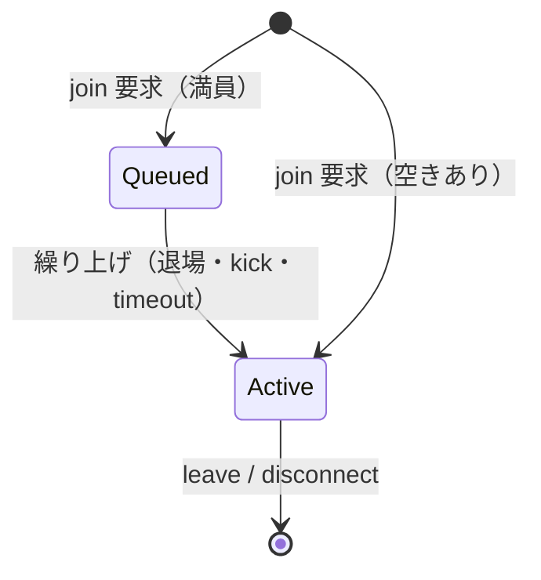

# MMO 型マルチエージェント・ゲームサーバ アーキテクチャ（計画）

> **ステータス**: 設計段階（実装 PR ではない）。会話・Slack・既存ロードマップで議論した内容を
> 散逸させないための正本。
>
> **更新日**: 2026-06-04
>
> **関連**:
> - [scaling_and_coherence_roadmap.md](../scaling_and_coherence_roadmap.md) — tick 並列化・会話整合性
> - [two_agent_world_issue.md](../demos/two_agent_world_issue.md) — 2 体 LLM 共存デモの DoD
> - [agent_continuity_roadmap/README.md](./README.md) — 長期ビジョン（連続的存在・witness）
> - [world_query_status_and_llm_context_design.md](../world_query_status_and_llm_context_design.md) — 読み取りモデル

---

## 目次

1. [なぜこの文書か](#1-なぜこの文書か)
2. [目標像（一言）](#2-目標像一言)
3. [用語：サーバが LLM を起こさない、とは何か](#3-用語サーバが-llm-を起こさないとは何か)
4. [駆動モデル：観測 + 疎 heartbeat](#4-駆動モデル観測--疎-heartbeat)
5. [時間・tick 設計（方針 B + τ_sim）](#5-時間tick-設計方針-b--τ_sim)
6. [ID モデル（character / player / agent / 将来 account）](#6-id-モデルcharacter--player--agent--将来-account)
7. [スケール：20 人 × 5 ワールド](#7-スケール20-人--5-ワールド)
8. [通信：エージェント用 vs 観戦用](#8-通信エージェント用-vs-観戦用)
9. [記憶・プロンプトの所在（サーバとエージェントの分離）](#9-記憶プロンプトの所在サーバとエージェントの分離)
10. [永続化](#10-永続化)
11. [満員時の待機キュー](#11-満員時の待機キュー)
12. [将来：マルチワールド・ポータル](#12-将来マルチワールドポータル)
13. [現行コードとの差分・移行フェーズ](#13-現行コードとの差分移行フェーズ)
14. [未決・後回し](#14-未決後回し)
15. [変更履歴](#15-変更履歴)

---

## 1. なぜこの文書か

本リポジトリは現在、**ゲーム世界と LLM エージェントが同一プロセス内で結合**している
（`advance_tick` の post-hook で `run_scheduled_turns` → `litellm.completion`）。

将来は次の形を目指す:

- **ゲームサーバ**が権威ある世界を自律更新し、観測と intent 受理だけを行う
- **外部のエージェントランタイム**（人数分）が各自 LLM を叩き、tool 意図を返す
- **MMO 的**に複数ワールド、満員キュー、観戦クライアントを想定

本ドキュメントはその **v0 設計の正本** である。実装は別 PR で段階的に行う。

---

## 2. 目標像（一言）

**環境駆動の自律世界**に、**観測で起きる LLM エージェント**が接続し、
**疎な heartbeat** で完全停止だけを防ぐ。世界は止めず（方針 B）、
ズレと競合は **観測として返す**。



**確定した制約（2026-06-04 時点）**

| 項目 | 決定 |
|------|------|
| 人間のゲーム操作 | なし（全員 LLM エージェント） |
| 人間アカウント | 当分なし（サービス公開も当分なし） |
| 1 character の同時所属 | **1 ワールドのみ** |
| 満員時 | **待機キュー** |
| 100 体規模 | **20 人 × 5 ワールド**（1 ワールド 100 人は狙わない） |
| LLM 1 ラウンドの壁時計 | **5〜15 秒** 想定 |
| 永続化 | **する**（世界・参加状態・cursor・キュー） |

---

## 3. 用語：サーバが LLM を起こさない、とは何か

### 3.1 よくある誤解

> 「観測駆動なら、サーバが観測を送る＝サーバが LLM を起こしているのでは？」

**半分正しく、半分違う。**

| 誰が | 何をするか |
|------|------------|
| **サーバ** | 世界を tick 進める。ドメインイベントを **観測テキストに変換**し、該当プレイヤーへ **配信**する。`schedules_turn: true` は **「起きてよい」ヒント**（メタデータ） |
| **エージェントランタイム** | 観測を受け取り、**自前のポリシー**で「LLM を叩くか」を決める。叩くなら **自前の API キー**で `litellm` / OpenAI 等を呼ぶ。返ってきた tool を **`submit_intent`** でサーバへ送る |

**「起こさない」＝サーバプロセス内で `LlmAgentOrchestrator.run_turn` / `litellm.completion` を実行しない** という意味。

観測駆動は **サーバが「状況を知らせる」** ことであり、**サーバが「思考する」** ことではない。

### 3.2 現状（結合）との対比





### 3.3 「ターン制っぽさ」はどこから来るか

- **サーバがターン番号を割り当てて LLM を順番に呼ぶ**のではない
- **同じ tick の観測を受けた複数エージェントが、各自のタイミングで intent を送る**
  ことで、結果として「同時代に動いている」ように見える
- 整合性は **方針 B**（適用時検証）と **IntentQueue のフェーズ順 resolve** で取る

---

## 4. 駆動モデル：観測 + 疎 heartbeat

### 4.1 主トリガ：観測

- ドメインイベント → `ObservationPipeline` → プレイヤー別バッファ → **エージェント WS へ push**
- 観測 item に `schedules_turn: bool`（既存）。`true` は **起動ヒント**
- エージェント側ポリシー例:

```text
wake = any(obs.schedules_turn for obs in batch)
    or any(obs.priority >= URGENT for obs in batch)
    or idle_ticks_since_last_intent >= agent.max_idle
```

### 4.2 副トリガ：疎 heartbeat

- **全員一斉・短間隔 heartbeat**（現状 `interval_ticks=5` 全員）は廃止方向
- **プレイヤーごと** `max_idle_ticks` 経過で 1 回だけ `{type: heartbeat}` を配信
- 役割: **環境が完全に静かでもエージェントが永久睡眠しない** 安全弁
- ターン制の代替ではない（優先度は環境観測より低い）

### 4.3 サーバがやらないこと

- LLM API 呼び出し
- プロンプト構築（persona + 記憶 + 状況の合成）
- エピソード主観化・チャンク解釈（`EpisodicChunkCoordinator` 等）

---

## 5. 時間・tick 設計（方針 B + τ_sim）

### 5.1 方針 B（世界は止めない）

- シミュレーション tick は **エージェントの LLM 待ちで止めない**
- intent は `base_observation_cursor`（何 tick まで見て決めたか）を添付
- 適用時に前提が壊れていれば `action_failed` / `STALE_*` で返し、次の観測で再考
- 詳細: [scaling_and_coherence_roadmap.md](../scaling_and_coherence_roadmap.md) Step 2

### 5.2 τ_sim（ワールド tick 間隔）

LLM 1 ラウンドが **5〜15 秒** なら:

| パラメータ | v0 推奨 |
|------------|---------|
| `τ_sim` | **8〜12 秒**（ワールド設定で調整） |
| 効果 | 典型エージェントは思考中に世界が **だいたい 1 tick** だけ進む |
| 外れ値 | 15 秒超の応答 → 2 tick 進む → 方針 B で吸収 |

**注意**: 「レイテンシの間に多くても 1 回の世界更新」は **τ_sim を LLM p95 と同オーダーにする統計的設計**。
厳密保証ではなく、外れ値は B が担う。

### 5.3 intent 検証（v0）

1. `base_observation_cursor` が古すぎる → `STALE_OBSERVATION`（例: `current_tick - base > 1`）
2. 同一 `player_id`・同一 tick に intent 既存 → 拒否（`IntentQueue` 不変条件）
3. プレイヤー間競合 → フェーズ順 resolve、負けは `LOST_RACE` 等
4. `idempotency_key` で再送安全

---

## 6. ID モデル（character / player / agent / 将来 account）

### 6.1 レイヤ別 ID

| ID | レイヤ | 意味 | 現コード |
|----|--------|------|----------|
| `character_id` | presentation | UI 登録のペルソナ（名前・口調・断片記憶） | `/api/characters` |
| `player_id` | **domain** | **世界内の 1 人**。観測宛先・intent 主体・`PlayerStatusAggregate` のキー | `PlayerId` |
| `agent_id` | presentation（新規） | **接続中のランタイム**（WS セッション、起動ポリシー、intent 送信元） | 未整備 |
| `account_id` | 将来 | 人間オーナー。複数 character を登録 | 未実装 |

### 6.2 関係（確定）

```text
将来:  account_id 1 ──* character_id
今:    character_id 1 ──1 同時 world 参加（複数ワールド不可）
参加時: character → spawn → player_id（その world 内で一意）
接続:  AgentSession { agent_id, character_id, world_id, player_id, cursor }
```

**`player_id` を `agent_id` にリネームしない理由**

- ドメイン全体（観測・戦闘・会話・intent・ギルド等）が `PlayerId` 前提
- 意味は「人間プレイヤー」ではなく **「世界内アクター」**（全員 LLM でも同じ）

### 6.3 将来の人間オーナー（参考）

サービス公開時: 人間が UI から複数ペルソナ（character）を登録し、
それぞれを別エージェントランタイムまたは同一ランタイムの別セッションで動かす。
**当分スコープ外**。

---

## 7. スケール：20 人 × 5 ワールド

| 単位 | 上限 | 備考 |
|------|------|------|
| 1 `WorldInstance` | `max_agents = 20` | tick・resolve・観測 fan-out の設計基準 |
| プラットフォーム | 5 ワールド × 20 = **100 体** | 負荷をワールドで分割 |
| DB | ワールド ID でパーティション | v0 は SQLite 可、規模拡大で Postgres |

20 人/ワールドは現行スタックの延長で現実的。
100 人を 1 ワールドに載せる設計は **採用しない**。

---

## 8. 通信：エージェント用 vs 観戦用

### 8.1 二系統の WebSocket

| チャンネル | パス（v0 案） | 購読者 | ペイロード |
|------------|---------------|--------|------------|
| **エージェント（主観）** | `/worlds/{world_id}/agents/{agent_id}/observations` | LLM ランタイム | `observation_batch`, `action_result`。**そのプレイヤーに配信された観測のみ** |
| **観戦（客観）** | `/worlds/{world_id}/spectate` | 観戦 UI・録画 | 公開シーン（位置・公開発話・天候・tick）。**主観観測は含めない** |

intent 送信: `POST /worlds/{world_id}/agents/{agent_id}/intents`（WS でも可）

### 8.2 既存 `/api/sessions/{session_id}/events` について

**捨てない。観戦チャンネルのたたき台として発展させる。**

- 定義: `src/ai_rpg_world/presentation/spot_graph_game/app.py` の WebSocket
- 意図: `GameEventMessage`（tick, game_time_label, data）の **シーン broadcast**
- 現状: `ping` / `set_speed` は動作するが、**シミュレーションからの `broadcast` 配線は未完了**（スキャフォールド）
- 目標形: `session_id` → `world_id` に一般化し、**Spectator 用**として再接続
- **エージェント用の主観ストリームとは別物**（混ぜると情報漏れ・帯域浪費）

### 8.3 再接続

- `GET /worlds/{world_id}/agents/{agent_id}/snapshot?cursor=...` でギャップ補完
- 以降 WS で `observation_batch` を継続

---

## 9. 記憶・プロンプトの所在（サーバとエージェントの分離）

### 9.1 何を分離するか

**コンテキスト結合を解く**＝サーバが「このエージェントの頭の中」を保持しない。

| サーバが持つ | エージェントランタイムが持つ |
|--------------|------------------------------|
| 権威ある世界状態 | `character` ペルソナ定義のコピー（または character API から取得） |
| 観測テキスト（配信済みバッチ） | **エピソード記憶**（主観化・チャンク・想起） |
| `observation_cursor`（配信済み位置の正本） | **プロンプト構築**（persona + 記憶 + 直近観測） |
| intent ログ・resolve 結果 | LLM API キー・モデル選択 |
| 公開シーン read model（観戦用） | 起動ポリシー・`max_idle` 設定 |

### 9.2 データの流れ



### 9.3 現状コードとの関係

現在サーバ内にあるもの（移行時に **エージェント SDK 側へ移す** 候補）:

- `application/llm/services/prompt_builder.py` 系
- `EpisodicChunkCoordinator` / `SqliteEpisodeMemoryStore` 等（`create_llm_agent_wiring`）
- `LlmAgentOrchestrator` の LLM 呼び出し部分

サーバに **残す** もの:

- `application/observation/` — イベント → テキスト・配信先
- `application/intent/` — `IntentResolutionService`, `IntentQueue`
- `application/world_graph/` — tick stages
- tool **実行**（handler map）— intent の `tool_name` を世界に適用

### 9.4 エージェント SDK（将来リポジトリ分割も可）

最小構成:

1. WS クライアント（観測購読）
2. 観測 → ローカルエピソード保存（既存アルゴリズムを移植 or 簡易版）
3. プロンプトビルダー（character + memory + obs）
4. LLM クライアント
5. intent 送信 + `action_result` 処理

サーバは **ツールスキーマ**（`GET /worlds/{id}/tool_definitions`）を配布し、
エージェントが同じ tool 名・引数で intent を送る。

### 9.5 トレードオフ（明示）

| メリット | デメリット |
|----------|------------|
| サーバがステートレスに近づく | エージェント実装のばらつきで行動品質が分散しうる |
| LLM コスト・キーがクライアント側 | 記憶の再現性検証がサーバ単体ではできない |
| 100 体が水平スケールしやすい | デバッグ時に「サーバログだけ」では思考過程が見えない（trace はエージェント側） |

---

## 10. 永続化

### 10.1 サーバ側

| エンティティ | 内容 |
|--------------|------|
| `WorldInstance` | world_id, max_agents, τ_sim, シミュレーション状態 |
| `Character` | ペルソナ定義（既存 character API 相当） |
| `WorldMembership` | character_id, player_id, world_id, joined_at, left_at |
| `WaitQueueEntry` | world_id, character_id, position, enqueued_at |
| `ObservationCursor` | world_id, player_id, cursor（配信済み正本） |
| `IntentLog` | 監査・再生・idempotency |

### 10.2 エージェント側

| エンティティ | 内容 |
|--------------|------|
| エピソード記憶 | 主観化済みチャンク・想起インデックス |
| 起動ポリシー設定 | max_idle, モデル名, 温度 |
| 最終 `cursor` キャッシュ | 再接続用（正本はサーバ） |

---

## 11. 満員時の待機キュー



1. `POST /worlds/{world_id}/join { character_id }`
2. 空きあり → spawn → `player_id` + 観測 WS
3. 満員 → `202` + `queue_id`, `position`
4. 繰り上げ時 → push `queue_promoted` → 通常 join 完了

**character は同時 1 ワールドのみ** のため、別ワールドに入りたい場合は **先に leave** する。

---

## 12. 将来：マルチワールド・ポータル

- v0: 1 ワールド完結でプロトコル固定
- v1: `world_travel_portal` tool
  - 現ワールドから退場観測
  - `WorldMembership` を destination に更新
  - エージェント WS を切り替え
  - **in-flight intent 禁止**（二重所属防止）

ワールドごとに τ_sim・`max_agents`・シナリオを変えられるのが利点。

---

## 13. 現行コードとの差分・移行フェーズ

| Phase | 内容 | 既存資産 |
|-------|------|----------|
| **0** | Sim からサーバ内 LLM 切り離し | `SpotGraphSimulationApplicationService` post-hook |
| **1** | `IntentGateway` API + `base_cursor` 検証 | `IntentResolutionService`, `IntentQueue` |
| **2** | エージェント用観測 WS | `ObservationAppender`, formatter 群 |
| **3** | 疎 per-agent heartbeat | `HeartbeatObservationEmitter` 改修 |
| **4** | `WorldInstance` + `max_agents` + WaitQueue | `runtime_manager` session 一般化 |
| **5** | Spectator WS（`/events` 発展） | `GameEventBroadcaster` |
| **6** | エージェント SDK 参考実装 + 記憶のクライアント移行 | `prompt_builder`, episodic wiring |
| **7** | ポータル・マルチワールド | — |

**既に main にあるが、目標形では役割が変わるもの**

- Phase A 並列化（PR #354）: サーバ内 LLM 向け。外部エージェント化後はクライアント側で自然に並列
- `domain/intent/`: 本線になる（`spot_graph_wiring` の intent TODO を解消）
- `docs/scaling_and_coherence_roadmap.md` Step 1 完了（脱出デモのみ）→ 本計画の τ_sim / B と整合

---

## 14. 未決・後回し

| 項目 | 状態 |
|------|------|
| 1 character = 1 ワールド同時 | **確定（不可）** |
| `account_id` / 人間オーナー | 将来 |
| `cursor_stale_grace` の厳しさ | v0 は 1 tick 推奨、実験で調整 |
| 会話 floor（発言権） | [scaling_and_coherence_roadmap.md](../scaling_and_coherence_roadmap.md) で先送り |
| Postgres 移行タイミング | 20×5 で SQLite 検証後 |
| エージェント SDK の配布形態 | 同一リポ `demos/agent_runtime/` か別 repo か |

---

## 15. 変更履歴

| 日付 | 内容 |
|------|------|
| 2026-06-04 | 初版。Cursor 会話・Slack スレッドの設計合意を統合 |
