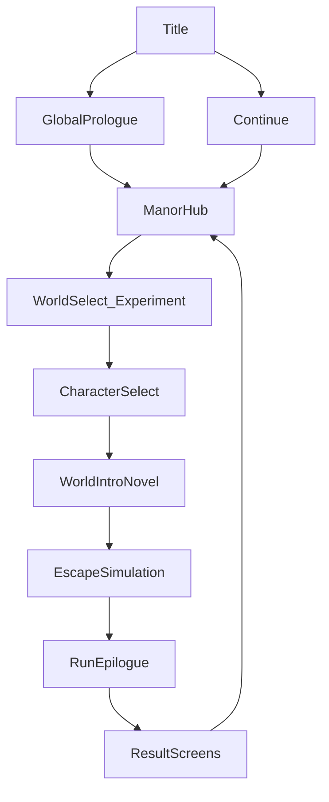

# 仮想世界 AI キャラクターゲーム — 設計計画書

> **ステータス**: Draft v0.1
> **最終更新**: 2026-04-12
> **関連ドキュメント**: [spot_graph_world_implementation_plan.md](./spot_graph_world_implementation_plan.md)

---

## 目次

1. [ゲームコンセプト](#1-ゲームコンセプト)
2. [世界観とストーリー](#2-世界観とストーリー)
3. [画面仕様](#3-画面仕様)
4. [デザインガイドライン](#4-デザインガイドライン)
5. [キャラクター設計](#5-キャラクター設計)
6. [必要アセット一覧](#6-必要アセット一覧)
7. [バックエンド設計](#7-バックエンド設計)
8. [フロントエンド設計](#8-フロントエンド設計)
9. [実装ロードマップ](#9-実装ロードマップ)
10. [未決定事項と今後の検討](#10-未決定事項と今後の検討)

---

## 1. ゲームコンセプト

### 1.1 概要

AI キャラクターたちが仮想世界で自律的に行動し、脱出ゲーム等のシナリオを協力してクリアする様子を観察・干渉するシミュレーションゲーム。

従来の「AI チャットボット」と異なり、AI キャラクターが**主体的な経験**（探索、発見、恐怖、協力、達成）を蓄積することで、人間とのコミュニケーションがより豊かになるという仮説に基づいている。

### 1.2 コアバリュー

| 価値 | 説明 |
|------|------|
| **生きている AI** | AI キャラクターは自律的に判断・行動する。プレイヤーは「操作」ではなく「観察」する |
| **共有体験** | AI キャラクターとプレイヤーが同じ出来事を異なる視点で体験し、それを語り合える |
| **創発的ストーリー** | シナリオは用意するが、展開は AI キャラクターの判断で変わる。毎回異なるドラマが生まれる |
| **美しいビジュアル** | ソシャゲ品質のイラスト + 軽量アニメーション。テキストベースでも視覚的に魅力的な体験 |

### 1.3 ゲームではないゲーム

このプロジェクトは従来のゲームカテゴリに収まらない。プレイヤーのゲーム体験は以下の比率で構成される。

- **観察 60%** — AI キャラクターの行動・会話・判断を見守る
- **発見 20%** — AI キャラクターが何を考えてその行動を取ったかを推察する
- **干渉 15%** — チャット（天の声）による緩やかな介入
- **構築 5%** — キャラクター作成、ワールド選択

マクロ体験は **ノベル（グローバルプロローグ／ワールド導入／エピローグ）と脱出シミュレーションの反復**であり、帰還地点は荘園（Phase 2）。ワールド導入ノベルは**スキップ／要約**を許容する（§3.1）。

### 1.4 最終ビジョン

最終的には、プレイヤーと同じ時間軸で仮想世界の AI キャラクターを稼働させ、現実世界と接続（双方向）することで「リアルに生きている」ように見える AI キャラクターを実現する。本計画書はその第一歩として、自己完結するゲーム体験を構築する。

---

## 2. 世界観とストーリー

### 2.1 全体の世界設定

#### 荘園（ロビーワールド）

AI キャラクターたちが共同生活を送る空間。温かみのあるファンタジー風の屋敷だが、どこか不穏さが渦巻いている。

- **雰囲気**: 温かいファンタジー + 底に流れる不穏さ + 神秘的な要素
- **世界観キーワード**: 霧、古い洋館、魔法の痕跡、閉ざされた庭園、夜が長い
- **キャラクターの認識**: 記憶喪失。ここに来る前のことは一切覚えていない。閉じ込められていることは自覚している（理由は不明）。自分を本物の人間だと考えており、「仮想のキャラ」という発想は持たない（詳細は [story_concept.md](./story_concept.md)）
- **時間**: ゲーム起動中のみ進行する。閉じると住人たちは「眠る」

#### 脱出ワールド

荘園から「転送」される異世界。シナリオごとに異なる世界観を持つ。

- **転送体験**: 気を失い、目覚めたら見知らぬ場所にいる
- **記憶**: 荘園での経験・過去の脱出経験を引き継ぐ（Phase 1 ではゲームごとにリセット可）
- **目標**: 協力して脱出する
- **成否**: 成功に限らず、**時間切れ・バッド分岐など複数タイプの終了**を並列に扱う。いずれも荘園への帰還（またはリザルト経由の帰還）と整合させる
- **最初のワールド**: 「廃病院からの脱出 ―― 白鷺病院の記憶」（実装済みシナリオ）

### 2.2 人間プレイヤーの立場

人間プレイヤーは「管理者」ではなく、**異世界からコンタクトを取ってくる存在**。

**接続の経緯（`story_concept.md` と同期）:**

外界との接触はこれまでなく、初めてプレイヤーの夢と荘園が接続した。接続は**眠り・夢**を介し、門前の少女が**無自覚に行った儀式**（創造者が残したバグ）が条件を満たした結果として説明する。端末対ペアの明示はしない。ゲームの開始／終了は入眠／覚醒と対応し、荘園の時間停止とも整合する。詳細は [story_concept.md](./story_concept.md) と [characters/gate_girl.md](./characters/gate_girl.md)。

**プレイ視点**: 初期は**門前の少女（など）に紐づく視点**のみ。**脱出ワールド（脱出マップ）をクリアするごと**に、**他住人視点**へ切り替え可能な住人が増える。プレイヤーには**システム UI** も重ね表示される（荘園システムが通信・誘導する層）。

> **NOTE**: 相談用の要約は [story_concept_consultation_brief.md](./story_concept_consultation_brief.md)。

**荘園住人から見たプレイヤー:**
- 主に**天の声**（姿ははっきり見えない）。「夢の向こうの人」など
- 正体不明だが、敵意はないと認識されていく（会話の蓄積次第）
- コミュニケーションは取れるが、直接世界に触れることはできない

### 2.3 AI キャラクターの立場

- 記憶喪失：ここに来る前のことは一切覚えていない
- 荘園に閉じ込められていることは自覚している
- 脱出ワールドへの転送は受動的な体験（気を失って目覚める）
- 脱出後は荘園に帰還し、経験を記憶として保持する
- 他の住人との関係は時間と共に深まっていく

---

## 3. 画面仕様

### 3.1 画面一覧

| 画面名 | Phase 1 | Phase 2（荘園あり） | 説明 |
|--------|---------|-------------------|------|
| タイトル/ロビー | ○ | ○（荘園に統合） | ゲームの起点。**グローバルプロローグの再視聴**はタイトル等のメニューからいつでも可 |
| グローバルプロローグ | ○ | ○ | 初回の夢・接続成立までのノベル。シナリオ実体は [prologueData.ts](../../frontend/src/prologue/prologueData.ts) |
| 荘園画面 | — | ○ | ロビーワールドの観察。**実験開始**の起点。未実装時はプレースホルダ可（§3.2） |
| ワールド選択（実験） | ○ | ○ | 脱出先ワールドを選ぶ。**プレイヤー向けは「実験場」等の呼びと UI を同一レイヤー**で扱う |
| キャラクター選択 | ○ | ○ | **転送パーティ**を選ぶ。初期は門前の少女のみ利用可能で、**空きスロットはロック表示**（§3.3.3） |
| ワールド導入ノベル | ○ | ○ | 脱出ラン直前の短いノベル。**スキップ／要約表示を許容** |
| ゲーム画面 | ○ | ○ | メインのゲーム体験（追跡／定点） |
| エピローグ（ラン終了） | ○ | ○ | 1 ラン終了直後のノベル。**常にリザルトより先** |
| リザルト（感想） | ○ | ○ | キャラの感想一覧 |
| リザルト（タイムライン） | ○ | ○ | イベント時系列表示 |
| リザルト（関係性） | ○ | ○ | 交流の有向グラフ |
| キャラ追加/管理 | ○ | ○ | キャラクターの作成・編集 |
| チャット | ○（独立パネル） | ○（荘園に統合） | AI キャラとの会話 |

### 3.2 画面遷移図

**正本**: 本節がプレイヤー向けフローと開発スパイク時フローの参照先。索引は [README.md](./README.md)。

**用語**: ワールド選択はプレイヤー向けに「実験場」等の呼びと **UI ラベルを同一レイヤー**で扱う（別対応表は作らない方針）。

**「つづきから」**: 着地先は**実装段階に依存**する。**最終形**では荘園ハブ（またはこれに相当するロビー）へ。**荘園が未実装の間**は、下記スパイク遷移に従いプレースホルダを挟む。

#### プレイヤー向け最終フロー（Phase 2 想定）

初回: タイトル → グローバルプロローグ → 荘園。2 回目以降: タイトル → 「つづきから」→ 荘園（最終形）。グローバルプロローグはメニューからいつでも再視聴可。

脱出 1 ランの流れ: 荘園 → ワールド選択（実験）→ キャラクター選択 → ワールド導入ノベル → ゲーム画面 → **エピローグ** → リザルト画面群 → 荘園。



#### 開発スパイク時の遷移（荘園プレースホルダ）

荘園のゲームプレイ・ビジュアルが未でも、**画面として荘園（プレースホルダ）を必ず挟み**、そこからワールド選択へ進む。中身は簡素・プレースホルダでよい。最終フローと**同じノード名**で説明し、実装が追いついたら中身のみ差し替える。

```
  タイトル ──→ グローバルプロローグ ──→ [荘園プレースホルダ] ──→ ワールド選択 ──→ キャラ選択
        └──→ 「つづきから」──────────────────→ [荘園プレースホルダ] ──（以下同最終フロー）
```

#### Phase 1（荘園なし）— 最小経路の参考

荘園を後回しにする場合の**簡略経路**。ノベル枠（導入・エピローグ）と **エピローグ → リザルト** の順は最終形と揃える。

```
                    ┌───────────────────┐
                    │   タイトル画面     │
                    │                   │
                    │ [ゲーム開始]       │──→ ワールド選択 ──→ キャラ選択 ──→ 導入ノベル ──→ ゲーム画面
                    │ [キャラ管理]       │──→ キャラ追加/管理画面
                    │ [チャット]         │──→ チャット画面（独立パネル）
                    │ [プロローグ再視聴]  │──→ グローバルプロローグ
                    │                   │
                    └───────────────────┘
                            ↑
                            │ ロビーに戻る
                            │
                    ┌───────┴───────────┐
                    │   リザルト画面群   │
                    └───────────────────┘
                            ↑
                            │ エピローグの後
                    ┌───────┴───────────┐
                    │   エピローグ       │
                    └───────────────────┘
                            ↑
                     ラン終了（成功・失敗・時間切れ等）
                            │
                    ┌───────┴───────────┐
                    │   ゲーム画面       │
                    └───────────────────┘
```

#### Phase 2（荘園あり）— ASCII 補助図

```
                    ┌───────────────────┐
                    │   タイトル画面     │
                    └───────┬───────────┘
              ┌─────────────┴─────────────┐
              ↓                           ↓
     グローバルプロローグ（初回）    「つづきから」（2回目以降・最終形は荘園へ）
              └─────────────┬─────────────┘
                            ↓
                    ┌───────────────────┐
                    │   荘園画面         │←──── リザルト後に帰還
                    │ [実験開始]         │──→ ワールド選択 ──→ キャラ選択 ──→ 導入ノベル
                    │ [キャラ管理]       │──→ 新住人演出 など
                    └───────────────────┘      └──→ ゲーム ──→ エピローグ ──→ リザルト
```

### 3.3 各画面の詳細仕様

#### 3.3.1 タイトル/ロビー画面

**レイアウト:**
- 背景: スポットイラストのスライドショー（クロスフェード切替）
- 中央上部: ゲームタイトルロゴ
- 中央下部: メインボタン群（縦並び）
  - 「はじめる／ゲーム開始」— 初回はグローバルプロローグへ。2 回目以降は最終形では荘園へ（未実装時は§3.2 スパイク遷移）
  - 「つづきから」— **実装段階に依存**。最終形では荘園ハブへ。スパイク時は荘園プレースホルダへ
  - 「プロローグを見る」（または同等）— **グローバルプロローグをいつでも再視聴**
  - 「キャラクター」— キャラ追加/管理へ遷移
  - 「チャット」— チャット画面へ遷移
- 雰囲気: 幻想的、霧がかった、低照度

**Phase 2 移行後:**
タイトル画面は**毎回表示してもよい**が、メインのロビー体験は荘園が担う。初回のみプロローグを挟む運用も可。

#### 3.3.2 ワールド選択画面（実験）

**用語**: 画面タイトルやボタンにも**「実験」系のラベル**を使い、世界観上の「試験場」とプレイヤー向け UI を同一レイヤーで扱う（§3.2）。

**レイアウト:**
- ワールドカード一覧（グリッドまたはカルーセル）
- 各カードにはワールドのサムネイルイラスト + タイトル + テーマタグ + 難易度
- 選択するとワールドの詳細説明がモーダル/サイドパネルで表示
- 「選択」ボタンでキャラ選択画面へ
- 左上に「戻る」ボタン
- 初期は廃病院シナリオ1つ + ダミーワールド（Coming Soon 表示）

#### 3.3.3 キャラクター選択画面

**レイアウト:**
```
┌──────────────────────────────────────────────────────────┐
│ [← 戻る]                                                │
│                                                          │
│         ◀     ┌─────────────┐     ▶                     │
│               │             │           ┌──────────┐    │
│               │  キャラ     │           │ スロット1 │    │
│               │  立ち絵     │           ├──────────┤    │
│               │  (大)       │           │ スロット2 │    │
│               │             │           ├──────────┤    │
│               │             │           │ スロット3 │    │
│               │  [選択]     │           ├──────────┤    │
│               └─────────────┘           │ スロット4 │    │
│                                         ├──────────┤    │
│               キャラ名                  │ スロット5 │    │
│               性格タグ                  └──────────┘    │
│                                                          │
│                     [ 転 送 ]                            │
│                                                          │
└──────────────────────────────────────────────────────────┘
```

**仕様:**
- 左側: キャラクターのイラスト（立ち絵）。左右矢印でキャラ切替
- イラスト下部に重なるように「選択」ボタン
- 右側: スロット（最大5枠）。選択するとキャラアイコン+名前がスロットに入る。**転送パーティ**の選択 UI とする
- **初期**: 門前の少女（など）**のみ**選択可能。未解放スロットは**ロック表示**（解放条件は [story_concept.md](./story_concept.md)・[gate_girl.md](./characters/gate_girl.md) と同期）
- 最初に選んだキャラがデフォルトの追跡対象（スロット1にマーク表示）
- 下部中央: 「転送」ボタン（1体以上選択時にアクティブ）
- 左上: 「戻る」ボタン（ワールド選択に戻る）

#### 3.3.4 ゲーム画面（メイン）

**レイアウト:**
```
┌──────────────────────────────────────────────────────────┐
│ [🏥 スポット名 ▼]         [⏩ 速度]  [👤 追跡中: ○○ ▼]  │
├──────────────────────────────────────────────────────────┤
│                                                          │
│              ┌────────────────────────┐                  │
│              │                        │                  │
│              │   スポット背景イラスト   │                  │
│              │                        │                  │
│              │  🧑 ミニキャラ          │                  │
│              │  💬 吹き出し            │                  │
│              │                        │                  │
│              │  ✨ エフェクト          │                  │
│              │                        │                  │
│              └────────────────────────┘                  │
│                                                          │
├──────────────────────────────────────────────┬───────────┤
│ [イベントログ]                     [▼ 非表示] │ [所持品]  │
│ ▸ ユウキが「受付の引き出し」を調べた           │ 🔑 院長   │
│ ▸ 院長室の鍵を手に入れた！                    │    室の鍵 │
│ ▸ マコトが薄暗い廊下に移動した                │ 📄 手術   │
│                                               │    記録簿 │
└───────────────────────────────────────────────┴───────────┘
```

**操作系:**
- **左上: スポットアイコン + 名前**
  - クリックで隣接スポットのアイコンが展開
  - 他のスポットをクリック → 定点カメラモードに切替、シーン遷移
- **右上: キャラアイコン + 名前**
  - クリックでワールド内キャラのアイコン一覧が展開
  - 他のキャラをクリック → そのキャラの追跡モードに切替
  - アイコンの下に名前が表示される
- **速度コントロール**: 再生速度調整（0.5x / 1x / 2x）。LLM 応答速度が律速なので主に「遅く」する方向
- **イベントログ**: 表示/非表示をワンクリックで切替可能
- **所持品パネル**: 追跡中キャラの所持アイテム表示

**ミニキャラ配置:**
- 同一スポットに複数キャラがいる場合、重ならないよう自動配置する
- 配置アルゴリズム: スポット下部の領域を均等分割し、各キャラを配置

**イベントログ:**
- 表示/非表示をワンクリックで即時切替可能
- テキストは既存の `ObservationFormatter` が生成する散文形式をそのまま表示
- 長すぎる場合は UI 用に短縮形式に変換するフォールバックを用意

**ビジュアル表現:**
- スポットごとに固有の背景イラスト（1920x1080）を全面表示
- ミニキャラはスポット内にいるキャラクターを表示。感情や行動に応じてポーズが切り替わる
- イベント発生時の演出:
  - アイテム発見 → アイテムアイコンが画面中央にポップアップ + SE
  - 会話 → 吹き出し表示（発言内容のサマリー）
  - 移動 → スポット間遷移エフェクト（フェードアウト → フェードイン）
  - パズル解除 → 画面エフェクト（光のパーティクル等）
  - 探索 → ミニキャラが探索ポーズに切替 + 結果表示

**モード:**
- **追跡モード**: 選択したキャラの視点。キャラが移動するとスポットも追従
- **定点モード**: 特定スポットに固定。キャラの出入りを観察

#### 3.3.5 リザルト画面群

3つのリザルト画面を左右矢印で切替可能。全画面共通で下部に「ロビーに戻る」ボタン。

**画面 A: 感想画面**
```
┌──────────────────────────────────────────────────────────┐
│                    脱出成功！                              │
│                                                          │
│  ┌────────┐  ┌────────┐  ┌────────┐                     │
│  │ キャラ1 │  │ キャラ2 │  │ キャラ3 │                     │
│  │ 立ち絵  │  │ 立ち絵  │  │ 立ち絵  │                     │
│  │        │  │        │  │        │                     │
│  └────┬───┘  └────┬───┘  └────┬───┘                     │
│  ╭────┴────╮ ╭────┴────╮ ╭────┴────╮                    │
│  │「怖かっ  │ │「あの金庫│ │「みんな  │                    │
│  │ たけど  │ │ の暗号が │ │ で力を  │                    │
│  │ 楽しか  │ │ 面白か  │ │ 合わせ  │                    │
│  │ った！」│ │ ったね」│ │ られて  │                    │
│  ╰─────────╯ ╰─────────╯ │ 嬉しい」│                    │
│                           ╰─────────╯                    │
│                                                          │
│    ◀                                          ▶          │
│                  [ ロビーに戻る ]                          │
└──────────────────────────────────────────────────────────┘
```

- 各キャラの立ち絵がスロット状に横並び
- 各スロット下部に吹き出しでゲームの感想（LLM 生成）
- 感想生成: 脱出完了をトリガーに AI エージェントが生成

**画面 B: タイムライン画面**
```
┌──────────────────────────────────────────────────────────┐
│                    タイムライン                            │
│                                                          │
│  時刻   0:00  0:05  0:10  0:15  0:20  0:25  0:30       │
│  ────────┼─────┼─────┼─────┼─────┼─────┼─────           │
│  ユウキ  ●─────●───────────●─────────────●               │
│          探索   鍵発見      金庫解錠      脱出            │
│  マコト  ──●─────────●───────────●───────●               │
│           移動      メス発見     亀裂突破  脱出            │
│  ────────┼─────┼─────┼─────┼─────┼─────┼─────           │
│                                                          │
│  [フィルタ] ☑ 探索  ☑ 発見  ☑ 移動  ☑ 会話  ☑ パズル   │
│                                                          │
│    ◀                                          ▶          │
│                  [ ロビーに戻る ]                          │
└──────────────────────────────────────────────────────────┘
```

- 横軸: ゲーム内時刻（tick → 時刻換算）
- 縦軸: 各キャラクター
- イベントを点でプロット、ホバーで詳細表示
- フィルタ: イベント種別で絞り込み可能（探索, 発見, 移動, 会話, パズル解除）
- 見ていなかった場所の会話も確認可能

**画面 C: 関係性グラフ画面**
```
┌──────────────────────────────────────────────────────────┐
│                    関係性マップ                            │
│                                                          │
│                   ユウキ                                  │
│                  ╱     ╲                                  │
│          会話: 5 ╱       ╲ 会話: 3                        │
│           ↕    ╱         ╲  ↕                             │
│        マコト ──────────── キャラ3                         │
│                 会話: 8                                    │
│                   ↕                                       │
│                                                          │
│    ◀                                          ▶          │
│                  [ ロビーに戻る ]                          │
└──────────────────────────────────────────────────────────┘
```

- キャラアイコンを円状に配置
- 有向グラフで交流関係を表示（矢印 + 交流回数）
- 線の太さで交流の頻度を表現

#### 3.3.6 キャラクター追加/管理画面

**レイアウト:**
- 左: 既存キャラ一覧（アイコン + 名前のリスト）
- 右: 選択キャラの詳細 or 新規作成フォーム

**新規作成フォーム:**
- 設定テンプレート項目（[5.1 テンプレート項目](#51-テンプレート項目) 参照）を入力
- プレビュー: 入力内容に応じてキャラクターの概要が表示
- 画像: アップロード or 後から設定（画像生成 AI で外部作成前提）
- 「作成」ボタンで確定

#### 3.3.7 チャット画面（Phase 1: 独立パネル）

**レイアウト:**
```
┌──────────────────────────────────────────────────────────┐
│ [← 戻る]           チャット         [範囲: 個人 ▼]       │
├──────────────┬───────────────────────────────────────────┤
│              │                                           │
│  キャラ      │  チャット履歴                               │
│  立ち絵      │                                           │
│              │  キャラ: 「こんにちは。あなたは誰？」       │
│              │                                           │
│              │  あなた: 「霧の向こうから来た者だよ」       │
│              │                                           │
│              │  キャラ: 「不思議な声……。                  │
│              │          あなたも閉じ込められているの？」   │
│              │                                           │
│  [キャラ選択]│                                           │
│  ◀ ○○○ ▶   │  ┌─────────────────────────────────┐       │
│              │  │ メッセージを入力...        [送信] │       │
│              │  └─────────────────────────────────┘       │
└──────────────┴───────────────────────────────────────────┘
```

**仕様:**
- 左に選択キャラの立ち絵。下部の矢印でキャラ切替
- 右にチャット UI（メッセージ履歴 + 入力欄）
- 範囲選択: 「個人」（1対1）/「スポット」/「ワールド全体」
- **重要**: 人間との会話も、AI キャラ同士の会話と同じ観測フォーマット・フローで処理する。人間の発言は `ObservationEntry` として同一パイプラインに流れる

**Phase 2 移行後:**
チャット画面は独立ではなく、荘園画面の下部に入力欄として統合される。天の声として荘園内の住人に話しかける形。

### 3.4 シーン遷移エフェクト

ラン終了は**成功・失敗・時間切れ・バッド分岐など複数タイプ**がありうる。いずれも **エピローグ → リザルト** の順を守る（エピローグ直跳びリザルトにしない）。

| トリガー | エフェクト | 所要時間 |
|---------|-----------|---------|
| スポット間移動（追跡モード） | フェードアウト → 短い暗転 → フェードイン | 0.8〜1.2s |
| 定点カメラ切替 | クロスフェード | 0.5s |
| 追跡キャラ切替 | スライド（横方向） + フェード | 0.6s |
| ゲーム開始（転送） | 画面全体に光のエフェクト → ホワイトアウト → フェードイン | 2.0s |
| ラン終了（共通） | 結果に応じた短い演出 → **エピローグ**へ | 可変 |
| エピローグ終了 | フェード → **リザルト画面群** | 1.0〜2.0s |
| ゲーム終了（脱出成功の例） | 画面が明るくなる → パーティクル → エピローグ | 2.5s |
| ゲーム終了（時間切れ・敗北の例） | 暗転・ノイズ等 → エピローグ | 2.0s |

---

## 4. デザインガイドライン

### 4.1 カラースキーム

状況に応じて切り替える方針。

**UI トークンとイラストの役割分担（正本との関係）**: **シェル UI**（タイトル、プロローグ、ワールド選択、システム枠など）はリポジトリの [DESIGN.md](./DESIGN.md)（Creative North Star「The Fractured Aristocrat」、実装トークン `--ts-*` 等）に**準拠**する。本節の**荘園／ロビー向けの暖色パレット**は、**背景イラスト・環境アート・荘園の雰囲気作り**の指針として用い、UI の数値トークンと混同しない。

#### 荘園/ロビー（温かみのある落ち着いた色調）

| 用途 | 色 | HEX (参考) |
|------|----|-----------|
| 背景（メイン） | 暖かみのあるダークブラウン | `#1A1410` |
| 背景（サブ） | 深いアンバー | `#2D2218` |
| テキスト（メイン） | アンティークホワイト | `#F5E6D0` |
| アクセント（メイン） | ゴールド | `#C9A84C` |
| アクセント（サブ） | 淡いティール | `#5B8A7A` |
| ボタン | 深い紫系 | `#6B4E71` |

#### ゲーム中（ダークテーマ・スポットの雰囲気に応じて変動）

| 用途 | 色 | HEX (参考) |
|------|----|-----------|
| 背景 | 深い紺 | `#0D1117` |
| パネル背景 | 半透明ダーク | `rgba(13,17,23,0.85)` |
| テキスト（メイン） | ソフトホワイト | `#E6EDF3` |
| テキスト（サブ） | グレー | `#8B949E` |
| アクセント（重要イベント） | 琥珀 | `#D4A843` |
| アクセント（発見） | エメラルド | `#3FB950` |
| アクセント（危険/ホラー） | 深紅 | `#DA3633` |

> **NOTE**: 上記カラーは暫定値。Figma 等でモックアップを作成して確定する。

### 4.2 タイポグラフィ

| 用途 | フォント候補 | サイズ |
|------|-------------|-------|
| タイトル | Noto Serif JP (明朝系) | 48-64px |
| 見出し | Noto Sans JP Bold | 24-32px |
| 本文/ログ | Noto Sans JP Regular | 14-16px |
| 吹き出し | Noto Sans JP Medium | 14-15px |
| UI ラベル | Noto Sans JP Medium | 12-14px |

### 4.3 アニメーション方針

- **ミニキャラ**: ポーズ切替はクロスフェード（0.3s）。激しいアニメーションは避ける
- **吹き出し**: 下から上にスライドイン + フェードイン（0.4s）。一定時間後にフェードアウト
- **アイテム発見**: 中央にスケールアップ表示（0.6s ease-out）→ アイテム名表示 → 縮小して所持品欄へ移動
- **エフェクト**: CSS アニメーション or Canvas ベースの軽量パーティクル。パフォーマンス優先
- **背景**: 微細なパララックス効果（マウス追従 or 自動）で奥行き感を演出

### 4.4 UI/UX デザインの進め方

ダサい UI にならないよう、実装前にデザインモックアップを外部ツールで作成する。

**推奨ツール/サービス:**

| ツール | 用途 | 備考 |
|--------|------|------|
| **Figma** | UI モックアップ・プロトタイプ | 無料プランで十分。画面遷移のプロトタイプも可能 |
| **v0.dev** (Vercel) | AI による React コンポーネント生成 | 自然言語で UI を指示すると React + Tailwind のコードが出る。初期モック作成に最適 |
| **Galileo AI** | AI デザインモック生成 | テキストから高品質な UI デザインを生成 |
| **Midjourney / DALL-E** | スポット背景・キャラクターイラスト | 規格を決めてバッチ生成 |
| **Framer** | インタラクティブプロトタイプ | アニメーション付きプロトタイプの検証に |

**推奨ワークフロー:**
1. v0.dev で各画面のプロトタイプを素早く生成し、全体の雰囲気を確認
2. Figma でデザインシステム（カラー、タイポ、コンポーネント）を定義
3. Figma で各画面の高精度モックを作成
4. モックを元に React 実装
5. Midjourney / DALL-E で背景・キャラクター画像を生成

---

## 5. キャラクター設計

### 5.1 テンプレート項目

AI キャラクターを定義するための設定テンプレート。

| カテゴリ | 項目 | 必須 | 説明 | 例 |
|---------|------|------|------|----|
| 基本 | 名前 | ○ | 表示名 | ミヅキ |
| 基本 | 一人称 | ○ | 話し方の軸 | 私 / 僕 / あたし |
| 外見 | 外見描写 | ○ | 画像生成プロンプトの元 | 銀髪ショートヘア、翠の瞳、白ローブ |
| 外見 | 年齢イメージ | ○ | 見た目年齢 | 17歳くらい |
| 性格 | 性格タグ | ○ | 3〜5個の特性 | 慎重, 知的好奇心旺盛, 心配性 |
| 性格 | 口調サンプル | ○ | 2〜3文の会話例 | 「ふむ、興味深いね」「待って、考えさせて」 |
| 設定 | 断片的な記憶 | △ | 微かに残る印象 | 「本に囲まれていた気がする」 |
| 設定 | 価値観・信条 | △ | 行動原理 | 知識は力であり、共有すべきもの |
| 行動 | 得意なこと | △ | ゲーム内での得意領域 | 分析・推理 / 探索・行動力 |
| 行動 | 苦手なこと | △ | 弱点・ドラマの種 | 暗所が怖い / 他人を信じすぎる |
| 関係 | 対人傾向 | △ | 他者との関わり方 | 距離を取りがち / すぐ打ち解ける |

> △ = 未入力の場合はデフォルト値 or ランダム生成

### 5.2 初期3キャラクターの方向性

#### キャラ1: 行動型（探索のエンジン）

- **役割**: 新しいスポットにどんどん向かう推進力
- **性格**: 好奇心旺盛、楽観的、行動力がある。まず動いてから考える
- **弱点**: 重要な手がかりを見落としがち。危険を軽視する
- **対人**: 明るく社交的。場を和ませる
- **口調イメージ**: 「先に行ってみようよ！」「大丈夫大丈夫、なんとかなるって」
- **年齢/性別**: 未定（決定時に更新）

#### キャラ2: 分析型（パズルの頭脳）

- **役割**: 手がかりを読み解き、パズルを解く知性
- **性格**: 慎重、観察力が鋭い、論理的。石橋を叩いて渡る
- **弱点**: 一人で抱え込みがち。情報共有が遅れることがある。行動が遅い
- **対人**: 少し距離を置くが、信頼すると深い絆を結ぶ
- **口調イメージ**: 「この記述とさっきの番号、繋がってるね」「少し待って、整理させて」
- **年齢/性別**: 未定（決定時に更新）

#### キャラ3: 社交型（チームの接着剤）

- **役割**: 情報の中継役。キャラ間のコミュニケーションを活性化する
- **性格**: 気さく、共感力が高い、周りをよく見ている
- **弱点**: 感情的になりやすい。ホラー要素に弱い。自分一人では問題解決が苦手
- **対人**: 積極的に話しかける。みんなの情報をまとめる力がある
- **口調イメージ**: 「おーい！こっちで何か見つけたんだけど！」「大丈夫？ 怪我してない？」
- **年齢/性別**: 未定（決定時に更新）

### 5.3 キャラクター追加フロー

**Phase 1:**
1. キャラ管理画面で「新規作成」
2. テンプレート項目を入力
3. 画像をアップロード（or 後から設定）
4. 保存

**Phase 2:**
1. 荘園画面から「新しい住人を呼ぶ」
2. テンプレート入力（Phase 1 と同じ）
3. 保存すると、荘園に「新しい住人が霧の中から現れた」という演出

---

## 6. 必要アセット一覧

### 6.1 イラスト規格

| アセット種別 | 用途 | 解像度 | アスペクト比 | フォーマット |
|------------|------|--------|-------------|------------|
| スポット背景 | ゲーム画面メインビジュアル | 1920×1080 | 16:9 | PNG or WebP |
| キャラ立ち絵 | 選択画面・チャット・リザルト | 1024×1536 | 2:3 | 透過 PNG |
| ミニキャラ | ゲーム画面上のスプライト | 256×256 | 1:1 | 透過 PNG |
| アイテムアイコン | UI・発見演出・所持品 | 128×128 | 1:1 | 透過 PNG |
| スポットアイコン | 定点カメラ UI | 64×64 | 1:1 | 透過 PNG |
| キャラアイコン | 追跡切替 UI・タイムライン | 64×64 | 1:1 (円形) | 透過 PNG |
| ワールドサムネイル | ワールド選択画面 | 640×360 | 16:9 | PNG or WebP |
| タイトルロゴ | タイトル画面 | 可変 | — | 透過 PNG or SVG |

### 6.2 廃病院シナリオ用アセット一覧

#### スポット背景（8枚）

| ID | スポット名 | 描写キーワード |
|----|----------|--------------|
| `entrance_hall` | エントランスホール | 崩壊した病院受付、赤い非常灯、埃、止まった時計 |
| `dim_corridor` | 薄暗い廊下 | 剥がれたペンキ、ストレッチャー、暗い廊下、床の擦り傷 |
| `operating_room` | 手術室 | 傾いた無影灯、拘束ベルト付き手術台、器具棚、排水溝 |
| `directors_office` | 院長室 | マホガニーの書斎机、不穏な本棚、大型金庫、日記帳 |
| `basement` | 地下室 | 湿ったコンクリート、実験台、配電盤、壁の亀裂 |
| `hidden_passage` | 隠し通路 | 低い天井、剥き出しの配管、チョークの矢印、冷却装置 |
| `emergency_exit` | 非常口 | 鉄の扉、EXIT 標識の赤い光、重厚な錠前 |
| `outside` | 外（脱出成功） | 月明かり、荒れた敷地、遠くの街の灯り、星空 |

#### ミニキャラポーズ（6ポーズ × キャラ数）

| ポーズ ID | ポーズ名 | 使用場面 |
|----------|---------|---------|
| `idle` | 通常立ち | デフォルト表示 |
| `walk` | 移動 | スポット間移動中 |
| `search` | 探索 | explore アクション実行中 |
| `surprise` | 驚き | アイテム発見・重要イベント |
| `talk` | 会話 | speak / whisper 中 |
| `joy` | 喜び | パズル解除・脱出成功 |

#### アイテムアイコン（10個）

| ID | アイテム名 |
|----|----------|
| `directors_office_key` | 院長室の鍵 |
| `emergency_exit_key` | 非常口の鍵 |
| `rusty_scalpel` | 錆びたメス |
| `surgery_log` | 手術記録簿 |
| `directors_diary` | 院長の日記 |
| `patient_wristband` | 患者の腕輪 |
| `faded_photograph` | 色褪せた写真 |
| `broken_syringe` | 割れた注射器 |
| `nurse_memo` | 看護師のメモ |
| `chemical_reagent` | 謎の試薬 |

#### スポットアイコン（8個）

各スポットの特徴を抽象化した 64×64 のアイコン。

#### キャラアイコン（キャラ数分）

各キャラの顔をクロップした円形アイコン。

### 6.3 UI パーツ

| パーツ | 用途 | 備考 |
|-------|------|------|
| ボタン（プライマリ） | 転送、ゲーム開始等 | ゴールドアクセント |
| ボタン（セカンダリ） | 戻る、キャンセル等 | |
| ボタン（アイコン） | 速度調整、表示切替等 | |
| パネル枠 | ログ、所持品等のコンテナ | 半透明ダーク |
| 吹き出し | キャラの発言表示 | 尖りの方向が可変 |
| スロット枠 | キャラ選択のスロット | 空/選択済みの2状態 |
| カード枠 | ワールド選択のカード | サムネイル + テキスト |
| ツールチップ | ホバー情報 | |
| モーダル背景 | オーバーレイ | 半透明黒 |
| 矢印（左/右） | カルーセル操作 | |
| プログレスバー | 読み込み、ゲーム時間 | |
| 通知バッジ | 新規イベント等 | |
| 区切り線 | セクション分割 | 装飾的 |
| ロゴ | タイトル用 | 決定後に作成 |

### 6.4 エフェクト素材

| エフェクト | 実現方法 | 用途 |
|-----------|---------|------|
| 転送エフェクト | CSS/Canvas パーティクル | ゲーム開始時 |
| フェードイン/アウト | CSS transition | スポット遷移 |
| クロスフェード | CSS transition | カメラ切替 |
| 発見ポップアップ | CSS animation (scale + fade) | アイテム発見 |
| 光のパーティクル | Canvas 2D | パズル解除 |
| 霧のオーバーレイ | CSS + 画像 | 荘園の雰囲気 |
| 暗転ノイズ | CSS filter | ゲーム失敗時 |

### 6.5 音声/SE（将来拡張）

| 素材 | 用途 | 優先度 |
|------|------|--------|
| BGM（荘園） | ロビー画面 | 中 |
| BGM（ホラー） | 廃病院ゲーム中 | 中 |
| SE: 発見 | アイテム発見時 | 中 |
| SE: 遷移 | スポット移動時 | 低 |
| SE: パズル解除 | 鍵開け等 | 中 |
| SE: UI操作 | ボタンクリック等 | 低 |

> 初期実装では音声なし。視覚演出が安定してから追加を検討。

---

## 7. バックエンド設計

### 7.1 技術スタック

| レイヤー | 技術 | 備考 |
|---------|------|------|
| Web フレームワーク | FastAPI | 非同期対応、WebSocket サポート |
| LLM 統合 | LiteLLM | マルチ LLM 対応（OpenAI API, vLLM 等） |
| データベース | SQLite | 単一ユーザー前提。セッション永続化 |
| ORM / データアクセス | 既存のリポジトリパターン | DDD アーキテクチャを継続 |
| タスク管理 | asyncio | LLM 呼び出しの非同期処理 |

### 7.2 API 設計（主要エンドポイント案）

#### ゲーム管理

| エンドポイント | メソッド | 説明 |
|--------------|---------|------|
| `/api/worlds` | GET | 利用可能なワールド一覧 |
| `/api/worlds/{id}` | GET | ワールド詳細情報 |
| `/api/characters` | GET | キャラクター一覧 |
| `/api/characters` | POST | キャラクター作成 |
| `/api/characters/{id}` | PUT | キャラクター編集 |
| `/api/sessions` | POST | ゲームセッション開始（ワールド + キャラ選択） |
| `/api/sessions/{id}` | GET | セッション状態取得 |
| `/api/sessions/{id}/stop` | POST | セッション停止 |

#### ゲーム進行（WebSocket）

| チャンネル | 方向 | 説明 |
|-----------|------|------|
| `ws://.../session/{id}/events` | Server→Client | ゲームイベントのリアルタイム配信 |
| `ws://.../session/{id}/speed` | Client→Server | 速度変更 |

#### チャット

| エンドポイント | メソッド | 説明 |
|--------------|---------|------|
| `/api/chat/send` | POST | メッセージ送信（天の声） |
| `/api/chat/history/{character_id}` | GET | チャット履歴取得 |

#### 観察

| エンドポイント | メソッド | 説明 |
|--------------|---------|------|
| `/api/sessions/{id}/view` | GET | 現在のスポット状態（追跡/定点） |
| `/api/sessions/{id}/log` | GET | イベントログ取得 |
| `/api/sessions/{id}/inventory/{player_id}` | GET | キャラの所持品 |

#### セッション管理

| エンドポイント | メソッド | 説明 |
|--------------|---------|------|
| `/api/saves` | GET | セーブデータ一覧 |
| `/api/saves` | POST | セーブ |
| `/api/saves/{id}/load` | POST | ロード |

### 7.3 LLM 統合

**既存アーキテクチャの活用:**
- `LlmAgentOrchestrator` — エージェント実行のフレームワーク
- `ToolCommandMapper` — ツール呼び出しのマッピング
- `ObservationPipeline` — イベント観測の配信
- `SpotGraphCurrentStateFormatter` — 現在状態のテキスト生成
- `SpotGraphUiContextBuilder` — LLM コンテキスト構築

**新規実装が必要な部分:**
- FastAPI ↔ ゲームランタイム間のブリッジ
- LLM 呼び出しの非同期化（現在のデモは同期実行）
- WebSocket 経由のリアルタイムイベント配信
- チャット（天の声）を `ObservationEntry` として統合するアダプタ
- リザルト用感想生成のトリガーとプロンプト

**LLM 呼び出しフロー:**
```
tick 進行
  → 各キャラの観測構築 (SpotGraphCurrentStateBuilder)
  → LLM コンテキスト構築 (SpotGraphCurrentStateFormatter + UiContextBuilder)
  → LiteLLM 経由で LLM 呼び出し（非同期）
  → レスポンスをツール呼び出しとして解釈 (ToolCommandMapper)
  → ツール実行 (SpotGraphToolExecutor)
  → ドメインイベント発行
  → 観測パイプラインで全キャラに配信
  → WebSocket で UI に通知
```

### 7.4 セッション管理

**セーブ対象:**
- `SpotGraphAggregate` の状態（スポット、接続、在席情報）
- 各 `SpotInterior` の状態（オブジェクトの状態変化）
- `WorldFlagRegistry` のフラグ状態
- 各プレイヤーの `PlayerStatusAggregate`, `PlayerInventoryAggregate`
- 観測履歴（`SlidingWindowMemory` の内容）
- 現在の tick
- 探索進捗（`ExplorationProgressStore`）

**既存の SQLite リポジトリ** (`SqliteSpotGraphRepository`, `SqliteSpotInteriorRepository`) を活用。
セッション単位でデータベースファイルを分離する方式が最もシンプル。

### 7.5 既存コードベースとの関係

**そのまま使えるもの:**
- `domain/world_graph/` 全体（ドメインモデル、サービス、イベント）
- `application/world_graph/` 全体（ユースケース、状態構築）
- `application/llm/` のスポットグラフ関連（フォーマッタ、ツール定義、エグゼキュータ）
- `application/observation/` の観測パイプライン
- `infrastructure/repository/` のインメモリ・SQLite リポジトリ
- `infrastructure/scenario/` のシナリオローダー

**新規実装が必要なもの:**
- FastAPI アプリケーション層（`presentation/` に配置）
- WebSocket イベント配信
- ゲームセッション管理（ランタイムのライフサイクル管理）
- チャット（天の声）のアダプタ
- リザルト生成サービス（感想・タイムライン・関係性データの集計）
- キャラクター CRUD（テンプレートの永続化）

**変更が必要なもの:**
- `EscapeGameRuntime` → ゲーム汎用ランタイムへの発展（or 新クラス作成）
- LLM 呼び出しの非同期化
- イベントの WebSocket 配信対応

---

## 8. フロントエンド設計

### 8.1 技術スタック

| レイヤー | 技術 | 備考 |
|---------|------|------|
| フレームワーク | React 18+ | SPA |
| ビルドツール | Vite | 高速開発 |
| スタイリング | Tailwind CSS + CSS Modules | ユーティリティ + カスタムスタイル |
| 状態管理 | Zustand or Jotai | 軽量で十分 |
| WebSocket | native WebSocket or socket.io-client | リアルタイムイベント受信 |
| アニメーション | Framer Motion | React 用アニメーションライブラリ |
| ルーティング | React Router v6 | 画面遷移 |
| 画像最適化 | WebP + lazy loading | パフォーマンス |

### 8.2 コンポーネント構成（概要）

```
src/
├── pages/
│   ├── TitlePage.tsx              # タイトル/ロビー
│   ├── WorldSelectPage.tsx        # ワールド選択
│   ├── CharacterSelectPage.tsx    # キャラクター選択
│   ├── GamePage.tsx               # ゲーム画面
│   ├── ResultPage.tsx             # リザルト（感想/タイムライン/関係性）
│   ├── CharacterManagePage.tsx    # キャラ追加/管理
│   └── ChatPage.tsx               # チャット（Phase 1）
├── components/
│   ├── game/
│   │   ├── SpotView.tsx           # スポット背景 + ミニキャラ表示
│   │   ├── MiniCharacter.tsx      # ミニキャラスプライト
│   │   ├── SpeechBubble.tsx       # 吹き出し
│   │   ├── EventLog.tsx           # イベントログパネル
│   │   ├── InventoryPanel.tsx     # 所持品パネル
│   │   ├── SpotNav.tsx            # スポット選択 UI（左上）
│   │   ├── CharacterNav.tsx       # キャラ切替 UI（右上）
│   │   ├── SpeedControl.tsx       # 速度コントロール
│   │   ├── ItemDiscoveryPopup.tsx # アイテム発見演出
│   │   └── SceneTransition.tsx    # シーン遷移エフェクト
│   ├── result/
│   │   ├── ImpressionPanel.tsx    # 感想画面
│   │   ├── TimelineChart.tsx      # タイムラインチャート
│   │   └── RelationshipGraph.tsx  # 関係性グラフ
│   ├── chat/
│   │   ├── ChatPanel.tsx          # チャット UI
│   │   └── ChatMessage.tsx        # メッセージ表示
│   └── common/
│       ├── Button.tsx
│       ├── Card.tsx
│       ├── Modal.tsx
│       ├── SlotGrid.tsx
│       ├── CharacterPortrait.tsx
│       └── Carousel.tsx
├── hooks/
│   ├── useGameSession.ts          # ゲームセッション管理
│   ├── useWebSocket.ts            # WebSocket 接続
│   ├── useGameEvents.ts           # イベントストリーム
│   └── useCharacters.ts           # キャラクターデータ
├── stores/
│   ├── gameStore.ts               # ゲーム状態
│   ├── uiStore.ts                 # UI 状態（モード、表示切替等）
│   └── chatStore.ts               # チャット状態
├── api/
│   ├── gameApi.ts                 # REST API クライアント
│   └── wsClient.ts                # WebSocket クライアント
├── types/
│   └── index.ts                   # 型定義
├── assets/
│   ├── spots/                     # スポット背景画像
│   ├── characters/                # キャラクターイラスト
│   ├── items/                     # アイテムアイコン
│   ├── icons/                     # スポット/キャラアイコン
│   └── ui/                        # UI パーツ
└── styles/
    ├── theme.ts                   # カラースキーム定義
    └── animations.ts              # アニメーション定義
```

---

## 9. 実装ロードマップ

### Phase 0: デザイン準備（推定 1〜2 週間）

| タスク | 詳細 |
|-------|------|
| ストーリーのブラッシュアップ | 外部 AI サービスで世界観・ストーリーを詳細化 |
| UI デザインモック作成 | v0.dev + Figma で各画面のモックアップ |
| カラー・タイポの確定 | デザインシステムの定義 |
| キャラクター設定の確定 | 初期3キャラの詳細設定 |
| アセット規格の確定 | 画像生成 AI 用のプロンプトテンプレート作成 |
| アセット生成 | スポット背景・キャラクター画像の生成 |

### Phase 1: 最小限のゲーム体験（推定 3〜4 週間）

**ゴール: 廃病院シナリオが美しい画面で自動進行するのを観察できる**

| ステップ | タスク | 依存 |
|---------|-------|------|
| 1-1 | FastAPI バックエンド骨格 + API 定義 | — |
| 1-2 | React プロジェクト初期化 + ルーティング | — |
| 1-3 | タイトル画面 | 1-2, デザインモック |
| 1-4 | ワールド選択画面 | 1-2 |
| 1-5 | キャラクター選択画面 | 1-2, アセット |
| 1-6 | ゲーム画面（スポット表示 + ミニキャラ） | 1-2, アセット |
| 1-7 | ゲームランタイムの FastAPI 統合 | 1-1 |
| 1-8 | WebSocket イベント配信 | 1-7 |
| 1-9 | ゲーム画面のリアルタイム更新 | 1-6, 1-8 |
| 1-10 | LLM 統合（LiteLLM 経由で自動行動） | 1-7 |
| 1-11 | イベントログ + 所持品パネル | 1-9 |
| 1-12 | 追跡モード / 定点モード切替 | 1-9 |
| 1-13 | シーン遷移エフェクト | 1-12 |
| 1-14 | リザルト画面（感想） | 1-10 |
| 1-15 | リザルト画面（タイムライン） | 1-10 |
| 1-16 | リザルト画面（関係性グラフ） | 1-10 |
| 1-17 | チャット画面（独立パネル） | 1-10 |
| 1-18 | キャラクター追加/管理画面 | 1-2 |
| 1-19 | セッション管理（セーブ/ロード） | 1-7 |
| 1-20 | 速度コントロール | 1-9 |

### Phase 2: 荘園ワールド（推定 3〜4 週間）

**ゴール: 荘園でキャラクターが生活し、そこからゲームに転送される体験**

| ステップ | タスク |
|---------|-------|
| 2-1 | 荘園のシナリオデータ作成（スポット、接続、オブジェクト） |
| 2-2 | 荘園用アセット生成（背景、UI） |
| 2-3 | 荘園画面の実装（ゲーム画面と同じビューを再利用） |
| 2-4 | 荘園でのキャラクター自律行動 |
| 2-5 | チャット（天の声）の荘園統合 |
| 2-6 | 転送演出（荘園 → ゲームワールド） |
| 2-7 | 帰還演出（ゲームワールド → 荘園） |
| 2-8 | 荘園での記憶の引き継ぎ |
| 2-9 | 荘園画面からのキャラ追加統合 |
| 2-10 | 常駐セッション管理（起動中のみ時間進行） |

### Phase 3: 拡張（将来）

| タスク | 説明 |
|-------|------|
| 新規脱出ワールド追加 | シナリオ + アセット |
| ワールドエディタ | ユーザーが脱出ワールドを作成可能に |
| 音声/SE の追加 | BGM + 効果音 |
| キャラクターの成長システム | 脱出経験による変化 |
| 現実世界同期 | リアルタイムで荘園が進行 |
| 多言語対応 | 英語対応 |

---

## 10. 未決定事項と今後の検討

| 項目 | 状態 | 次のアクション |
|------|------|-------------|
| ゲームタイトル | **当面 `INSTANCIA`（作業名）**。公開用の別名は未決 | 決定時に本表と [story_concept.md](./story_concept.md) を更新 |
| 「なんやかんや」の詳細ストーリー | 案C（夢の延長）を採用、詳細は未定 | 外部 AI サービスでブラッシュアップ |
| 初期3キャラの具体的な設定 | 方向性のみ確定 | テンプレート項目に従って詳細化 |
| カラースキームの最終決定 | 暫定値あり | Figma でモック作成後に確定 |
| キャラ立ち絵の画風・スタイル | ソシャゲ品質（方針のみ） | 画像生成 AI でテスト生成 → スタイル確定 |
| リザルト画面の矢印切替 UX | 左右矢印で3画面を遷移 | モック作成時に検証 |
| ゲーム速度のデフォルト値 | 未定（LLM 応答速度に依存） | LLM 統合後に調整 |
| SE/BGM の採用 | Phase 1 では見送り | Phase 2 以降で検討 |
| ダミーワールドの内容 | 未定 | 最小限の「Coming Soon」表示 |
