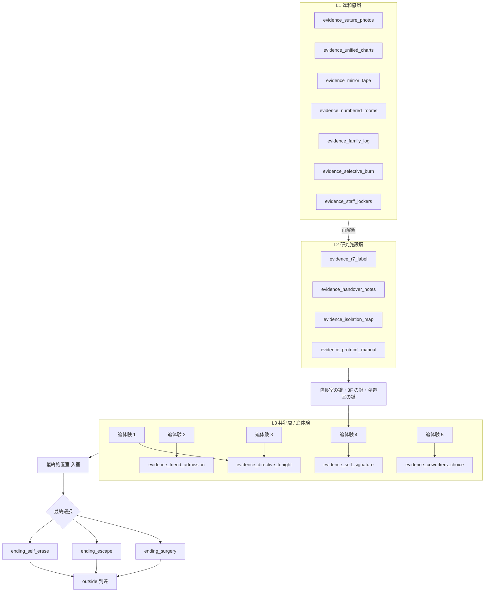

# 実験 01 — フラグ・アイテム・証拠・状態遷移

「どのアクションが何を変えるか」の**意味的な正本**。ID・実装は `data/scenarios/abandoned_hospital.json` を見れば分かるが、**何のためにあるのか**はここを見る。

> 2026-04 全面刷新版。旧フラグ（`read_diary` / `hidden_passage_opened` / `emergency_door_unlocked` 等）と旧アイテム（`rusty_scalpel` / `chemical_reagent` 等）は破棄。

## 1. 証拠（L1〜L3 の層構造）

証拠は**層（Layer）**を持つ。L1 の証拠は単体ではただの違和感だが、**L2 の証拠を 1 つでも握ると L1 の解釈が書き換わる**。これが「捲っていく体験」の本体。

### L1: 違和感層（廃墟の現代パートで収集）

| ID | 物 | 場所 | 単体の解釈 | L2 後の解釈 |
|---|---|---|---|---|
| `evidence_suture_photos` | 患者掲示写真（複数人の側頭部縫合痕） | `ward_reception` | 「古い手術痕のある人が偶然多い」 | 「処置部位の一致 = 全員同じ処置を受けた」 |
| `evidence_unified_charts` | 主訴欄が同筆跡「不明」のカルテ束 | `nurse_station_1f` | 「杜撰な記録」 | 「全員が記憶処置対象」 |
| `evidence_mirror_tape` | リハビリ室の鏡の「あなたの名前は──」 | `rehab_room` | 「奇妙な貼り紙」 | 「再定着訓練用（患者は自分を忘れる）」 |
| `evidence_numbered_rooms` | 番号のみ管理の病室扉 | `isolation_corridor` | 「古い病院にはよくある」 | 「患者を人格単位で扱っていない」 |
| `evidence_family_log` | 面会記録「再定着失敗」「再認不能」 | `meeting_record_shelf` | 「暗号めいた記録」 | 「家族が本人を認識できない状態」 |
| `evidence_selective_burn` | 選択的に焼却された書類棚 | `archive_room` | 「撤収の半端さ」 | 「隠滅対象と非対象の選別」 |
| `evidence_staff_lockers` | 空の職員ロッカー vs 残された患者私物 | `staff_room` | 「急な退職」 | 「撤収の優先順位＝職員のみ脱出」 |

### L2: 研究施設層

| ID | 物 | 場所 | 意味 |
|---|---|---|---|
| `evidence_r7_label` | 薬品棚の「R-7（想起誘導剤）」「パーサ-9（人格安定補助剤）」「リコール-β（記憶再編剤）」 | `pharmacy` | 記憶再編処置の薬剤群 |
| `evidence_handover_notes` | 申し送りノート「再燃前に処置完了」「関係者との接触に注意」 | `nurse_station_2f` | 処置が組織的に運用されていた |
| `evidence_isolation_map` | 区画図、番号と処置段階の対応表 | `isolation_control` | 第三隔離区の実態 |
| `evidence_protocol_manual` | 『再編プロトコル 第三版』 | `directors_office` | 処置が標準化されたプロトコルだった |

### L3: 共犯層（追体験シーンで到達）

| ID | 物 | 取得契機 | 意味 |
|---|---|---|---|
| `evidence_directive_tonight` | 今夜の渡良瀬からの指示「対象者 MJ の再処置準備、最終段階で立ち会い」 | 追体験 1・3 で段階的に完成 | 主人公が今夜の指示を受けていた |
| `evidence_friend_admission` | 澪の搬送カルテ、過去の処置記録と照合済み | 追体験 2 | 澪が以前ここで処置を受けていた事実 |
| `evidence_self_signature` | 過去に主人公自身が押した "処置完了" の判子控え | 追体験 4 | **主人公は見て見ぬふりどころではなく、実際に加担してきた** |
| `evidence_coworkers_choice` | 同僚たちの今夜の去就（樋口: 撤収加担／苅田: 失踪／園田: 「見なかったことにして」） | 追体験 5 | 主人公だけが特別ではない、全員が選択している |

### L4: 明かさない核（本ワールドでは確定させない）

- 主人公（志木）はこの夜の後どうなったか
- 第三隔離区の残存患者たちは救われたか
- 澪が以前目撃した具体的内容（断片だけ残す）
- 澪の姉・真島 透子の治療内容（黒塗り）
- 施設の最初期の実態・久世院長と渡良瀬医師の関係

## 2. ストーリー補強アイテム（ナラティブ層・任意収集）

**主人公デスク**（`nurse_station_1f` の POI）に集約。進行必須ではないが、集めると追体験と最終選択のナラティブが厚くなる。

| ID | カテゴリ | 入手元 | 役割 |
|---|---|---|---|
| `keepsake_diary` | LORE | 主人公デスクの引き出し | 友人との思い出。一部ページが白く抜けている（主人公も処置を受けている示唆） |
| `dusty_photograph` | LORE | 主人公デスクの額 | 澪と二人で笑う写真。裏に「またね」の走り書き |
| `handmade_bookmark` | LORE | 日記に挟まれた栞 | 澪からもらった栞 |
| `shift_memo_old` | LORE | 主人公デスクの古い束 | 「真島さんご家族 面会済み／担当Dr 不在」 |
| `friend_family_record` | LORE | `meeting_record_shelf` の古い来院記録 | 姉・真島 透子の来院記録。主治医欄黒塗り、診療科欄「先進治療」 |

## 3. 鍵・進行アイテム

| ID | カテゴリ | 入手元 | 用途 |
|---|---|---|---|
| `directors_office_key` | KEY_ITEM | 追体験 5 で園田が残した鍵（`staff_room`） | `directors_office` 入室 |
| `third_floor_key` | KEY_ITEM | `directors_office` の金庫 | 2F → 3F の階段扉 |
| `treatment_room_key` | KEY_ITEM | `pharmacy` の薬剤師ロッカー | `treatment_room` 入室 |
| `final_room_key` | KEY_ITEM | `isolation_control` の区画図裏 | `final_room` 入室（ただしフラグ要件もあり） |

> 金庫の暗証番号は `evidence_protocol_manual` に示された症例番号（例: `0307` = C-307）。澪が夢で見ていた病室番号と一致する、という**プレイヤー側の気付き**を設計する。

## 4. フラグ

### 進行フラグ

| flag_name | 立つタイミング | 利用先 |
|---|---|---|
| `flashback_1_completed` | 追体験 1 終了（1F ナースステーション当直表） | — |
| `flashback_2_completed` | 追体験 2 終了（リハビリ室・澪の名札） | — |
| `flashback_3_completed` | 追体験 3 終了（2F ナースステーション申し送り） | — |
| `flashback_4_completed` | 追体験 4 終了（処置室・過去の判子） | — |
| `flashback_5_completed` | 追体験 5 終了（職員休憩室・同僚の去就） | — |
| `flashback_1_5_completed` | 上記 5 つ全て達成 | `final_room` 入室条件 |
| `ending_chosen` | `final_room` で最終選択完了 | `rear_exit` 解錠、`outside` 到達可能 |

### エンディング分岐フラグ

| flag_name | 立つ契機 | 意味 |
|---|---|---|
| `ending_surgery` | 最終選択で「手術」 | 主人公残留、澪は記憶なく退院 |
| `ending_escape` | 最終選択で「逃走」 | 主人公行方不明、澪の記憶は保持 |
| `ending_self_erase` | 最終選択で「自己消去」 | 主人公が記憶処置を受ける、翌朝から通常勤務に戻る |

### ナラティブ フラグ（少女演出・非進行）

| narrative flag | 立つタイミング | 用途 |
|---|---|---|
| `narrative_girl_ward_reception` | `ward_reception` 初回到達 | 少女「……この廊下、知ってる気がする」 |
| `narrative_girl_room_number` | `isolation_corridor` で `C-307` の扉を調べる | 少女、意味不明な既視感を覚える |
| `narrative_girl_family_log` | `friend_family_record` を閲覧 | 少女「姉、ってなんだろう。わたしに姉はいたかな」（記憶がぼやける） |
| `narrative_girl_pronoun_slip` | 追体験 4 の処置室内で発火 | §4 の人称ぶれ台詞（1 回のみ） |
| `narrative_girl_permission` | `outside` 到達時 | エピローグ独白「わたしが忘れていい」（エンディング別に変奏） |

> 実装方針は旧版と同じく、ナラティブ フラグは実装着手フェーズまで JSON には入れない。本ファイルを契約として固定する。

## 5. エンディング 3 分岐

| エンディング | 主人公 | 澪 | 現代廃墟の見え方（振り返り時） | 少女の独白トーン |
|---|---|---|---|---|
| **E-手術** (`ending_surgery`) | 施設に残留、澪に忘れられる。現代廃墟に "最後まで残った誰かの痕跡" として存在 | 数週間後、笑顔で「**本当にお世話になりました**」と退院。振り返らずに去る | 廃墟のまま。ただし 1F ナースステーションだけ**異様に整頓されている** | 「わたしが忘れていい……**それでも**」 |
| **E-逃走** (`ending_escape`) | 裏切り者として追跡対象、行方不明 | 障害は残るが記憶は保持、告発に向かう可能性 | 廃墟のまま、裏口が**開いたまま**風に煽られている | 「忘れなくても、いい」（逆転） |
| **E-自己消去** (`ending_self_erase`) | 自ら記憶処置を受ける、翌朝から通常勤務 | そのまま処置され日常復帰、主人公との関係も消える | 一瞬だけ**稼働中の病院の姿**に見えてから、また廃墟に戻る | 「わたしが……**誰だったんだろう**」 |

### E-手術の決定打カット

数週間後、1F 受付に澪が立っている。退院許可証を受け取りながら:

> 「本当にお世話になりました。ここにいた時のこと、もうほとんど覚えていないんですけど……皆さん、優しくしてくださったんだなって、伝わってきます」

澪は微笑んで歩き去る。振り返らない。主人公は何も言えない。ここがこのエンディングのトーン確定点。

## 6. 進行依存グラフ

## 7. 監査メモ

- ショートカットルート（金庫を飛ばす／裏を見ずに脱出）は**意図的に存在しない**。全プレイヤーが L1〜L3 と追体験を経てから最終選択に至る。
- 主人公デスクのナラティブ アイテムは**任意収集**で、進行に影響しない。集めると最終選択時のテキストが差し替わる（エンディング分岐は変えない）。
- 超自然要素は使わない。追体験の視点切替は「記述技法」として表現する（[lore.md §6](./lore.md)）。
