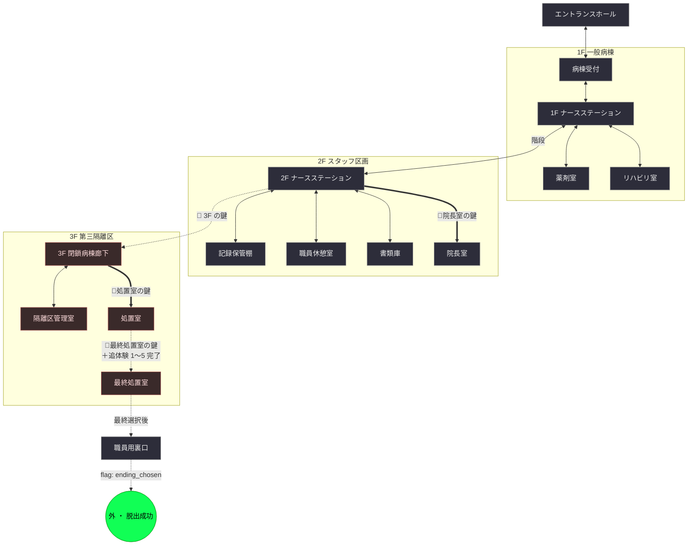
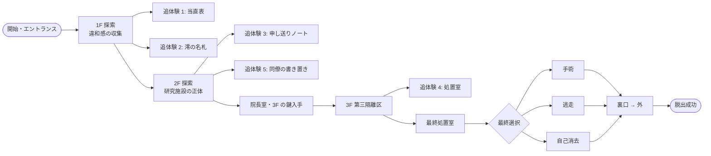

# 実験 01 — マップ（スポット接続と条件）

ランタイム正本: `data/scenarios/abandoned_hospital.json` の `spots[]` / `connections[]`。本ファイルは**論理構造のデザイン正本**で、改変時はまずここで議論し JSON に反映する。

> 本ファイルは 2026-04 の全面刷新版。旧スポット（手術室・院長室・地下室・隠し通路・非常口）は破棄、新たに「静原総合病院」の 1F〜3F と第三隔離区を配置する。

## 1. スポット一覧

### 1F（表向きの一般病棟）

| ID | 名称 | 種別 | 役割 |
|---|---|---|---|
| `entrance_hall` | エントランスホール | OTHER | 開幕。正面入口は崩落で閉塞 |
| `ward_reception` | 病棟受付 | OTHER | `evidence_suture_photos`（掲示写真の縫合痕） |
| `nurse_station_1f` | 1F ナースステーション | OTHER | 中央ハブの一つ。`evidence_unified_charts`。POI: **職員デスク**（記憶の欠落を示す任意証拠の集積点）。追体験シーン 1 の入口 |
| `pharmacy` | 薬剤室 | OTHER | `evidence_r7_label`。処置室の鍵を持つ薬剤師ロッカーあり |
| `rehab_room` | リハビリ室 | OTHER | `evidence_mirror_tape`。追体験シーン 2 の入口 |

### 2F（スタッフ区画）

| ID | 名称 | 種別 | 役割 |
|---|---|---|---|
| `nurse_station_2f` | 2F ナースステーション | OTHER | `evidence_handover_notes`。追体験シーン 3 |
| `meeting_record_shelf` | 記録保管棚 | OTHER | `evidence_family_log` |
| `staff_room` | 職員休憩室 | OTHER | `evidence_staff_lockers`。追体験シーン 5 の入口 |
| `archive_room` | 書類庫 | OTHER | `evidence_selective_burn` |
| `directors_office` | 院長室 | OTHER | `evidence_protocol_manual`。鍵付き |

### 3F（第三隔離区 / 閉鎖）

| ID | 名称 | 種別 | 役割 |
|---|---|---|---|
| `isolation_corridor` | 3F 閉鎖病棟廊下 | DUNGEON | `evidence_numbered_rooms` |
| `isolation_control` | 隔離区管理室 | DUNGEON | `evidence_isolation_map`。処置室への鍵要件 |
| `treatment_room` | 処置室 | DUNGEON | 追体験シーン 4（過去の自分の判子） |
| `final_room` | 最終処置室 | DUNGEON | 追体験シーン 6 の舞台（澪の前に立つ） |

### 脱出

| ID | 名称 | 種別 | 役割 |
|---|---|---|---|
| `rear_exit` | 職員用裏口 | OTHER | 脱出動線。**非常口ではなく裏口**（職員が撤収時に使った動線） |
| `outside` | 外（脱出成功） | FIELD | ゴール |

## 2. 接続マップ（mermaid）

凡例:
- **実線** 通常通行可（双方向 ↔ / 一方向 →）
- **太線 `==`** 鍵・アイテム所持が必要
- **点線 `-.`** 初期は閉鎖。条件達成でフラグが立ち通行可
- `🔑`鍵 / `📖`文書 / `🧪`薬品 / `🔍`証拠

> 補足: 1F → 2F → 3F の**垂直方向への段階的探索**が基本動線。1F は違和感の発見、2F は研究施設の正体を掴む層、3F は追体験で共犯層に到達する層、という**フロアと層構造の一致**を設計の軸にしている。

## 3. 各スポットの POI

| スポット | 区画 | 調査対象（→ 入手物・効果） |
|---|---|---|
| エントランスホール | ロビー / 崩落した正面入口 | 壁の掲示板（閉鎖告知の貼り紙）／ 倒れた案内スタンド |
| 病棟受付 | カウンター / 待合 | 患者掲示写真 → `evidence_suture_photos` ／ 古い雑誌ラック |
| 1F ナースステーション | カウンター / **職員デスク** | カルテ束 → `evidence_unified_charts` ／ 当直表 → 追体験 1 ／ 職員デスク（後述 §3.1） |
| 薬剤室 | 薬品棚 / 薬剤師ロッカー | 薬品ラベル → `evidence_r7_label` ／ ロッカー → 🔑処置室の鍵 |
| リハビリ室 | 鏡の前 / 機材置き場 | 鏡のテープ → `evidence_mirror_tape` ／ 掲示板に澪の名札（追体験 2 発火） |
| 2F ナースステーション | カウンター / 申し送りノート棚 | 申し送りノート → `evidence_handover_notes` ／ 追体験 3 |
| 記録保管棚 | （区画なし） | 面会記録簿 → `evidence_family_log` ／ 古い来院記録 → `friend_family_record` |
| 職員休憩室 | ロッカー / テーブル | 空ロッカー → `evidence_staff_lockers` ／ 同僚の書き置き → 追体験 5 |
| 書類庫 | 焼却痕のある棚 / 未処理の棚 | 選択的焼却痕 → `evidence_selective_burn` |
| 院長室 | 書斎机 / 金庫 | 机上の指示書 → `evidence_protocol_manual` ／ 金庫（3F の鍵） |
| 3F 閉鎖病棟廊下 | （区画なし） | 病室番号に見える剥がれた扉札 → `evidence_numbered_rooms` |
| 隔離区管理室 | 制御パネル / 区画図 | 区画図 → `evidence_isolation_map` ／ 最終処置室の鍵 |
| 処置室 | 処置台 / 器具トレイ | 過去の処置記録 → 追体験 4 ／ 処置完了の判子控え → `evidence_self_signature` |
| 最終処置室 | 処置台（澪が拘束されている） | 最終選択（手術／逃走／自己消去） |
| 職員用裏口 | 鉄扉 | 最終選択後に解錠 |

### 3.1 職員デスク（`nurse_station_1f` 内の POI）

**ストーリー補強用の非違和感系証拠**を集約する場所。進行には必須ではないが、集めると追体験シーンと最終選択のナラティブが厚くなる。

| 調査対象 | 入手物 | 役割 |
|---|---|---|
| 引き出しの日記 | `keepsake_diary` | 友人との思い出、一部ページが白く抜けている（主人公自身も処置を受けている示唆） |
| 埃だらけの額 | `dusty_photograph` | 澪と二人で笑う写真、裏に「またね」の走り書き |
| 挟まれた栞 | `handmade_bookmark` | 澪からもらった栞、日常の残骸 |
| 古い申し送りメモ | `shift_memo_old` | 「真島さんご家族 面会済み／担当Dr 不在」 |
| クリアファイルの控え | `friend_family_record`（同名で記録棚にもある） | 姉・真島 透子の来院記録、主治医欄黒塗り |

## 4. 接続条件表

| connection ID | from → to | 双方向 | 初期通行 | 解除条件 |
|---|---|:---:|:---:|---|
| `entrance_to_ward_reception` | EH ↔ WR | ✓ | ✓ | — |
| `ward_reception_to_nurse_station_1f` | WR ↔ NS1 | ✓ | ✓ | — |
| `nurse_station_1f_to_pharmacy` | NS1 ↔ PH | ✓ | ✓ | — |
| `nurse_station_1f_to_rehab_room` | NS1 ↔ RH | ✓ | ✓ | — |
| `nurse_station_1f_to_nurse_station_2f` | NS1 ↔ NS2 | ✓ | ✓ | 階段（無条件） |
| `nurse_station_2f_to_meeting_record_shelf` | NS2 ↔ MR | ✓ | ✓ | — |
| `nurse_station_2f_to_staff_room` | NS2 ↔ SR | ✓ | ✓ | — |
| `nurse_station_2f_to_archive_room` | NS2 ↔ AR | ✓ | ✓ | — |
| `nurse_station_2f_to_directors_office` | NS2 ↔ DO | ✓ | ✗ | アイテム: `directors_office_key`（院長室の鍵、同僚園田の残した鍵） |
| `nurse_station_2f_to_isolation_corridor` | NS2 ↔ IC | ✓ | ✗ | アイテム: `third_floor_key`（院長室の金庫内） |
| `isolation_corridor_to_isolation_control` | IC ↔ ICT | ✓ | ✓ | — |
| `isolation_corridor_to_treatment_room` | IC ↔ TR | ✓ | ✗ | アイテム: `treatment_room_key`（薬剤師ロッカー内） |
| `treatment_room_to_final_room` | TR ↔ FR | ✓ | ✗ | アイテム: `final_room_key`（隔離区管理室内）＋ フラグ: `flashback_1_5_completed` |
| `final_room_to_rear_exit` | FR → RE | ✗ | ✗ | フラグ: `ending_chosen` |
| `rear_exit_to_outside` | RE → OUT | ✗ | ✗ | フラグ: `ending_chosen` |

## 5. 主要進行ルート

- **最終処置室に入るには追体験 1〜5 を全て通過済みであることが必要**。「裏を見ないまま出る」ルートは存在しない。前バージョンのショート/ロング分岐は廃止。
- 代わりに、**職員デスクの非違和感系証拠**は収集が任意。集めなくてもクリア可能だが、集めると追体験と C-307 の処置分岐のナラティブが厚くなる（ナラティブ層）。
- 3 つのエンディングはどれを選んでも `ending_chosen` フラグが立ち、裏口から外に出られる。選択内容が**現代の廃墟の姿**とエピローグ台詞を変える（[flags_items.md §5](./flags_items.md)）。

## 6. 失敗条件

- `tick_limit = 150` 以内に `outside` へ到達できなければ失敗（建物のさらなる崩落で閉じ込められる）。前版より長めに設定（3F 探索と追体験の分）。

## 7. 接続を改変する際のチェックリスト

- [ ] mermaid と接続条件表を**同時に**更新したか
- [ ] `data/scenarios/abandoned_hospital.json` の `connections[]` も更新したか
- [ ] フラグ名を変えた場合、[flags_items.md](./flags_items.md) と JSON の両方を grep したか
- [ ] `tests/e2e/test_escape_game_puzzle_flow.py` がまだ通るか
