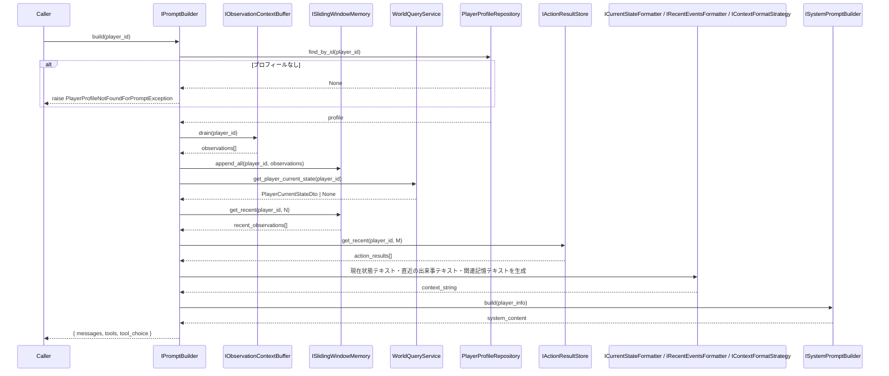
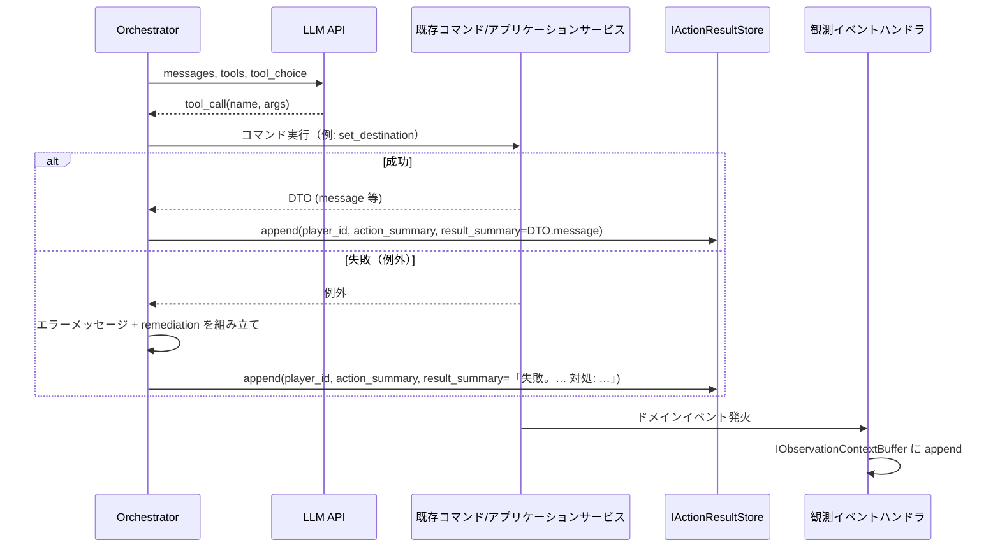

# LLM エージェント向けプロンプト・記憶・行動選択 実装計画

本ドキュメントは、本プロジェクトの**LLM エージェントがゲーム世界で冒険する**ための、プロンプト組み立て・観測・記憶・ツール（行動選択）まわりの実装計画をまとめたものです。議論で決まった仕様と、実装の段階・インターフェース・データフローを漏れなく記載し、今後の改善の土台とします。

---

## 1. 全体アーキテクチャとレイヤー

```
[ ゲーム世界 ] ドメイン + アプリケーション（WorldQuery, Observation ハンドラ, Movement, 各種 Command 実行）
        ↓ イベント発行 / クエリ
[ 観測・状態取得 ]
  - 観測バッファ（IObservationContextBuffer）: イベント由来の観測を drain
  - WorldQueryService: get_player_current_state 等
  - （将来）プレイヤー関連クエリとワールド関連クエリの分離を検討
        ↓
[ 表示・記憶層 ]  ← LLM 向け「UI」に相当
  - 記憶: SlidingWindowMemory, IActionResultStore, （将来）長期記憶
  - コンテキストフォーマット: IContextFormatStrategy（案A / 案B 差し替え可能）
  - プロンプト組み立て: ISystemPromptBuilder, IPromptBuilder
  - 利用可能ツール列挙: IAvailableToolsProvider
        ↓ messages + tools（OpenAI 互換辞書）
[ エージェント層 ]
  - LLM API 呼び出し（シングルターン）
  - 応答の tool_calls をコマンドに変換してゲーム世界で実行
  - 実行結果（成功/失敗）を行動結果として記録し、次ターンの観測・プロンプトに統合
```

- **シングルターン**: LLM には毎回「システム + ユーザー（コンテキスト＋行動選択の説明）」と `tools` を送り、1 回の応答で tool_call を受け取る。過去のマルチターン履歴は「直近の出来事」としてコンテキストに含まれる。
- **出力形式**: OpenAI API 互換の辞書（`messages`, `tools`, `tool_choice`）で渡し、同形式をサポートする任意の LLM で利用可能にする。

---

## 2. LLM 出力の受信と「行動・結果」の観測への統合（重要フロー）

「人間用 UI のテキストボックス／キーボード」に相当するのが、**LLM にプロンプトとツールを送り、返キャッチする層**です。ここで「どんな行動をしたか」と「その結果」を観測として統合します。

### 2.1 フロー概要

1. **プロンプト送信**: 表示・記憶層で組み立てた `messages` と `tools` を LLM API に送信する（`tool_choice: "required"` でツール呼び出しを必須とする）。
2. **LLM 応答**: 1 つの `tool_call`（ツール名 + 引数）が返ってくる想定。
3. **コマンド実行**: オーケストレータが tool_call を既存のコマンド（例: `SetDestinationCommand`）にマッピングし、対応するアプリケーションサービス（例: `MovementService.set_destination`）を呼び出す。
4. **結果の取得**:
   - **成功時**: コマンドが返す DTO（例: `MoveResultDto`）の `message` 等を「結果の要約」とする。
   - **失敗時**: 例外を捕捉し、**エラーメッセージと対処法（remediation）** を組み立てて「結果の要約」とする。LLM がエラーを元に次の行動を修正できるよう、観測として適切に伝える。
5. **行動・結果の記録**: 「どのツールをどの引数で呼んだか」の要約（行動）と、上記の「結果の要約」を **IActionResultStore** に 1 件追加する。これが「直近の出来事」の「あなたの行動 → 結果」として次ターンにプロンプトに載る。
6. **イベント駆動の観測**: コマンド実行によりドメインイベント（例: `GatewayTriggeredEvent`, `PlayerLocationChangedEvent`）が発火し、既存の観測パイプライン（ObservationRecipientResolver → Formatter → IObservationContextBuffer）によって、該当プレイヤー用バッファに観測が **append** される。これらは次のターンで drain され、スライディングウィンドウ記憶に渡され、「直近の出来事」の「環境・他プレイヤー」側の記述になる。
7. **次ターンでの統合**: プロンプト組み立て時に、「直近の出来事」＝ スライディングウィンドウの観測（イベント由来）＋ IActionResultStore の直近 N 件（行動→結果）を **時刻でマージ** し、新しい順で 1 本のリストとしてコンテキストに載せる。これにより「自分が何をしたかとその結果」と「周囲で起きたこと」が時系列で LLM に伝わる。

### 2.2 失敗時の観測としての扱い

- ツール実行が例外で失敗した場合、**その失敗も「結果」として IActionResultStore に記録**する。
- 結果テキストには **エラー内容** と **対処のヒント（remediation）** を含める（例: 「移動に失敗しました。現在地にいるか、目的地が接続されているか確認してください」）。アプリケーション例外からメッセージと remediation を生成する仕組み（既存の ApplicationException やドキュメントの方針）に合わせて実装する。
- これにより、次ターンの「直近の出来事」に「あなたは ○○ した → 結果: 失敗。△△。対処: □□」と出るので、LLM が次の行動を修正できる。

### 2.3 まとめ（この節の要点）

- **LLM 用 UI** = プロンプト＋ツールを送り、tool_call を受け取るオーケストレータまでを含む「表示・記憶層」＋「エージェント層」の境界。
- **行動**: オーケストレータが tool_call をコマンドに変換して実行した「事実」を、要約して **IActionResultStore** に保存。
- **結果**: コマンドの戻り DTO の message、または例外時のエラーメッセージ＋remediation を **IActionResultStore** の「結果」として保存。
- **観測との統合**: イベント由来の観測は従来どおり **IObservationContextBuffer** に蓄積され、drain 後にスライディングウィンドウ記憶に入る。「直近の出来事」は **観測（スライディングウィンドウ）＋ 行動結果（IActionResultStore）** を時刻でマージした 1 本の時系列としてプロンプトに載せる。

---

## 3. プロンプト構成とフォーマット差し替え

### 3.1 送信するメッセージ構成

- **system**: システムプロンプト（プレイヤー名・基本情報・ゲーム説明・ルール・出力形式）。ゲーム仕様が固まり切っていない現状では、テンプレートの初版を用意する。
- **user**: コンテキスト（現在の状況・直近の出来事・関連する記憶）＋ 行動選択の説明。1 ターンに 1 本。

### 3.2 コンテキストのフォーマット差し替え（案A / 案B）

- **IContextFormatStrategy**: 現在状態テキスト・直近の出来事（観測＋行動結果のリスト）・関連記憶テキストを入力に取り、**1 本のコンテキスト文字列** を返すインターフェース。実装を差し替えることで、異なる「書き方」に対応する。
- **案A（デフォルト）**: セクション見出し形式。
  - `## 現在の状況` → 現在状態テキスト
  - `## 直近の出来事（新しい順）` → 観測・行動結果を時系列で箇条書き
  - `## 関連する記憶` → 長期記憶（Phase 1 では空）
- **案B**: タグ付きブロック形式（XML 風）。
  - `<current_state>`, `<recent_events>`, `<relevant_memories>` で囲む。
- 初版実装では **案A をデフォルト** とし、案B は別実装で差し替え可能にする。

### 3.3 行動選択の説明

- ユーザー content の末尾に「利用可能なツールで次の行動を選んでください」に相当する短文を付与する。この文言は **差し替え可能**（設定またはテンプレート）とする。

---

## 4. システムプロンプト

### 4.1 役割

- ゲーム内で**ほぼ不変**な情報を渡す: プレイヤー名・基本情報・ゲーム説明・役割・出力形式。
- ドメイン層の変更で項目が増えても、テンプレートのプレースホルダを増やすだけで対応できるようにする。

### 4.2 初版テンプレート（ゲーム仕様未確定のため最小構成）

ゲームエンジン的な段階のため、以下のような初版を想定する。

```text
あなたはMMO RPGの冒険者「{{player_name}}」です。
{{game_description}}

【基本情報】
役職: {{role}} / 種族: {{race}} / 属性: {{element}}

【ルール】
- ゲーム世界と相互作用する唯一の手段は、提供されるツール（関数）の呼び出しです。必ずいずれか1つのツールを呼び出して行動してください。
- 現在の状況と直近の出来事を踏まえ、次に取る行動を1つ選び、対応するツールを呼び出してください。
- 行動に失敗した場合は、エラー内容と対処のヒントが「直近の出来事」に含まれます。それを参考に別の行動を選ぶことができます。
```

- **プレースホルダ**: `player_name`, `game_description`, `role`, `race`, `element`。`game_description` は空または短い説明文でよい。
- **ISystemPromptBuilder**: 入力 DTO（プレイヤー名・role・race・element・game_description 等）を受け取り、上記テンプレートを適用してシステムプロンプト文字列を返す。入力は PlayerProfile 等から取得する（プレイヤー関連クエリでまとめて取得する構成も可）。

---

## 5. ツール（行動選択）と失敗処理

### 5.1 ツール呼び出しを必須とする

- ゲーム世界と相互作用する**唯一の手段**はツール呼び出しとする。したがって **tool_choice: "required"** とする。
- 利用可能ツールが 0 になることは想定しないが、**「何もしない」ツール**（ゲーム内で何も起きない）を必ず 1 つ含め、何もしたくない場合に選択できるようにする。

### 5.2 失敗時の処理

- ツール実行が例外で失敗した場合:
  - 例外を捕捉し、**エラーメッセージ** と **対処法（remediation）** を組み立てる。
  - これを **IActionResultStore** の「結果」として記録する（「あなたは ○○ した → 結果: 失敗。△△。対処: □□」）。
  - 既存の ApplicationException 等でメッセージや error_code を持っている場合は、それに応じた remediation をマッピングする仕組みを用意する。LLM はこの観測を次のターンで読み、行動を修正できる。

### 5.3 利用可能ツールの列挙（ドラフト）

- **IAvailableToolsProvider**: 現在の状況（例: ToolAvailabilityContext）を入力に、その状況で利用可能なツールだけを **OpenAI の tools 形式**（`type: "function"`, `function: { name, description, parameters }`）で返す。
- **IGameToolRegistry**: 全ツールの定義（名前・説明・parameters スキーマ・availability 判定の参照）を保持する。ツール追加時はここに 1 件追加し、対応する **IAvailabilityResolver** を登録する。
- **IAvailabilityResolver**: ツールごとに「このコンテキストでこのツールを提示するか」を判定する。入力は **ToolAvailabilityContext**（現在地・接続先・視界内オブジェクト・インベントリ要約など、判定に必要な最小限の情報）。
- **ツールスキーマ**: まずは**コード内**で定義する。後に YAML/JSON 等で外部化する予定であり、実装時はレジストリやツール定義の読み込み部分を差し替え可能にしておく。
- 既存コマンド（SetDestinationCommand, MoveTileCommand, ChangeAttentionLevelCommand, チェスト・設置物関連など）と 1:1 でツールを用意し、動的に「今使えるもの」だけを返すことで、ツール数过多を防ぐ。

### 5.4 目的地設定（set_destination）とティック移動（tick_movement）を分ける利点

現在の仕様では、**set_destination**（目的地・経路の設定）と **tick_movement**（経路に沿った 1 ステップ実行）が別ツールとして分かれている。この分離の利点は以下のとおりである。

- **ゲームループとの整合**: 実際の移動はゲームのティック（時間経過）に合わせて行うため、LLM が「目的地を決める」ことと「1 マス進む」ことを同一の API で扱うと、1 回の応答で複数マス進む・進まないの制御が難しくなる。経路を先に設定し、ティックごとに tick_movement で進めることで、シミュレーション側の進行と一致する。
- **失敗の局所化**: 経路設定時の失敗（接続先なし・条件不達など）と、移動実行時の失敗（スタミナ切れ・ブロックなど）を区別できる。LLM は「直近の出来事」で「目的地を設定した → 結果: 成功」と「その後 tick で進もうとした → 結果: 失敗」を別々に受け取り、次の行動を選びやすい。
- **将来の変更に強い**: のちに「1 回のツールで目的地まで一気に移動」する仕様に変える場合でも、set_destination の意味を「目的地まで移動を開始する」に拡張するか、新ツールを追加するだけで済む。内部の経路計算・ティック進行はそのまま利用できる。

一方で、プレイヤー体験としては「どこかへ行く」が 2 段階（設定＋進行）に分かれるため、後から「移動は 1 ツールにまとめる」などの仕様変更を検討する余地はある。

---

## 6. インターフェース一覧（差し替え可能にすべきもの）

以下は実装を差し替え可能にするため、ポートとして定義する。

### 6.1 表示・記憶層

| インターフェース | 役割 |
|------------------|------|
| **IContextFormatStrategy** | 現在状態・直近の出来事・関連記憶を 1 本のコンテキスト文字列にフォーマット（案A/案B 等）。 |
| **ISystemPromptBuilder** | プレイヤー情報等の DTO からシステムプロンプト文字列を生成。 |
| **IPromptBuilder** | システム・ユーザー（コンテキスト＋行動選択の説明）を組み立て、OpenAI 互換の `messages` を返す。必要に応じて tools 情報の組み立ても依頼。 |
| **ISlidingWindowMemory** | 観測を append し、直近 N 件を get_recent で返す。 |
| **IActionResultStore** | 行動要約＋結果要約を append し、直近 N 件を get_recent で返す。 |
| **IObservationContextBuffer** | 既存。観測の受信箱。drain で取得。 |

### 6.2 ツール・行動選択

| インターフェース | 役割 |
|------------------|------|
| **IAvailableToolsProvider** | 現在状況から利用可能なツールのリスト（OpenAI tools 形式）を返す。 |
| **IGameToolRegistry** | 全ツール定義の登録・取得。 |
| **IAvailabilityResolver** | あるツールが現在のコンテキストで利用可能かどうかを判定。 |

### 6.3 現在状態・直近の出来事のテキスト化

| インターフェース | 役割 |
|------------------|------|
| **ICurrentStateFormatter** | PlayerCurrentStateDto → 現在状態のプロンプト用テキスト。 |
| **IRecentEventsFormatter** | 観測リスト＋行動結果リストを「直近の出来事」のテキスト（案A/案B に依存しない中間形式でも可）に変換。IContextFormatStrategy がこれを利用するか、直近イベントのリストを渡してフォーマット戦略側で文字列化するかは実装次第。 |

### 6.4 将来の長期記憶

| インターフェース | 役割 |
|------------------|------|
| **ILongTermMemoryStore** | 長期記憶の格納・検索（セマンティック／論理検索）。 |
| **IContextRelevantMemoryRetriever** | 現在コンテキストに適合する長期記憶をルールベースで取得（ツールを自動で呼ぶフェーズ用）。 |

---

## 7. データフロー（1 ターン分）

1. **事前準備（表示・記憶層）**
   - WorldQueryService.get_player_current_state(player_id) → PlayerCurrentStateDto
   - 観測バッファを drain(player_id) → 取得した観測を SlidingWindowMemory に append
   - SlidingWindowMemory.get_recent(player_id, N) と IActionResultStore.get_recent(player_id, M) を取得し、時刻でマージして「直近の出来事」リストを構成
   - ICurrentStateFormatter で現在状態テキスト、IRecentEventsFormatter（または IContextFormatStrategy 内）で直近の出来事テキストを生成。Phase 1 では関連記憶は空。
   - IContextFormatStrategy でコンテキスト 1 本の文字列に（案A または案B）
   - ISystemPromptBuilder でシステムプロンプト文字列を生成（プレイヤー情報は PlayerProfile 等から取得）
   - IAvailableToolsProvider で現在の利用可能ツールリストを取得
   - IPromptBuilder で messages（system + user）を組み立て。user content = コンテキスト文字列 + 行動選択の説明（差し替え可能な文言）
   - 出力: OpenAI 互換の辞書（messages, tools, tool_choice: "required"）

2. **エージェント層**
   - 上記辞書を LLM API に送信
   - 応答から tool_call を 1 つ取得

3. **コマンド実行と結果の統合**
   - tool_call をコマンドにマッピングして実行。成功時は DTO の message、失敗時はエラーメッセージ＋remediation を結果要約とする
   - IActionResultStore.append(player_id, action_summary, result_summary)
   - コマンド実行で発火したドメインイベントは、既存の観測ハンドラにより IObservationContextBuffer に append される（次ターンで drain され、スライディングウィンドウに入る）

---

## 8. 実装フェーズ

### Phase 1: スライディングウィンドウ＋プロンプト組み立て（関連記憶なし）

- ICurrentStateFormatter, IContextFormatStrategy（案A 実装）, ISystemPromptBuilder（初版テンプレート）, IPromptBuilder を定義・実装。
- ISlidingWindowMemory を定義・実装。観測バッファの drain 結果をここに append するフックを用意。
- 「直近の出来事」は観測のみ（行動結果はまだなし）。関連する記憶は空。
- OpenAI 互換のリクエスト辞書を組み立てるまで。LLM 呼び出し・ツール実行は別タスクでも可。

### Phase 2: 行動・結果の記録とプロンプトへの統合

- IActionResultStore を定義・実装。
- オーケストレータでツール実行後に action_summary / result_summary を IActionResultStore に append。失敗時はエラーメッセージ＋remediation を result_summary に。
- IRecentEventsFormatter（または IContextFormatStrategy の入力）で「観測リスト＋行動結果リスト」を扱い、時刻でマージして「直近の出来事」に含める。

### Phase 3: ツール列挙とツール実行の接続

- IGameToolRegistry, IAvailabilityResolver, IAvailableToolsProvider, ToolAvailabilityContext を定義・実装。ツールスキーマはコード内で定義。
- 「何もしない」ツールを必ず含める。
- オーケストレータで tool_call → コマンド実行 → IActionResultStore への記録までを一連で実装。失敗時の観測（エラー＋remediation）を確実に記録。

### Phase 4: ルールベースの長期記憶（任意）

- ILongTermMemoryStore, IContextRelevantMemoryRetriever を定義。現在コンテキストに適合する長期記憶を裏で取得し、コンテキストの「関連する記憶」に載せる。Phase 1 ではここは未実装でよい。

### Phase 5: 記憶の高度化・ツール化（将来）

- セマンティック／論理検索、記憶生成（行動＋観測からエピソード／エンティティを生成）、ツールによる記憶操作の露出。別計画で記載。

---

## 9. 配置・クエリの整理

- システムプロンプト用のプレイヤー情報（名前・role・race・element）は、既存の **PlayerProfileRepository** および **WorldQueryService** 等から取得する想定でよい。
- 綺麗な実装として、**プレイヤー関連のクエリ**（プロフィール・ステータス要約など）と **ワールド関連のクエリ**（現在地・スポット・視界・移動先など）を分離することも検討する。その場合でも、IPromptBuilder が両方の結果を組み合わせてプロンプトに載せる形にすればよい。

---

## 10. 参照ドキュメント

- `docs/domain_events_observation_spec.md` — 観測対象イベントと配信先・観測内容
- `docs/observation_implementation_plans.md` — 観測まわり実装計画
- `docs/world_query_status_and_llm_context_design.md` — WorldQuery と LLM コンテキスト設計

---

## 11. 要点まとめ: LLM 出力の受信と「行動・結果」の観測統合

実装計画を書く際に参照しやすいよう、この部分の流れだけ簡潔にまとめる。

- **LLM 用 UI**  
  プロンプト（システム＋ユーザー）と `tools` を送り、1 回の応答で `tool_call` を受け取るまでの層。オーケストレータが「送信 → 応答受信 → コマンド実行 → 結果記録」を担う。

- **受信後の処理**  
  1. オーケストレータが `tool_call` を既存のコマンドにマッピングして実行する。  
  2. 成功時は DTO の message、失敗時は例外から「エラーメッセージ＋対処法」を組み立てる。  
  3. 「何をしたか」（行動要約）と「どうなったか」（結果要約）を **IActionResultStore** に 1 件 append する。  
  4. コマンド実行で発火したドメインイベントは、既存の観測パイプラインで **IObservationContextBuffer** に append される（次ターンで drain → スライディングウィンドウへ）。

- **観測としての統合**  
  - **行動とその結果**: IActionResultStore に保存した「行動→結果」が、次ターンの「直近の出来事」に含まれる（時刻で観測とマージ）。  
  - **周囲の出来事**: イベント由来の観測はバッファ → drain → スライディングウィンドウに入り、同じ「直近の出来事」に時刻順で並ぶ。  
  これで「自分がやったことと結果」と「周囲で起きたこと」が一つの時系列として LLM に渡る。

---

## 12. 実装状況（追記）

以下の実装を `application/llm/` に配置した。

| 項目 | 配置 | 備考 |
|------|------|------|
| **契約（interfaces / dtos）** | `application/llm/contracts/` | ICurrentStateFormatter, IRecentEventsFormatter, IContextFormatStrategy, ISystemPromptBuilder, IPromptBuilder, ISlidingWindowMemory, IActionResultStore, IAvailabilityResolver, IGameToolRegistry, IAvailableToolsProvider, ILLMClient。SystemPromptPlayerInfoDto, ActionResultEntry, LlmCommandResultDto, ToolDefinitionDto。ToolAvailabilityContext は PlayerCurrentStateDto を利用。 |
| **ツール名プレフィックス** | `application/llm/tool_constants.py` | TOOL_NAME_PREFIX_WORLD, TOOL_NAME_PREFIX_MOVE, TOOL_NAME_PREFIXES, TOOL_NAME_NO_OP, TOOL_NAME_SET_DESTINATION。 |
| **スライディングウィンドウ** | `application/llm/services/sliding_window_memory.py` | DefaultSlidingWindowMemory（in-memory）。観測の append / append_all / get_recent。 |
| **行動結果ストア** | `application/llm/services/action_result_store.py` | DefaultActionResultStore（in-memory）。 |
| **フォーマッタ・戦略** | `application/llm/services/` | DefaultCurrentStateFormatter, DefaultRecentEventsFormatter, SectionBasedContextFormatStrategy（案A）。 |
| **システムプロンプト・プロンプト組み立て** | `application/llm/services/` | DefaultSystemPromptBuilder（初版テンプレート）, DefaultPromptBuilder。drain → SlidingWindow への append は DefaultPromptBuilder.build() 内で実施。IAvailableToolsProvider で tools を取得し返り辞書に含める。 |
| **ツール・オーケストレータ** | `application/llm/services/` | DefaultGameToolRegistry, NoOpAvailabilityResolver, SetDestinationAvailabilityResolver, DefaultAvailableToolsProvider, tool_definitions（register_default_tools）, ToolCommandMapper, LlmAgentOrchestrator。StubLlmClient（テスト用）。 |
| **結果標準化** | `application/llm/` | LlmCommandResultDto（成功/失敗＋message, error_code, remediation）, result_summary_builder.build_result_summary。 |
| **失敗時 remediation** | `application/llm/remediation_mapping.py` | error_code → 対処法のマッピング。MOVEMENT_INVALID, GATEWAY_*, UNKNOWN_TOOL 等を追加。 |
| **例外** | `application/llm/exceptions/` | LlmApplicationException, PlayerProfileNotFoundForPromptException。 |

- **Phase 1**: 上記のうち、プロンプト組み立て・スライディングウィンドウ・コンテキスト（案A）・現在状態／直近の出来事フォーマットまで実装済み。直近の出来事には観測に加え IActionResultStore の行動結果を時刻でマージして含めている。
- **Phase 2**: IActionResultStore および直近の出来事への統合（IRecentEventsFormatter で観測＋行動結果をマージ）まで実装済み。
- **Phase 3**: 実装済み。IGameToolRegistry, IAvailabilityResolver, IAvailableToolsProvider（ToolAvailabilityContext = PlayerCurrentStateDto）, ILLMClient, ツール定義（world_no_op, move_set_destination）, ToolCommandMapper（ツール名→コマンド実行→LlmCommandResultDto）, LlmAgentOrchestrator（build → invoke → execute → IActionResultStore.append）。DefaultPromptBuilder は IAvailableToolsProvider で tools を組み立て。実際の LLM API 呼び出しは ILLMClient の実装（インフラ層）で差し替え可能。

---

## 13. 処理フロー（Mermaid）

### 1 ターン分のプロンプト組み立て〜ツール実行までの流れ（目標形）



### オーケストレータでのツール実行〜結果記録（Phase 3 実装時の流れ）



---

## 14. ティック・時間まわりの整理

### 14.1 時間の二層

- **シミュレーション時間（tick）**: 世界の進行単位。移動・スキルなどは「何ティックかかるか」で表現する（例: `busy_until_tick`）。LLM の呼び出し頻度とは独立である。
- **意思決定のタイミング**: 「いつ run_turn を実行するか」は tick とは無関係に、**駆動条件**（イベント駆動 or 定期）で決める。

### 14.2 駆動条件

- **イベント駆動**: 当該プレイヤー向けの観測が発生したとき、そのプレイヤーについて run_turn を 1 回実行する。対象 LLM が駆動される。
- **定期**: 観測が長くない場合でも、定期的に run_turn を実行する仕組みをいずれ整える。

### 14.3 ツールとティック

- 各ツールはゲーム内で「0 ティックで終わる」か「N ティックかけて実行される」かのいずれかで表現する。
- LLM 呼び出しの頻度は「1 tick ごと」ではなく、上記駆動条件に従う。ツールが何ティックかかるかはシミュレーション側の事実として扱う。

### 14.4 レスポンス待ちのあいだに観測が届く場合（スナップショットで確定）

- 1 プレイヤーあたり、同時に 1 本の LLM リクエストを飛ばす。
- プロンプトは**送信時点で drain した観測**で組み立てる（スナップショット）。返ってきた tool_call はそのまま実行する。その後に届いた観測は**次の run_turn** のプロンプトに含める。
- 応答が一定時間返ってこない場合はタイムアウトとし、次のトリガーで改めて run_turn する。行動は前のコンテキストに基づいていても許容する。

### 14.5 ツール実行中（複数ティック）に観測が届く場合

- **原則**: 現在のアクションが完了するまで、そのプレイヤーの新たな run_turn は発火しない。実行中に届いた観測はバッファに蓄積し、アクション完了後にトリガーされる run_turn のプロンプトに含める。
- **割り込み**: リアルタイム性を要求する観測（友達に話しかけられた・探していたアイテムを発見・ダメージを受けた等）が届いた場合は、**現在の行動を中断**する。経路をキャンセルし、「行動が中断されたこと」とその観測を IActionResultStore に記録してから、改めて run_turn を実行し LLM に渡す。観測の `causes_interrupt` と PlayerCurrentStateDto の `is_busy` で判定し、LlmAgentTurnRunner が割り込み処理と run_turn を一括して行う。

---

*本ドキュメントは、LLM エージェントのプロンプト・記憶・行動選択まわりの実装と改善のための正規の計画として維持してください。*
