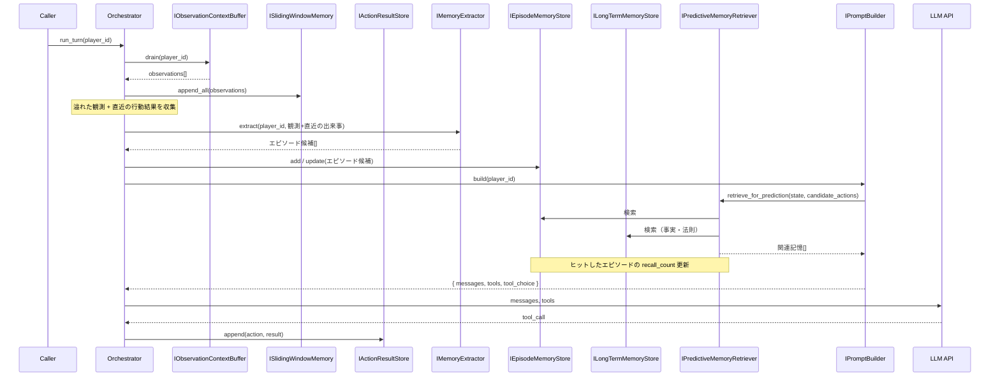
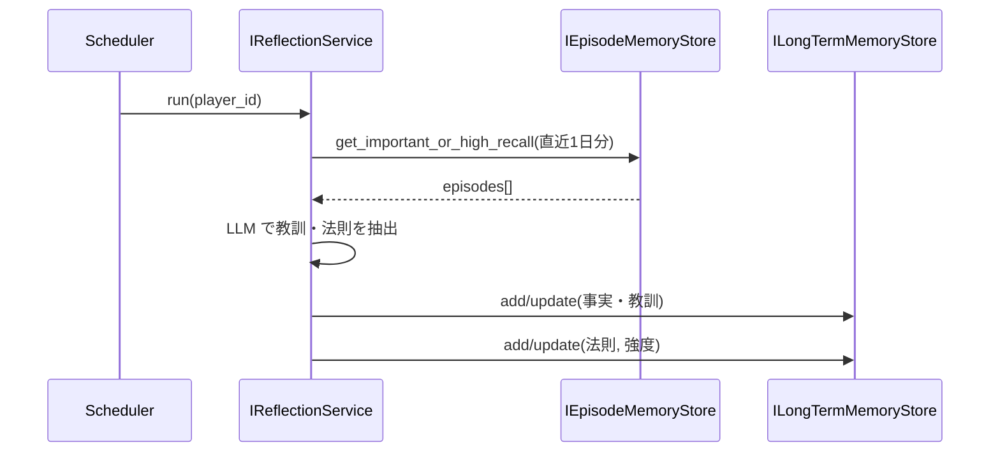

# 記憶モジュール実装計画（Phase 4 / Phase 5）

本ドキュメントは、LLM エージェント向けの**長期記憶・エピソード記憶・予測志向の記憶**まわりの実装計画をまとめたものです。`docs/llm_agent_prompt_and_memory_implementation_plan.md` の Phase 4 / Phase 5 を具体化し、議論で決まった設計方針・インターフェース・データフロー・学習の仕組みを漏れなく記載します。

---

## 1. 概要と設計原理

### 1.1 目的

- **現在のコンテキスト**（観測・現在状態）に対して、**関連する記憶**（エピソード・長期記憶）を取得し、プロンプトの「関連する記憶」に載せる。
- **観測が発生するたび**に、非同期ではなく **LLM が 1 回行動するタイミング（run_turn）で 1 回**、記憶抽出を行い、エピソード記憶・長期記憶へ追加する（コスト抑制）。
- **学習する記憶**：共起・因果を学習し、**行動の結果を予測**して適切な行動選択に役立てる。Phase 5 では記憶の読み書きをツールで露出し、予測に基づく高度な推論（例：HP が少ないときにチェストを開けた過去の結果を想起し、回復アイテムの可能性を踏まえて開ける）を可能にする。

### 1.2 設計原理：予測誤差最小化

記憶モジュールの目的関数を **「先の未来をなるべく予測できるようにする」＝予測誤差の最小化** とする。

- **蓄積**: 将来の予測に効く情報（共起・因果・行動–結果）を残す。
- **検索**: 現在の状態と**候補行動**に対して「結果を予測するのに役立つ記憶」を返す。
- **学習**: エピソードから法則性（「A をしたら B になりやすい」）を抽出し、長期記憶として更新する。

これにより、**チェストを開ける → お宝／罠** のような法則性や因果をメモリが学習し、行動結果の予測と意思決定の質を高める。

---

## 2. 記憶の種類と役割

### 2.1 エピソード記憶と長期記憶の区別

| 軸 | エピソード記憶 | 長期記憶 |
|----|----------------|----------|
| **粒度** | 1 回の体験・イベント（いつ・どこで・誰が・何をした・どうなったか） | 複数エピソードから抽象化した**事実・教訓**と、**法則・共起**（主体–関係–対象） |
| **時系列** | 日時・tick に紐づく | 時系列は弱い（「〇〇は△△である」のような事実／法則） |
| **更新** | 基本的に追加のみ（重複はマージ可） | 同じ主題は UPDATE／統合。法則は強度・カウントで更新。 |
| **検索** | 「この場所／NPC／クエスト／行動に関連する体験」 | 「この状況で役立つ一般則・関係性・傾向」 |

### 2.2 エピソード記憶の定義とソース

- **ソース**: **スライディングウィンドウから溢れた観測**を保存する。すなわち、`get_recent(N)` で返さなくなった観測（およびそのターンで取った行動と結果）を 1 エピソード単位で蓄積する。
- **保存単位**: 1 ターン分の「観測＋そのターンの行動結果」をまとめて **1 エピソード** とする。これにより（状況, 行動, 結果）が揃い、予測用の検索がしやすい。
- **構造**: 各エピソードは少なくとも次の情報を持つ（記憶抽出 LLM またはルールで生成）。
  - `context_summary`: そのときの状況要約
  - `action_taken`: 取った行動（ツール名または要約）
  - `outcome_summary`: 結果の要約
  - `entity_ids` / `location_id` 等: 関与したエンティティ（検索インデックス用）
  - `timestamp`: 発生日時
  - `importance`: 静的重要度（low / medium / high）。記憶抽出 LLM が付与。
  - `surprise`: 予測外れだったか（オプション）。例外や「いつもと違う結果」をタグ付けし、学習で優先する。

### 2.3 エピソード記憶の重要度

- **静的重要度**: 記憶抽出 LLM が `importance` を付与（戦闘・クエスト完了・初遭遇などは高め）。
- **動的重要度（想起ベース）**: 検索でヒットするたびに **想起回数** を加算（または `last_recalled_at` を更新）。「よく参照される ＝ 予測に効く」とみなし、長期記憶への昇格や Reflection の入力に優先する。
- **サプライズ**: 期待と違った結果だったエピソードを重要とみなし、Reflection や長期記憶の更新で優先する。

### 2.4 長期記憶の二層

長期記憶を **2 層** に分ける。

| 層 | 内容 | 例 |
|----|------|-----|
| **事実・教訓** | 抽象化された事実、教訓、傾向の自然文 | 「〇〇の洞窟ではモンスターが強かった」「△△の NPC はクエストをくれる」 |
| **法則・共起** | （主体, 関係, 対象）＋強度／頻度。連想記憶のモデル化。 | （チェスト, 開けると_しばしば, 回復アイテム）, （チェスト, 開けると_たまに, 罠）, （洞窟の奥, 行くと_よく, 強敵） |

- **事実・教訓**: Reflection や「よく想起されたエピソードの昇格」で、要約・一般化して ADD/UPDATE（Mem0 の update と同様）。
- **法則・共起**: 複数エピソードから繰り返し現れる（行動/文脈, 結果）パターンを抽出し、**強度** または **経験回数** で更新。矛盾する結果が来たら既存法則を弱めるか、別の辺を追加する。

---

## 3. 記憶抽出（Extraction）

### 3.1 実行タイミング（コスト対策）

- **LLM が invoke される時（＝ 1 回行動する際）に 1 回だけ** 記憶抽出を行う。観測イベントごとには行わない。
- つまり **run_turn** の流れのなかで、プロンプト組み立て前またはコマンド実行後に、そのターンで drain した観測と直近の行動結果を入力に記憶抽出を実行する。

### 3.2 記憶抽出の二つの意味

| 用語 | 意味 |
|------|------|
| **記憶の抽出（extraction）** | 観測テキスト（＋直近の出来事）から「記憶すべき事実・エピソード」を LLM で構造化して取り出す処理。Mem0 の extraction phase に相当。 |
| **長期記憶への昇格（promotion / consolidation）** | 既存のエピソードのうち「重要で再利用価値が高い」ものを要約・一般化して長期記憶に書き足す処理。Reflection や閾値ベースで実施。 |

### 3.3 抽出パイプライン（Mem0 を参考）

参照: [Mem0: Building Production-Ready AI Agents with Scalable Long-Term Memory](https://arxiv.org/pdf/2504.19413)

- **入力**: そのターンで drain した観測 ＋ 直近のスライディングウィンドウ（または直近数件のエピソード）＋ そのターンの行動と結果。必要に応じて「現在状態の短い要約」を含める。
- **Extraction**: 専用 LLM に上記を渡し、次のような構造で出力させる。
  - **エピソード候補**: `(context_summary, action_taken, outcome_summary, entity_ids, importance, surprise?)`
  - **エンティティメモ**（任意）: `(entity_kind, name_or_id, facts[])`。NPC・場所・アイテムなどの固有事実。
- **Update**: 抽出された候補を既存のエピソード／長期記憶と比較し、**ADD / UPDATE / DELETE / NOOP** のいずれかを LLM に選ばせる（Mem0 の update phase）。重複は統合、矛盾は DELETE してから ADD。
- **保存**: エピソード候補は **IEpisodeMemoryStore** に、長期記憶候補は **ILongTermMemoryStore** に反映する。

### 3.4 記憶抽出用 LLM のプロンプト設計の要点

- **役割と制約**: 「ゲーム内の観測ログから、記憶に残すべきエピソードとエンティティ情報だけを抽出する。推測や創作はしない。」
- **出力形式**: JSON Schema を固定し、必須フィールド（`context_summary`, `action_taken`, `outcome_summary`, `importance` など）を明示する。
- **重要度**: エピソードに `importance`（low / medium / high）を持たせ、Reflection では high / medium を優先する。
- **重複抑制**: 「既に同じ内容が記憶にありそうな場合は新規エピソードを出さない」などの指示を入れ、ノイズを減らす。

### 3.5 スライディングウィンドウからの「溢れ」の扱い

- **トリガー**: `get_recent(N)` で返さなくなった観測を「溢れ」とみなす。実装では、drain → SlidingWindow への append の後、または run_turn 内で「直近 N 件を超えた分」をエピソード化する。
- **単位**: 溢れた観測を 1 件ずつエピソードにするか、**1 ターン分（そのターンの観測＋行動結果）を 1 エピソード** にするか。後者にすると（状況, 行動, 結果）が揃い、予測用検索と法則抽出に有利。

---

## 4. 記憶の検索（Retrieval）

### 4.1 二種類の検索

| 種類 | 入力 | 用途 |
|------|------|------|
| **コンテキスト適合検索** | 現在の状態（場所・クエスト・視界内オブジェクト等） | 「今の状況に関連する過去の体験・事実」を取得。既存の IContextRelevantMemoryRetriever の責務。 |
| **予測志向検索（Action-conditioned）** | 現在状態 ＋ **候補行動**（利用可能ツール名のリストなど） | 「この行動をしたときの過去の結果・傾向」を取得。Phase 4 ではプロンプト組み立て時に自動で呼び、Phase 5 ではツールで明示的に呼べるようにする。 |

### 4.2 検索の実装方針

- **ルールベース**: 現在地の location_id・spot_id、進行中クエスト、視界内オブジェクト ID、**候補行動名** でインデックス検索。エピソードの `entity_ids`・`action_taken`、長期記憶の法則（主体・関係・対象）と一致するものを返す。
- **意味的検索（オプション）**: 埋め込みベクトルで「現在コンテキスト要約」や「(状態, 行動) の要約」に近い記憶を取得。Phase 4 ではキーワード＋ルールのみでも可。Phase 5 でベクトル検索を追加する。
- **結果の制限**: エピソードは上限 N 件、長期記憶は上限 M 件。古いものは減衰またはスコアでソート。想起回数をスコアに含めてもよい。

### 4.3 想起回数の更新

- 検索でヒットしたエピソードについて、**想起回数** をインクリメントする（または `last_recalled_at` を更新）。これにより「何度も呼ばれたエピソード」を重要とみなし、長期記憶への昇格や Reflection の入力に使う。

---

## 5. Reflection（統合・学習）

### 5.1 目的

- 複数の重要なエピソードから **抽象化された教訓・傾向・法則** を抽出し、長期記憶（事実・教訓 および 法則・共起）を更新する。
- 「学習するメモリ」の中心。予測誤差を減らすために、繰り返し現れるパターンを長期記憶に定着させる。

### 5.2 トリガー

- **日次**: ゲーム内の「1 日」の終わり、または実時間のスケジュールで 1 日 1 回など、明確なルールで実行する。
- **閾値ベース（オプション）**: 想起回数が K 回を超えたエピソードを随時、長期記憶の要約に変換して ADD する。

### 5.3 入力と処理

- **入力**: その日（または直近）の **重要度が高い** エピソード、および **想起回数が多い** エピソードを N 件取得。
- **処理**: 専用プロンプトで「これらのエピソードから、キャラクターの傾向・教訓・学んだこと・関係性の変化・**法則（A をすると B になりやすい）** を抽出し、長期記憶として保存する」。
- **出力**:
  - **事実・教訓**: 自然文で 1 件〜数件を **ILongTermMemoryStore** の事実層に ADD/UPDATE。
  - **法則・共起**: （主体, 関係, 対象）＋強度を法則層に ADD/UPDATE。既存の同じ (主体, 関係, 対象) があれば強度を更新。

### 5.4 法則の強度更新

- 長期記憶の法則（主体, 関係, 対象）に **強度** または **経験回数** を持たせる。
- 新エピソードで「チェスト→回復」がまた 1 件観測されたら、対応する法則のカウント＋1 または強度を更新。
- 矛盾する結果（チェスト→罠）が来たら、既存の「チェスト→回復」を弱めるか、別の辺「チェスト→罠」を追加する（Mem0 の UPDATE/DELETE に相当）。

---

## 6. 学習するメモリの流れ（全体）

1. **蓄積**: スライディングウィンドウから溢れた観測（＋そのターンの行動結果）を、run_turn 時に記憶抽出 LLM で構造化し、エピソードとして **IEpisodeMemoryStore** に保存。重要度・サプライズを付与。
2. **検索**: プロンプト組み立て時に、現在状態と **候補行動（利用可能ツール）** で **IPredictiveMemoryRetriever**（または拡張した IContextRelevantMemoryRetriever）を呼び、関連エピソード＋長期記憶（事実＋法則）を取得。ヒットしたエピソードの想起回数を更新。
3. **統合**: Reflection（日次または閾値）で、重要・高想起エピソードから (1) 教訓・事実を長期記憶に ADD/UPDATE、(2) 繰り返しパターンを法則として抽出し、法則層の強度を更新。
4. **Phase 5**: ツールで「記憶の検索・追加・更新」に加え、「この行動をしたときの傾向・結果を取得」を提供。エージェントが予測に基づいて行動を選べるようにする。

---

## 7. インターフェース一覧（Phase 4 で追加・拡張）

### 7.1 エピソード記憶

| インターフェース | 役割 |
|------------------|------|
| **IEpisodeMemoryStore** | エピソードの格納・取得。構造は（context_summary, action_taken, outcome_summary, entity_ids, timestamp, importance, surprise?, recall_count）。インデックスは entity_ids・action_taken・timestamp 等。 |
| **IEpisodeOverflowHandler**（または IPromptBuilder 内の責務） | スライディングウィンドウから溢れた観測（＋そのターンの行動結果）を 1 エピソードとして IEpisodeMemoryStore に渡す。実際の構造化は記憶抽出と連携する。 |

### 7.2 長期記憶

| インターフェース | 役割 |
|------------------|------|
| **ILongTermMemoryStore** | 長期記憶の格納・検索。**事実・教訓**（自然文）と **法則・共起**（主体, 関係, 対象, 強度）の両方を扱う。セマンティック／ルールベース検索。 |
| **IMemoryLawStore**（または ILongTermMemoryStore の一部） | 法則（主体, 関係, 対象, strength_or_count）の追加・更新・検索。 |

### 7.3 記憶抽出・更新

| インターフェース | 役割 |
|------------------|------|
| **IMemoryExtractor** | 観測＋直近の出来事（＋現在状態要約）を入力に、構造化されたエピソード候補・エンティティメモを返す。LLM を内部で利用。 |
| **IMemoryUpdatePolicy**（または Mem0 風の Update をサービス内に実装） | 抽出候補と既存記憶を比較し、ADD/UPDATE/DELETE/NOOP を決定。LLM の function calling で操作を選ばせるか、ルールで簡略化。 |

### 7.4 検索

| インターフェース | 役割 |
|------------------|------|
| **IContextRelevantMemoryRetriever** | 現在コンテキストに適合するエピソード・長期記憶をルールベースで取得。既存計画のまま。 |
| **IPredictiveMemoryRetriever** | 現在状態と **候補行動** を入力に、「その行動の結果を予測するのに役立つ」エピソード・長期記憶（事実＋法則）を返す。Phase 4 では IContextRelevantMemoryRetriever を拡張して「候補行動」を引数に取る形でも可。 |

### 7.5 Reflection

| インターフェース | 役割 |
|------------------|------|
| **IReflectionService** | 日次（または閾値）で、重要・高想起エピソードを入力に、教訓・法則を抽出し長期記憶に ADD/UPDATE する。LLM を利用。 |

### 7.6 プロンプト・コンテキストとの接続

- **IPromptBuilder** / **IContextFormatStrategy**: 「関連する記憶」に、IContextRelevantMemoryRetriever および IPredictiveMemoryRetriever の結果（エピソード＋長期記憶の事実＋法則の要約）を含める。候補行動は IAvailableToolsProvider から取得したツール名リストで渡す。

---

## 8. データフロー（Phase 4 想定）

### 8.1 run_turn 1 回分（記憶抽出を含む）

1. **観測の drain**: IObservationContextBuffer.drain(player_id) → 観測を SlidingWindowMemory に append。溢れがあれば、そのターンの行動結果と合わせてエピソード候補の入力に回す。
2. **記憶抽出**: IMemoryExtractor.extract(player_id, 観測＋直近の出来事＋現在状態要約) → エピソード候補・エンティティメモ。IMemoryUpdatePolicy で既存記憶と比較し ADD/UPDATE/DELETE/NOOP を適用。IEpisodeMemoryStore / ILongTermMemoryStore に保存。
3. **プロンプト組み立て**: WorldQueryService で現在状態取得。SlidingWindowMemory + IActionResultStore で直近の出来事を構成。**IPredictiveMemoryRetriever.retrieve_for_prediction(player_id, current_state_summary, candidate_action_names)** で関連記憶を取得。ヒットしたエピソードの想起回数を更新。IContextFormatStrategy で「関連する記憶」セクションにフォーマット。
4. **LLM 呼び出し・ツール実行・IActionResultStore.append**: 既存どおり。

### 8.2 Reflection（日次）

1. **入力取得**: IEpisodeMemoryStore から、直近 1 日分のうち important が high/medium または recall_count が閾値以上のエピソードを N 件取得。
2. **Reflection 実行**: IReflectionService.run(player_id, episodes) → 教訓・法則のリスト。ILongTermMemoryStore に ADD/UPDATE。法則は IMemoryLawStore（または ILongTermMemoryStore の法則層）の強度を更新。

---

## 9. Phase 4 実装ステップ（案）

| ステップ | 内容 |
|----------|------|
| 1 | **IEpisodeMemoryStore** を定義・実装（in-memory または永続化）。スキーマに context_summary, action_taken, outcome_summary, entity_ids, timestamp, importance, surprise, recall_count を含める。 |
| 2 | **IMemoryExtractor** を定義。記憶抽出用 LLM のプロンプトと JSON 出力形式を固定。run_turn の流れに「観測＋直近の出来事」を渡して extract を 1 回呼ぶ。 |
| 3 | スライディングウィンドウから**溢れた観測**を検出し、そのターンの行動結果と合わせて IMemoryExtractor の入力に含める。抽出結果を IEpisodeMemoryStore に保存。Mem0 風の Update（既存エピソードとの重複判定）は簡易ルールまたは LLM で実施。 |
| 4 | **ILongTermMemoryStore** を定義・実装。事実・教訓のリストと、法則（主体, 関係, 対象, 強度）のストアを用意。 |
| 5 | **IContextRelevantMemoryRetriever** を実装。現在状態（場所・クエスト・視界等）でエピソード・長期記憶を検索。**IPredictiveMemoryRetriever** を実装（または IContextRelevantMemoryRetriever を拡張）。候補行動名で「その行動に関連するエピソード・法則」を検索。 |
| 6 | プロンプト組み立て時に IContextRelevantMemoryRetriever / IPredictiveMemoryRetriever を呼び、「関連する記憶」に結果を載せる。検索でヒットしたエピソードの recall_count を更新。 |
| 7 | **IReflectionService** を定義・実装。日次（または閾値）で重要・高想起エピソードを入力に、LLM で教訓・法則を抽出し、ILongTermMemoryStore に ADD/UPDATE。 |
| 8 | テスト: エピソードの蓄積・検索・想起回数更新、Reflection による長期記憶の更新、プロンプトに「関連する記憶」が含まれることを検証。 |

---

## 10. Phase 5：記憶のツール化と予測に基づく推論

### 10.1 目標

- 記憶の**読み書き**を LLM がツールで明示的に行えるようにする。
- 「何を追加するか」「何で検索するか」を LLM が指定し、**行動の結果を予測**して適切な行動を選べるようにする。
- 例: HP が少なく周囲に誰もおらずダウン寸前のとき、チェストがあれば、ツールで「チェストを開けたときのこれまでの結果」を想起し、「これまでの傾向から回復アイテムが入っている可能性がある」と予測してチェストを開ける選択をする。

### 10.2 ツール案

- **search_memories**: クエリ（自然文またはキーワード）、種別（episode / long_term / law）、件数上限。検索結果をテキストで返す。
- **recall_action_outcomes**: 行動名（またはツール名）を指定し、「その行動をしたときの過去の結果・傾向」を返す。IPredictiveMemoryRetriever の結果と長期記憶の法則を返す。
- **add_memory**: エージェントが「覚えておく」と判断した内容を長期記憶（事実）に追加。Mem0 の ADD に相当。
- **update_memory**（オプション）: 既存記憶の更新・削除。Phase 4 で同じストア・同じ検索インターフェースを共有しておけば、Phase 5 のツールはそれらのラッパーとなる。

### 10.3 Phase 4 との一貫性

- Phase 4 で「ルールベースの記憶操作」（自動での蓄積・検索・Reflection）を実装し、**同じストア・同じスキーマ・同じ検索インターフェース**を用意する。Phase 5 では、それらをツール経由で LLM が直接呼ぶ形にし、予測に基づく高度な推論を可能にする。

---

## 11. 注意点・非機能

### 11.1 非同期と順序

- 記憶抽出は **run_turn のたびに 1 回** とし、観測イベントごとの非同期にはしない（コストと実装の単純化）。
- 同一プレイヤーで複数 run_turn が並列しないように、既存の「1 プレイヤーあたり同時に 1 本の LLM リクエスト」を維持する。これにより、同じエピソードの二重記録を防ぎやすい。

### 11.2 コスト

- 記憶抽出の LLM 呼び出しは **run_turn 1 回あたり 1 回** に抑える。入力は「そのターンで drain した観測＋直近の出来事」に限定し、トークン量を抑える。

### 11.3 ドメイン層との境界

- 記憶の「中身」はアプリケーション層（表示・記憶層）の関心事とする。ドメインイベントはそのまま観測として渡し、記憶の構造化・保存・検索はすべてアプリケーション層で行う。

### 11.4 参照実装

- Mem0: 抽出・Update（ADD/UPDATE/DELETE/NOOP）・類似記憶の取得が参考になる。論文中のプロンプトや Algorithm 1 を、観測・エピソード・長期記憶の 3 層に写して実装する。

---

## 12. 参照ドキュメント

- `docs/llm_agent_prompt_and_memory_implementation_plan.md` — LLM エージェントのプロンプト・記憶・行動選択の全体計画（Phase 1–3 実装済み、Phase 4/5 の概要）
- `docs/domain_events_observation_spec.md` — 観測対象イベントと配信先・観測内容
- `docs/observation_implementation_plans.md` — 観測まわり実装計画
- [Mem0: Building Production-Ready AI Agents with Scalable Long-Term Memory](https://arxiv.org/pdf/2504.19413) — 記憶の抽出・更新・検索の設計参考

---

## 13. 処理フロー（Mermaid）

### 13.1 Phase 4: run_turn と記憶（記憶抽出・検索を含む）

### 13.2 Reflection（日次）

---

*本ドキュメントは、記憶モジュール（Phase 4 / Phase 5）の実装と改善のための正規の計画として維持してください。*
