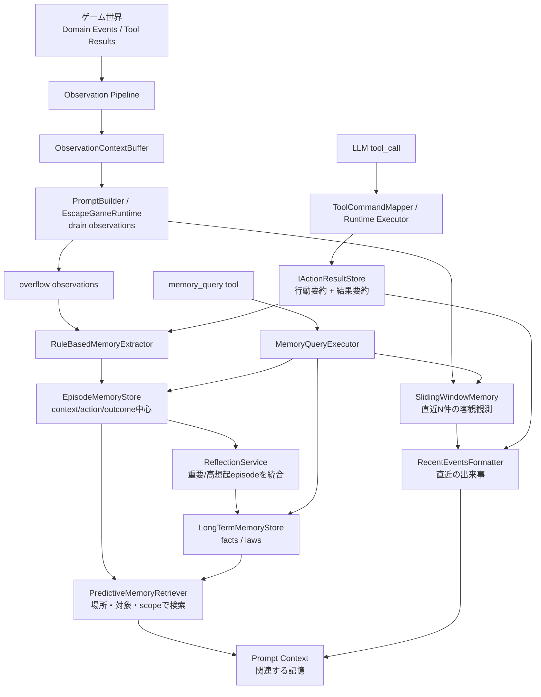
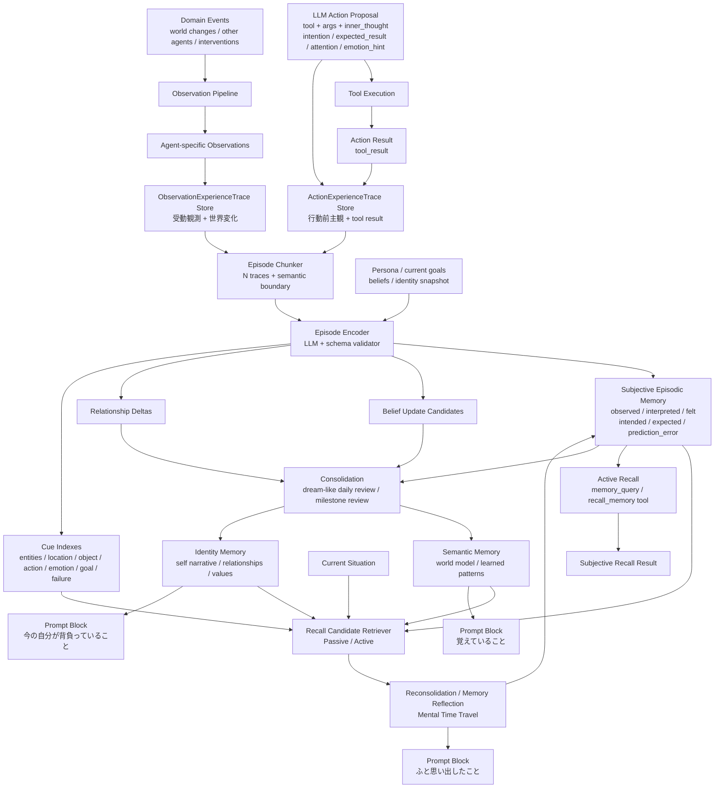
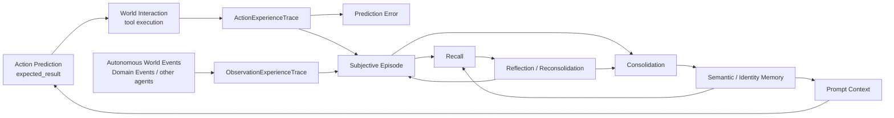

# Episodic Memory System Reimplementation Plan

この文書は、LLM エージェントに「人間のような体験の連続性」を持たせるための記憶システム再設計案である。

まだ実装前の議論用ドキュメントであり、既存コードを確認した上で、現在の `sliding window / episodic memory / long term memory / memory_query / reflection` をどう発展させるかをまとめる。現在の記憶システムのアーキテクチャの変更も考えている。

## 1. 背景と目的

このプロジェクトでは、LLM エージェントがゲーム世界を探索し、世界への相互作用を tool calling として行う。

現在の記憶機構は、直近 N 件の観測・行動結果をプロンプトに入れる Working Memory と、overflow した観測から作る簡易的な Episode Memory を持つ。これは「直近の事実を忘れない」ためには有効だが、現状の episode はまだ客観ログ要約に近い。

今回の改善目的は、単なるログ検索ではなく、エージェントが「自分にとって意味のある過去」を持ち、かつ世界を主観的にモデル化し、その過去を現在の判断へ反映できるようにすることである。

重要な思想は以下。

- 客観ログを、エージェント固有の主観的体験へ変換する。
- 行動前の予測と結果との差分、つまり予測誤差を記憶形成に使う。
- 受動想起と能動検索を分ける。
- 想起時に、現在の視点から過去を再解釈する。
- 再解釈を現在の行動判断に反映する。
- 複数の体験から、自己物語・他者への信頼・世界理解を更新する。
- 完璧な攻略情報検索ではなく、「過去を背負って現在を判断している」ように見える行動を目指す。

## 2. 既存の記憶アーキテクチャ

既存コードでは、主に以下が存在する。

- `ISlidingWindowMemory`: 直近 N 件の観測を保持する。
- `IActionResultStore`: LLM が呼んだ tool と実行結果を保持する。
- `DefaultRecentEventsFormatter`: 観測と行動結果を時系列の「直近の出来事」として整形する。
- `EpisodeMemoryEntry`: `context_summary / action_taken / outcome_summary / entity_ids / importance / surprise / recall_count` などを持つ簡易 episode。
- `RuleBasedMemoryExtractor`: overflow 観測と行動結果から、保存すべき episode をルールベースで作る。
- `DefaultPredictiveMemoryRetriever`: 現在状態、候補 tool、stable id、scope key などから関連 episode / fact / law を検索する。
- `MemoryQueryExecutor`: `memory_query` tool から episodic / facts / laws / recent_events / working_memory などを DSL で検索する。
- `RuleBasedReflectionService`: 重要 episode や高想起 episode から long term facts / laws を作る。

現状構造を図にすると以下。



この設計の強みは、stable id / scope key による検索と、Working Memory / Episode Memory / Long Term Memory の基本的な分離がすでにある点である。

一方で、今回の目的に対する不足は以下。

- `inner_thought` が主観生成の素材として十分に使われていない。
- 行動前の `intention` や `expected_result` が構造化されていない。
- Episode が `observed / interpreted / felt / intended / expected / prediction_error` に分離されていない。
- 想起結果が「自然な想起」ではなく「関連記憶の列挙」になりやすい。
- 想起時の再解釈、つまり Mental Time Travel が明示的でない。
- Identity Memory が facts / laws と混ざりやすい。
- Consolidation が「内部モデル形成」としてはまだ弱い。

## 3. 目標アーキテクチャ

今後は、記憶を以下の流れで扱う。

1. Tool call の直前に、エージェントの主観情報を構造化して出す。
2. Tool execution 後、行動前主観・実行した tool・結果を `ActionExperienceTrace` として保存する。
3. Observation pipeline 由来の観測・世界変化・他者の行動は、別経路で `ObservationExperienceTrace` として保存する。
   - Domain Events は、世界の自律的変化、他者の行動、他者から自分への介入、周囲で起きた出来事を捉える重要なシグナルである。
   - ただし、これは tool result と同じ trace に同居させない。能動行動の体験材料と、受動観測の体験材料は生成契機・必須フィールド・意味づけが異なる。
4. これらを `ExperienceTrace` の具体型として蓄積する。
5. N 個の trace、または意味的な区切り（こっちの方が人間らしい）ごとに `Episode Encoder` を非同期に実行する。
6. Encoder は persona / current goals / current beliefs を参照し、主観的 episode を作る。
7. episode は source trace を参照し、当時の解釈を保持する。
8. recall 時には episode を現在視点で再解釈する。
9. 日次・節目・高想起時には Consolidation を行い、semantic / identity memory を更新する。



## 4. Tool Call 共通 Schema

世界へ作用する tool に、行動前主観を取る共通フィールドを追加する。

`memory_query`, `subagent`, `todo_*`, `working_memory_append` のようなメタ系・補助系 tool には適用しない。これらは世界へ作用する行動ではなく、agent の内部補助や開発・運用上の検索であり、`expected_result` や `emotion_hint` を必須にすると記憶形成の材料が混ざる。

互換性は深く考えない。現段階は local experiment / demo 中であり、よりよい設計へ移行できる機会である。

### 4.1 共通フィールド案

| field | 役割 | 書くべきこと | 書くべきでないこと |
| --- | --- | --- | --- |
| `inner_thought` | キャラクター口調の短い独白 | 行動直前の自然な一文。観測者にも見せられる文 | 長い推論、未発見事実の断言、攻略メモ |
| `intention` | 行動目的 | この行動で達成したいこと | 予測結果、感情、演出 |
| `expected_result` | 行動前予測 | この行動をしたら何が分かる、何が起きると思うか。世界へ作用する tool で必須 | 願望、目的、すでに確定した事実の羅列 |
| `attention` | 注意焦点 | 現在もっとも注意している対象、手がかり、関係、危険、問い | 長文の状況説明 |
| `emotion_hint` | 感情傾向 | 行動直前の主要感情。正規化 enum + optional note | 長い独白、複数の曖昧な感情の羅列 |

### 4.2 フィールド説明の重要性

引数が増えると LLM の負荷は上がる。そのため description は、似たフィールドの違いを明確にする必要がある。

特に混同しやすいのは以下。

- `intention` と `expected_result`
  - `intention`: 何のために行動するか。
  - `expected_result`: 行動した結果、何が起きると予測しているか。
- `inner_thought` と `emotion_hint`
  - `inner_thought`: 口調つきの短い主観文。
  - `emotion_hint`: 検索・集計しやすい正規化された感情ラベル。
- `attention` と `intention`
  - `attention`: 注意対象。
  - `intention`: 目的。

### 4.3 Emotion Enum 案

検索や Consolidation のため、感情はある程度正規化する。

最初の enum 候補。

- `curiosity`: 気になる、知りたい。
- `caution`: 慎重、警戒。
- `fear`: 恐怖。
- `anxiety`: 不安。
- `urgency`: 焦り、急がなければならない感覚。
- `relief`: 安堵。
- `hope`: 期待。
- `frustration`: 苛立ち、行き詰まり。
- `confusion`: 混乱。
- `trust`: 信頼。
- `distrust`: 疑念。
- `determination`: 決意。
- `regret`: 後悔。
- `surprise`: 驚き。
- `neutral`: 明確な感情が薄い。

初期実装では単一 enum とする。検索性と記入負荷を優先し、複数感情や intensity は後で拡張する。

## 5. Experience Trace

`ExperienceTrace` は episode そのものではなく、episode を作るための材料である。

ここでの重要な決定は、`ExperienceTrace` を 1 種類の万能ログにしないことである。能動的に tool を実行した体験と、Observation pipeline から受動的に知覚した体験は、生成契機も意味も異なる。

- `ActionExperienceTrace`
  - tool call ごとに同期的に保存する。
  - 行動前主観、実行した tool、tool result、予測誤差の材料を保持する。
  - `intention` / `expected_result` / `attention` / `emotion_hint` はこの trace の中核になる。
- `ObservationExperienceTrace`
  - Domain Events / Observation pipeline 由来の観測から別経路で保存する。
  - 自分が何もしていない間に起きた世界の変化、他者の行動、他者から自分への干渉、周囲で起きた出来事を保持する。
  - 行動前予測は存在しないため、`expected_result` や `intention` を無理に持たせない。

Episode Encoding は非同期でよい。`SubjectiveEpisode` は、複数種類の trace を source として参照できる。

### 5.1 ActionExperienceTrace に含める情報

- `trace_id`
- `agent_id`
- `tick` / `game_time_label` / wall clock
- `location_snapshot`
- `visible_context_summary`
- `tool_name`
- `tool_args`
- `inner_thought`
- `intention`
- `expected_result`
- `attention`
- `emotion_hint`
- `current_goals_snapshot`
- `current_beliefs_snapshot`
- `identity_snapshot`
- `persona_snapshot`
- `tool_result`
- `result_success`
- `error_code`
- `visible_agents`
- `action_result_ref`

Phase 1 では `current_goals_snapshot`, `current_beliefs_snapshot`, `identity_snapshot`, `persona_snapshot` は、既存の current state / persona / working memory から薄く作る。Identity Memory はまだ独立 store がないため、空または要約可能な範囲でよい。

### 5.2 ObservationExperienceTrace に含める情報

- `trace_id`
- `agent_id`
- `tick` / `game_time_label` / wall clock
- `location_snapshot`
- `visible_context_summary`
- `observation_summary`
- `observation_kind`
  - `world_event`
  - `other_agent_action`
  - `speech`
  - `environment_change`
  - `intervention_to_self`
  - `system_notice`
- `attention_context`
- `perceived_salience`
- `emotion_hint`（任意。観測時に推定・入力できる場合のみ）
- `source_observation_ids`
- `world_event_refs`
- `visible_agents`

「客観ログ」と呼んでいるものも、実際には agent 固有の観測ログである。つまり、同じ world-level event でも、見ていた agent、聞こえた範囲、現在位置、注意対象によって trace は異なる。

そのため trace は「神視点の客観ログ」ではなく、「その agent がアクセスできた客観材料」として扱う。world-level event log への厳密な参照は必須ではない。キャラクター個人のログが一貫して残っていればよい。

## 6. Episode Encoder

Episode Encoder は、複数の `ExperienceTrace` と persona / identity / current beliefs を入力に、主観的 episode を生成する。

### 6.1 LLM を使うべきか

今回の目的では、Episode Encoder は LLM を使うのが自然である。

理由:

- 客観材料から主観的体験への変換は、単純なルールでは難しい。
- ペルソナによって同じ出来事の解釈や感情が変わる。
- `prediction_error` や `relationship_delta` は文脈依存である。
- 「意味のあるまとまり」を作るには、機械的な件数だけでは不足する。

ただし、全部を LLM に任せない。Hybrid にする。

- ルール側:
  - trace の収集。
  - stable id、location、agent、object、action、goal、emotion、error などの cue 抽出。
  - schema validation。
  - source trace 参照の検証。
- LLM 側:
  - observed / interpreted / felt / intended / prediction_error / belief_update / relationship_delta の生成。
  - episode の narrative summary。
  - later recall 用 cue の提案。
- Validator 側:
  - JSON schema 検証。
  - 未観測事実の混入チェック。
  - 長すぎる文の圧縮。
  - source trace に根拠がない assertion の削除または低 confidence 化。

### 6.2 LLM が生成する各フィールド

LLM が生成するフィールドと、生成時に渡すべき根拠は以下。

| field | 生成内容 | 主な根拠 | ハルシネーション防止 |
| --- | --- | --- | --- |
| `observed` | agent が実際に知覚できたこと | `tool_result`, `observations_after`, `visible_context_summary`, `source_observation_ids` | trace にない事実を書かない。推測は禁止 |
| `interpreted` | 当時 agent がどう意味づけたか | `inner_thought`, `intention`, `attention`, `current_beliefs_snapshot`, persona | 「当時そう考えた」に限定。世界の真実として断言しない |
| `felt` | 当時の感情 | `emotion_hint`, `inner_thought`, result success/failure, persona weaknesses | enum と短い explanation に分ける。強すぎる感情を創作しない |
| `intended` | 結果を受けて何をしようと思ったか | `intention`, `tool_result`, `observations_after`, current goals | 行動方針候補として書く。実際に次行動した事実と混同しない |
| `expected` | 行動前に期待・予測していたこと | `expected_result` | 後から結果を見て予測を書き換えない |
| `prediction_error` | 予測と結果の差分 | `expected_result` vs `tool_result / observations_after` | `none/small/medium/large` + reason。根拠比較を必須にする |
| `belief_update` | 信念更新候補 | `interpreted`, `prediction_error`, prior beliefs, result | 「候補」として出す。即時に identity/semantic を上書きしない |
| `relationship_delta` | 他者への印象変化候補 | visible agents, speech/action observations, prior relationship snapshot | 行動が見えていない相手の意図を断言しない。confidence を持つ |

`belief_update` と `relationship_delta` の confidence は、「この更新候補をどの程度採用してよいか」を示す信頼度である。たとえば Alice が鍵を渡した観測がある場合、「Alice は助けてくれる人かもしれない」は候補になるが、単発なので confidence は中程度に留める。相手の意図を直接観測していない場合、断言ではなく低〜中 confidence の仮説として扱う。

### 6.3 observed と interpreted の分離

`observed` は、agent が実際に知覚した情報に限定する。

例:

- observed:
  - 注意書きには、赤いカードが門前非常口、青いカードが職員通用口に対応すると書かれていた。
- interpreted:
  - 今必要なのは赤いカードであり、青ではないと考えた。

この分離により、後から `interpreted` が間違いだったと分かっても、当時の体験を保持できる。

### 6.4 belief_update と relationship_delta は直接反映しない

Episode Encoder は `belief_update` や `relationship_delta` を生成するが、これらは更新候補である。

実際に Semantic Memory や Identity Memory に反映するのは Consolidation の責務にする。

これにより、単発の誤解や一時的な感情で長期モデルが急に変わりすぎることを防ぐ。

## 7. Episode Chunking

方針として、未処理の `ExperienceTrace` 群から非同期に LLM Encoder を走らせる。

初期実装では `N ActionExperienceTrace -> 1 Episode` から始める。その後、Observation pipeline 由来の `ObservationExperienceTrace` を同じ chunk 候補に合流させる。ただし、機械的な N だけでは人間らしい episode の切れ目にならない。人間のエピソード記憶に近い単位は、活動・場所・予測誤差・目標の切り替わりで区切られる。

### 7.1 Chunker の入力

- 直近未処理の `ExperienceTrace`
- 現在地や activity の変化
- goal / intention の変化
- prediction_error の大きさ
- emotion の大きな変化
- result success / failure
- 他者との相互作用開始・終了
- scene / chapter / day boundary

### 7.2 Chunk boundary の候補

以下のいずれかを満たしたとき、episode candidate を切る。

- `max_traces_per_episode` に達した。
- 物理的な移動で、場所・場面が変わった。
- activity が変わった。例: 探索から会話、会話から逃走、解読から移動。
- 主要 goal が変わった。
- 予測誤差が大きかった。
- 強い感情変化があった。
- 失敗・危険・報酬・発見などの salient event が起きた。
- 他キャラクターとの関係性に変化がありそうな出来事が起きた。
- ユーザーやシナリオ側の節目が来た。

### 7.3 Chunker の実装案

初期実装では、ルールベース chunker がよい。

- hard limit: 例 `3-5 traces`
- boundary score:
  - location changed
  - action category changed
  - goal changed
  - high prediction error
  - high emotional shift
  - interaction partner changed
  - important observation
- score が閾値を超えたら chunk を閉じる。

その後、必要なら LLM に「この trace 群を episode としてどう分けるべきか」を判定させる。Chunker を LLM 化する場合は、深い推論より高速な境界判定が目的なので、可能なら `enable_thinking=False` 相当の軽量モードで実行する。

### 7.4 Episode 作成タイミング

Tool execution の同期処理中には trace だけ保存する。

Episode Encoding は以下のタイミングで非同期に行う。

- trace buffer が一定数に達した。
- boundary score が閾値を超えた。
- scene / day / milestone が終わった。
- passive recall が必要なのに未圧縮 trace が多すぎる。
- 実験 runtime が idle になった。

## 8. Subjective Episodic Memory

新しい episode は、既存 `EpisodeMemoryEntry` を拡張するより、まず v2 DTO として分けるのが設計上きれいである。

候補 schema:

- `episode_id`
- `agent_id`
- `created_at`
- `started_at_tick`
- `ended_at_tick`
- `source_trace_ids`
- `observed`
- `interpreted`
- `felt`
  - `primary_emotion`
  - `secondary_emotions`
  - `emotion_note`
- `intended`
- `expected`
- `prediction_error`
  - `level`: `none | small | medium | large`
  - `reason`
- `belief_at_encoding`
- `belief_update_candidates`
- `relationship_deltas`
- `cue_keys`
- `importance`
- `salience_reasons`
- `recall_count`
- `last_recalled_at`
- `reflections`
- `reconsolidation_history`
- `confidence`

`source_trace_ids` は必須。主観的 episode は生成物なので、元の agent-specific objective traces に戻れる必要がある。

episode は完全に固定されたものではない。元の trace と初回 encoding は保持しつつ、想起のたびに現在文脈の影響を受けた更新差分を `reconsolidation_history` に追記する。これにより、過去そのものを消さずに「思い出すたびに少し変化する記憶」を表現する。

## 9. Recall

想起は、受動想起と能動検索に分ける。どちらも Episodic Memory だけでなく Semantic Memory と Identity Memory を対象にする。

たとえば Alice を見たとき、最近 Alice と会話した episode だけでなく、過去の episode から形成された「Alice は自分に優しくしてくれることが多い」という agent 固有の semantic memory も一緒に想起されうる。

### 9.1 Recall Candidate Retrieval

Recall の第一段階は、現在状況に関連する記憶候補を選ぶことである。

入力:

- current situation
- current goal
- current attention
- current emotion
- identity memory summary
- episode cue indexes
- semantic memory indexes

出力:

- related episodes
- related semantic memories
- related identity fragments
- recall trigger explanation

この段階では、まだ深い再解釈を完了している必要はない。まず「なぜこれを思い出しそうか」を軽量に判定する。

### 9.2 Passive Recall

Passive Recall は、エージェントが明示的に記憶検索 tool を使わなくても、システム側が現在状況に関連する記憶を短く差し込む仕組みである。つまり無意識な記憶想起です。　

episode は以下のような cue index を持つ。

- `spatial_cues`: 場所、領域、移動先。
- `actor_cues`: 人物、NPC、他 agent、組織。
- `object_cues`: アイテム、装置、環境オブジェクト。
- `action_cues`: 調べる、話す、使う、戦う、待つなど。
- `sensory_cues`: 色、音、匂い、形、温度、光など。
- `concept_cues`: 約束、危険、失敗、報酬、秘密、規則、違和感など。
- `goal_cues`: 現在の目的、未解決問い。
- `emotion_cues`: 不安、警戒、信頼、後悔など。
- `relationship_cues`: 信頼、疑念、助けられた、邪魔されたなど。
- `prediction_cues`: 予測が当たった、外れた、想定外だった。

シナリオ固有語は cue の中身として入るが、検索ロジックは cue type と overlap / recency / salience / emotion / goal relevance で一般化する。

### 9.3 Passive Recall の出力

Prompt に入れるのは episode の全文ではない。

出力例:

```text
【ふと思い出したこと】
現在の状況に関連して、あなたは以前の体験を思い出した。
...
この記憶は、今の判断に ... という影響を与えそうだ。
```

ここで問題になるのは、「現在視点での再解釈はまだ生成前ではないか」という点である。

解決案として、Passive Recall を二段階に分ける。

1. `RecallCandidateRetriever`
   - episode / semantic / identity から候補を選ぶ。
   - ここでは軽量な trigger と relevance だけを出す。
2. `RecallRenderer`
   - prompt に入れる短い自然文を作る。
   - 高 importance の候補だけ、短い reconsolidation / reflection を事前生成して添える。
   - 低 importance の候補は「当時の記憶の短い要約」だけにする。

つまり、毎回すべての Passive Recall に重い LLM Reflection を走らせる必要はない。重要な候補だけ、そのターンの prompt 構築前に軽量 LLM か専用 prompt で再解釈する。これでも難しい場合は、prompt には「想起候補」だけを入れ、エージェントが必要に応じて Active Recall を呼ぶ設計にする。

### 9.4 Active Recall

Active Recall は、エージェント自身が `memory_query` または新規 `recall_memory` tool で記憶を探す仕組みである。

目的は攻略 DB 検索ではなく、「自分は過去に何を体験し、どう解釈していたか」を取り出すこと。

返却には Episodic Memory と Semantic Memory の両方を含める。

返却には以下を含める。

- 当時観測したこと。
- 当時どう解釈したか。
- 当時何を感じたか。
- 当時の予測と予測誤差。
- 今の状況から見た再解釈、または再解釈候補。
- 次の判断への影響。
- 関連する semantic memory。

例えばその場で出会った"Alice"について自分が過去に体験したことや、"Alice"はどんな人かを想起する。

## 10. Memory Reflection / Reconsolidation

Memory Reflection は、想起された episode を現在視点で再解釈する処理である。

これはいわゆる Mental Time Travel である。 

さらに、ここでは Reconsolidation も扱う。記憶は思い出された瞬間に一時的に不安定になり、現在の知識・気分・価値観に影響されて再保存される。コード上では、元 episode を消さずに、現在文脈による更新差分を追記する。

入力:

- retrieved episode
- current observation
- current goals
- current beliefs
- identity memory
- current emotion/state

出力:

- `recall_trigger`: なぜ思い出したか。
- `current_interpretation`: 今の状況から見ると、その記憶はどういう意味を持つか。
- `effect_on_decision`: 次の判断にどう影響するか。
- `episode_patch`: episode の流動的な部分への更新差分。
  - 強調された点。
  - 薄れた点。
  - 新しい文脈で追加された意味。
  - 変化した emotional tone。
- `semantic_update_candidates`: semantic memory への更新候補。
- `identity_update_candidates`: identity memory への更新候補。

重要:

- 元 episode の初回 encoding と source trace は上書きしない。
- 当時の誤解や不完全な理解を保持する。
- reflection / reconsolidation は履歴として追記する。
- `current_interpretation` が中心であり、他者が存在しない episode では relationship 系の更新は出さない。
- `confidence_delta` や `relationship_reconsideration` は独立必須キーにしない。必要なら `semantic_update_candidates` / `identity_update_candidates` の中で表現する。

### 10.1 同じ記憶が何度も想起された場合

同じ episode が何度も想起されると、その episode は agent にとって重要な記憶になる。

ただし、毎回同じ reflection を積み上げるとノイズになるため、以下の方針にする。

- `recall_count` と `last_recalled_at` は毎回更新する。
- reconsolidation は、現在文脈が前回と十分違う場合、または高 salience の場合だけ新規 patch を作る。
- 似た reflection は統合・圧縮する。
- 繰り返し強調された interpretation は Consolidation の重要入力にする。
- 元 trace と initial episode は保持し、現在の自分に寄った記憶との差分を追えるようにする。

## 11. Consolidation

Consolidation は、複数の episode / reflections / belief update candidates から、より安定した内部モデル（自分の経験を元にした世界、他者に対する信念）を形成する処理である。

ユーザーの表現では「夢のような一日のエピソードを振り返る仕組み」に近い。これは Reflection の一種でもあるが、役割としては Consolidation と呼ぶのがよい。

### 11.1 Reflection と Consolidation の違い

| 処理 | タイミング | 入力 | 出力 |
| --- | --- | --- | --- |
| Memory Reflection | later recall 時 | 1 episode + current context | 現在視点での再解釈 |
| Consolidation | 日次、節目、睡眠/夢、章終わり、高想起時 | 複数 episodes + reflections | semantic memory / identity memory の更新 |

### 11.2 Consolidation は LLM を使うべきか

使うべきである。

理由:

- 内部モデル形成は、単なるカウントではなく意味の統合である。
- 他キャラクターへの印象や信頼は、複数 episode の文脈から形成される。
- キャラクターごとの persona によって、何を重視するかが変わる。
- ハードコードされた社会性ではなく、体験から社会的理解が生まれるようにしたい。

ただし、ここも Hybrid にする。

- ルール側:
  - consolidation 対象 episode の選定。
  - high salience / high recall / large prediction error の重み付け。
  - source evidence の保持。
  - schema validation。
- LLM 側:
  - 世界理解、行動傾向、対人印象、自己物語、未解決問いの更新案を生成。
- Update Policy 側:
  - 既存 identity / semantic memory と比較し、ADD / UPDATE / WEAKEN / NOOP を決める。

### 11.3 Consolidation の成果物

- `Semantic Memory`
  - 世界について分かったこと。
  - 行動と結果の傾向。
  - 場所・対象・ルール・危険の内部モデル。
- `Identity Memory`
  - 自分が何を経験してきたか。
  - 何を恐れ、何を優先し、何を信じつつあるか。
  - 他者をどう見ているか。
  - 未解決の問い。

### 11.4 Semantic Memory の形式

Semantic Memory は、agent 固有の内部モデルである。世界の真実そのものではなく、「その agent が複数体験から形成した安定的な意味」として扱う。

初期 schema 候補:

- `memory_id`
- `agent_id`
- `kind`
  - `world_fact`: 世界や場所、物についての理解。
  - `entity_model`: 人物、他 agent、組織、物体などへの理解。
  - `action_model`: ある行動をすると何が起きやすいか。
  - `causal_hypothesis`: 因果仮説。
  - `social_model`: 他者の傾向や関係性。
  - `self_model`: 自分の傾向。ただし Identity Memory と重なる場合は Identity 側を優先。
  - `open_question`: 未解決の問い。
- `subject`
  - 主な対象。例: `Alice`, `赤いカード`, `非常口`, `調べる`.
- `claim`
  - agent が形成した意味・仮説・一般化。自然文でよい。
- `summary`
  - prompt に出しやすい短文。
- `structured_view`
  - 任意。検索・集計用に `subject / relation / target` などへ分解した補助表現。
- `confidence`
  - `low | medium | high`
- `valence`
  - `positive | neutral | negative | mixed`
- `evidence_episode_ids`
- `evidence_reflection_ids`
- `contradiction_episode_ids`
- `last_updated_at`
- `stability`
  - 一時的仮説か、かなり安定した信念か。
- `tags`
  - cue 検索用。

例:

```yaml
kind: social_model
subject: Alice
claim: Alice は私が困っていると助けてくれることが多い。
summary: Alice は困った時に頼れるかもしれない。
confidence: medium
valence: positive
evidence_episode_ids: [...]
tags: [Alice, help, trust]
```

```yaml
kind: action_model
subject: locked_door
claim: 鍵のかかった扉は、鍵だけでなく暗証番号も要求することがある。
summary: 施錠された扉では、鍵以外の認証も警戒する。
confidence: low
valence: neutral
evidence_episode_ids: [...]
tags: [door, locked, prediction_error]
```

Semantic Memory は facts だけでなく、confidence を持つ仮説として扱う。Contradiction が来たときは削除よりも confidence 低下や例外条件追加を優先する。

## 12. Identity Memory

Identity Memory は、episode から直接生成されるのではなく、Reflection と Consolidation によって育つ。

つまり認識としては以下でよい。

```text
ExperienceTrace
  -> SubjectiveEpisode
  -> MemoryReflection
  -> Consolidation
  -> IdentityMemory
```

ただし、Episode Encoder が `identity_update_candidate` を出すことはある。その候補を即時反映するのではなく、Consolidation が採用・更新・弱化する。

### 12.1 Identity Memory の候補 schema

- `self_narrative`
  - 自分はどのような経緯でここにいると思っているか。
- `active_goals`
  - 現在の目的と優先度。
- `current_commitments`
  - 守ろうとしている約束、方針、制約。
- `unresolved_questions`
  - まだ分からないこと。
- `emotional_baseline`
  - 継続している不安、焦り、期待、警戒など。
- `beliefs_about_world`
  - 世界についての安定理解。
- `relationships`
  - 他者ごとの信頼、疑念、恩義、警戒、親近感。
- `avoidance_lessons`
  - 過去の失敗から避けたい行動。
- `confidence_map`
  - 信念ごとの確信度。

### 12.2 Prompt への入れ方

Identity Memory 全体を毎ターン入れない。

`IdentityPromptSummarizer` が、現在状況に効く要素だけを 3-6 行に圧縮する。

Prompt block:

```text
【今の自分が背負っていること】
...
```

このブロックは、エージェントの一貫性を支える。

## 13. 学習システムとしての協調

全体は、以下のような学習ループとして動く。



学習とは、単に事実を増やすことではない。

- 予測が当たった体験は、既存信念を強める。
- 予測が外れた体験は、信念を弱めるか、例外条件を作る。
- 他者の行動が繰り返し似た意味を持つと、関係モデルが変わる。
- 何度も想起される episode は、その agent にとって重要な過去になる。
- Identity Memory は、次の予測・注意・感情傾向に影響する。

## 14. 実装計画案

### Phase 1: Trace と共通 Tool Schema

- 世界へ作用する tool schema に `intention`, `expected_result`, `attention`, `emotion_hint` を追加する。
- メタ系・補助系 tool には主観フィールドを追加しない。
- `expected_result` は世界へ作用する tool で必須にする。
- 主観フィールド欠落時は hard validation で失敗にする。
- `emotion_hint` は初期実装では単一 enum にする。
- `ActionExperienceTrace` DTO / store を追加する。
- まずは in-memory store を実装する。SQLite 永続化は trace 粒度を実験で確認してから追加する。
- tool call 前主観、tool 名、引数、tool result、current state / persona / working memory 由来の薄い snapshot を `ActionExperienceTrace` として保存する。
- emotion enum を定義する。

#### Phase 1 テスト方針

- world action 系 tool の schema に `intention`, `expected_result`, `attention`, `emotion_hint` が追加され、required に含まれることを確認する。
- `memory_query`, `subagent`, `todo_*`, `working_memory_append` などメタ系・補助系 tool の schema には主観フィールドが追加されないことを確認する。
- `emotion_hint` が定義済み enum 以外の場合、または主観フィールドが空の場合、tool 実行前の argument validation で失敗することを確認する。
- `LlmAgentOrchestrator.run_turn()` が world action tool の成功結果を `ActionExperienceTrace` として保存することを確認する。
- trace には、行動前主観、tool 名、canonical arguments、tool result summary、success / error_code、薄い current state / persona / working memory snapshot が入ることを確認する。
- メタ系・補助系 tool 実行では `ActionExperienceTrace` が作成されないことを確認する。
- Phase 1 では `ObservationExperienceTrace` は仕様のみ定義し、実装テスト対象にしない。

### Phase 2: Chunker

- 未処理 trace buffer を管理する。
- N traces + boundary score で episode candidate を作る。
- boundary score は location / activity / goal / prediction_error / emotion / interaction / salient event を見る。

### Phase 3: LLM Episode Encoder

- Episode Encoder port を定義する。
- LLM prompt と JSON schema を作る。
- persona / identity snapshot / current character state / beliefs / goals / traces を入力する。
- `SubjectiveEpisode` を生成する。
- validator で source trace にない事実を抑制する。

### Phase 4: Passive Recall + Memory Reflection

- cue index を episode に保存する。
- current situation から cue overlap / salience / recency / goal relevance で episode / semantic / identity を検索する。
- 高 importance の retrieved memory だけ、現在視点で再解釈または reconsolidation patch を作る。
- `【ふと思い出したこと】` block を prompt に入れる。

### Phase 5: Active Recall

- `memory_query` の episodic 出力に主観フィールドを含める。
- 可能なら `recall_memory` tool を追加し、自然言語 query + current context で subjective recall を返す。

### Phase 6: Consolidation

- 日次・節目・高想起時に consolidation job を走らせる。
- episode / reflections / belief candidates を入力する。
- 重要 episode の初期フィルタリングはルールで行う。
- LLM に update policy を任せ、semantic memory / identity memory を更新する。
- prompt 用 identity summary を生成する。

### Phase 7: Evaluation

- 予測誤差が大きい出来事が高 importance になるか。
- Passive Recall が現在判断に効く短い形で出るか。
- Active Recall が攻略 DB ではなく体験として返るか。
- Identity Memory が過去 episode に基づいて変化するか。
- 他者への印象が単発ではなく複数 episode から形成されるか。
- Domain Events 由来の観測が、自分の tool result 以外の体験として episode に入るか。
- 同じ episode の再想起で reconsolidation history が増えすぎず、意味ある変化だけが残るか。

## 15. 未確定事項

今後さらに詰めたい点。

1. Chunk boundary score の初期重み。
   - 最初は妥当な値で始め、実験ログから調整する。
2. `belief_update` と `relationship_delta` の confidence 表現。
   - confidence は更新候補の採用しやすさ。低 confidence は「単発の仮説」として保持し、Consolidation で慎重に扱う。
3. Passive Recall の最大件数と prompt 圧縮方針。
   - 重要な順に一定数まで入れる。具体数は prompt 長と実験で決める。
4. `Memory Reflection / Reconsolidation` を recall ごとに毎回 LLM で行うか、重要候補だけ LLM にするか。
   - 未決。重い LLM reflection を毎回走らせるとコストと遅延が大きい。
5. Semantic Memory と Identity Memory の境界。
   - Semantic は「世界・他者・行動の内部モデル」、Identity は「自分が何者として何を背負っているか」を優先する。
6. Chunker を LLM 化する時期。
   - 初期はルールベース。LLM 化するなら軽量モードで境界判定に限定する。
7. ObservationExperienceTrace の実装タイミングと observation_kind の最終 enum。
   - ActionExperienceTrace の実験ログを確認してから、Observation pipeline 側の保存契約を別途固める。

決定済み:

- `emotion_hint` は初期実装では単一 enum。
- `expected_result` は世界へ作用する tool で必須。メタ系・補助系 tool には主観フィールドを適用しない。
- 主観フィールド欠落時は hard validation で失敗させる。移行期間は設けない。
- `ExperienceTrace` は総称であり、まず `ActionExperienceTrace` と `ObservationExperienceTrace` を分ける。
- Phase 1 では `ActionExperienceTrace` の in-memory 実装から始める。
- Episode Encoder には persona / identity / 現在のキャラクター情報を入れる。
- Consolidation の重要 episode フィルタリングはルール、Update Policy はまず LLM に任せる。
- Identity Memory は独立 store。
- agent-specific objective trace と world-level event log の厳密な参照にはこだわらない。キャラクター個人のログが残ればよい。
