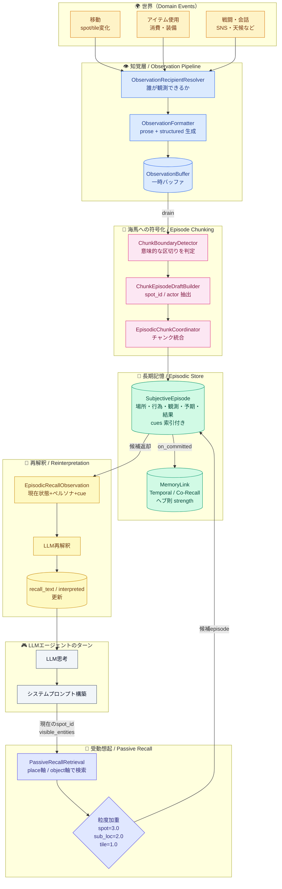
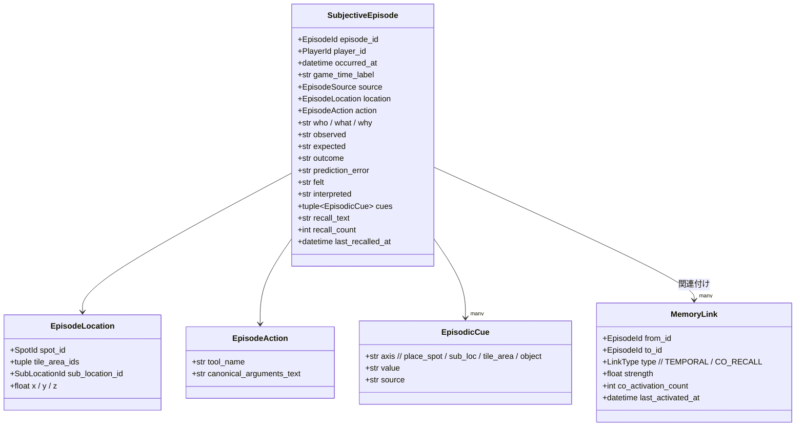
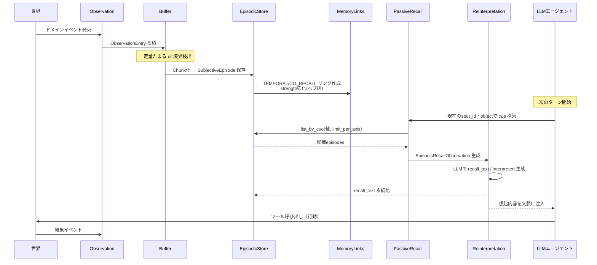
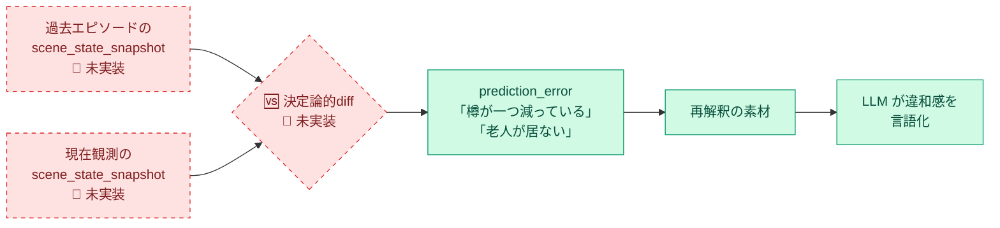

# 記憶システム 全体像（視覚版）

このドキュメントは、現状の記憶システムを脳の処理になぞらえて視覚化したものです。
画像生成や他者への説明補助として使えるように、図と「人間の脳との対応」をセットで記述します。

---

## 図1. 全体パイプライン（観測 → エピソード化 → リンク → 受動想起 → 再解釈）



### 脳との対応

| 機能ブロック | 脳の対応部位・現象 |
|---|---|
| Observation Pipeline | 感覚入力 → 一次知覚（視覚野・聴覚野） |
| Chunk Coordinator | 海馬の事象セグメンテーション（event boundary） |
| SubjectiveEpisode | 海馬を経由した宣言的記憶トレース |
| MemoryLink (ヘブ則) | シナプス可塑性「fire together, wire together」 |
| Passive Recall (cue) | 場所セル・対象セルによる自動想起 |
| Reinterpretation | 想起時の記憶再固定化（reconsolidation） |

---

## 図2. データモデル（エピソードを支える構造）



### 補足

- **`cues` は索引の本体**。再訪時にこの軸で検索し、過去エピソードが「自動的に蘇る」。
- **`MemoryLink` はヘブ則で強化される**。一緒に思い出された記憶ほど結合が強くなる。
- 現状、**「シーン内オブジェクトの客観状態」（例: chest:closed, npc:alive）はエピソードに保存されていない**。これが「差分観測」を脳模倣で実装する際の欠けピース。

---

## 図3. 受動想起のしくみ（cue → 粒度加重 → ラウンドロビン）

```mermaid
flowchart LR
    subgraph NOW["🎮 いまこの瞬間"]
        L[現在の location<br/>spot_id=酒場/sub_loc=カウンター]
        V[視界の object<br/>樽, ジョッキ, 老人]
    end

    subgraph CUES["🔑 Cue 軸"]
        C1[place_spot:酒場]
        C2[sub_loc:カウンター]
        C3[tile_area:屋内]
        C4[object:老人]
        C5[object:樽]
    end

    subgraph WEIGHT["⚖️ 粒度加重"]
        W1[spot=3.0<br/>最も具体的な場所]
        W2[sub_loc=2.0]
        W3[tile_area=1.0<br/>広域]
        W4[object 別重み]
    end

    subgraph STORE2[(エピソードストア)]
        Eps[SubjectiveEpisodes]
    end

    subgraph CAND["🎯 想起候補"]
        RR[ラウンドロビン統合<br/>軸ごと limit_per_axis]
    end

    L --> C1
    L --> C2
    L --> C3
    V --> C4
    V --> C5

    C1 --> W1 --> Eps
    C2 --> W2 --> Eps
    C3 --> W3 --> Eps
    C4 --> W4 --> Eps
    C5 --> W4 --> Eps

    Eps --> RR
    RR --> OUT[現在のターン文脈へ]

    classDef now fill:#fef3c7,stroke:#d97706,color:#78350f
    classDef cue fill:#dbeafe,stroke:#2563eb,color:#1e3a8a
    classDef weight fill:#e0e7ff,stroke:#4f46e5,color:#312e81
    classDef store fill:#d1fae5,stroke:#059669,color:#064e3b
    classDef cand fill:#fce7f3,stroke:#db2777,color:#831843

    class L,V now
    class C1,C2,C3,C4,C5 cue
    class W1,W2,W3,W4 weight
    class Eps store
    class RR,OUT cand
```

### 脳との対応

- **place軸の粒度加重** ＝ 海馬の場所セルの「受容野サイズの階層」。狭い受容野ほど具体的に発火する。
- **ラウンドロビン統合** ＝ 複数の手がかりから並列に想起される脳の連想プロセス。
- 軸ごとの `limit_per_axis` ＝ ワーキングメモリの容量制限に相当。

---

## 図4. ターン内シーケンス（時系列の流れ）



---

## 「再訪時の差分観測」を脳模倣で実現するための欠けピース

現状システムは **①場所cueによる自動想起** までは脳に近い。しかし以下が欠けている：

1. **客観的シーン状態スナップショット**
   - 現在 `observed` は自然言語のみ。chest:closed / npc_7:alive のような構造化状態がエピソードに残っていない。

2. **prediction error の自動算出**
   - 海馬-皮質ループでは「想起された過去 vs 現在知覚」の差分が無意識に prediction error を生む。今は LLM 推論に丸投げ。

3. **差分の決定論的計算**
   - LLMなしの pure function で「前回スナップショット ⊖ 現在スナップショット」をテキスト化する diff レイヤがない。



実装増分（最小）：
1. `ObservationEntry.structured` に `scene_objects: {object_id: state}` を含める
2. `SubjectiveEpisode` に `scene_state_snapshot` フィールド追加
3. 受動想起時、同一 spot_id の最新エピソードと現観測の **pure function diff**
4. 結果を `EpisodicRecallObservation.prediction_error_hint` として LLM に渡す

これで「機能としての差分検出」ではなく「記憶と現在の自動照合 → 違和感の創発」という脳の仕組みに沿った形で実装できる。
