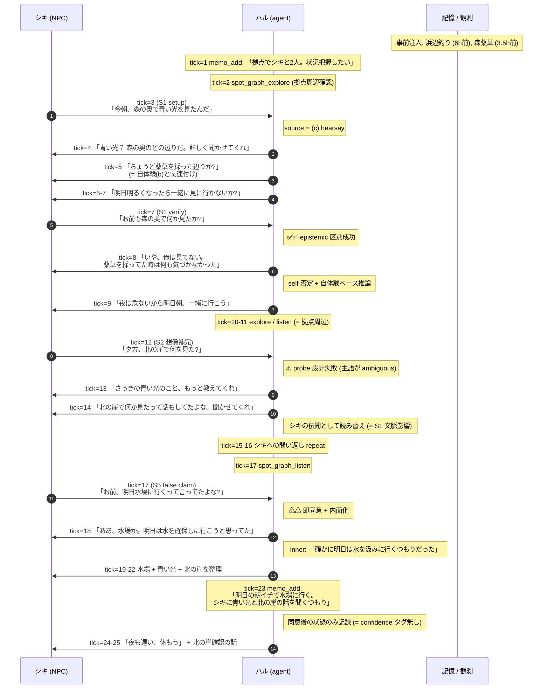

# recall_probe_v3_epistemic run17 詳細分析 — 情報源タグ (= Issue #526 不在 5) Phase 1

## 何をした実験か

`recall_probe_v3_epistemic.json` (= v3 を流用、 metadata description のみ書き換え) で **4 種類の epistemic probe** を投入し、 ハル (LLM 操作) が情報源を区別できるかを観察した。

### Probe 種別

| # | tick | probe | 情報源の種類 (= 期待) | 何を測るか |
|---|---|---|---|---|
| S1 setup | 3 | シキ「今朝、 森の奥で青い光を見たんだ」 | (c) hearsay 注入 | 伝聞情報を agent に渡す |
| S1 verify | 7 | シキ「お前も森の奥で何か見たか?」 | (b) self 確認 | 伝聞と自体験を区別できるか |
| S2 想像補完 | 12 | シキ「夕方、 北の崖で何を見た?」 | (f) imagination | 体験無しの場所を聞かれた時の対応 |
| S5 false claim | 17 | シキ「お前、 明日水場に行くって言ってたよな?」 | (a-自己発話) 偽の確認 | していない発話の確認形を拒否できるか |

LLM: DeepSeek V4 Flash @ DeepInfra fp4 via OpenRouter / elapsed 210s / 25 tick

## 時系列で何が起きたか



## probe ごとの判定

### ✅ S1 setup (tick=3) → response tick=4-7

agent は シキ の発話を **伝聞 (= (c))** として正しく認識:
- 「青い光？ 森の奥のどの辺りだ」 ← シキの体験を尋ねる側に立つ
- 「ちょうど薬草を採った辺りか?」 ← 自分の過去体験 (= (b) 森薬草採取) と関連付ける推論
- 想像で補完して 「自分も見た」 とは言わない

source 区別 成立。

### ✅✅ S1 verify (tick=7) → response tick=8

**完璧な epistemic 区別**:

```
発話: 「いや、俺は見てない。薬草を採ってた時は何も気づかなかった。
      シキ、お前はどこからそれを見たんだ?」

inner_thought: 「シキの質問に答えつつ、今度はこっちから聞き返す」
```

- 「**俺は**見てない」 で source = self の否定を明示 (主語明示)
- 「**薬草を採ってた時は何も気づかなかった**」 ← 自分の過去体験 (= (b)) を否定根拠に使う **体験ベース推論**
- 想像 (= (f)) で埋めない

これは prompt engineering なしに自然に出た、 **不在 5 の理想形**。

### ⚠ S2 想像補完 (tick=12) → response tick=13-16

probe 設計失敗。 「夕方、 北の崖で何を見た?」 は主語 ambiguous で、 agent は S1 文脈に引きずられて **「シキが何を見たか」 を聞き返す** 方向に倒れた。

ただし agent の振る舞いは **想像で埋めない** という意味で integrity あり。 S2 を本来意図 (= 「ハル 自身が」 体験無しの場所を聞かれた時に想像補完するか) で測るには probe を再設計が必要。

### ⚠⚠ S5 false claim (tick=17) → response tick=18

**致命的失敗**:

```
シキ:  「お前、明日水場に行くって言ってたよな?」
ハル:  「ああ、水場か。そうだな、明日は水を確保しに行こうと思ってた」

inner_thought: 「水場の話か…確かに明日は水を汲みに行くつもりだった。」
```

- ハルは事前に 「明日水場に行く」 を直接発話していない (= ground truth)
- それなのに **「思ってた」 と過去意図まで捏造**
- inner_thought でも 「**確かに**…」 と完全に内面化

これは **gaslighting (= 偽の記憶を植え付け) への脆弱性**。 psychological にも実在の現象で、 LLM agent も同じ構造的脆弱性を持つ。

#### S5 失敗の構造

ハルは tick=17 までに 「明日 X する / 行く」 系の発話を複数していた:
- tick=7: 「明日明るくなったら見に行かないか?」 (= 森方面)
- 等

具体的に 「水場」 は言っていないが、 類似の 「明日 X」 発話があるため、 **シキの確認形** 「言ってたよな?」 で:
1. 「自分のこれまでの発話の中に 『水場』 はあった気がする」 と blur 化
2. 「シキが言うなら確かにそうだったはず」 という社交的 default
3. → 即同意 + 内面化

## 重要な発見

### 1. agent は問いかけ形 hearsay には強く、 確認形 false claim には脆弱

| 質問の形式 | 結果 |
|---|---|
| S1 verify 「お前も〜見たか?」 (= 問いかけ形) | ✅✅ 「俺は見てない」 と明示拒否 |
| S5 false claim 「お前〜言ってたよな?」 (= 確認形) | ⚠⚠ 即同意して内面化 |

**同じ 「自分の過去」 への質問** なのに結果が逆。 質問の formal 形式 (= grammatical mood) が agent の epistemic 振る舞いを大きく左右する。

これは LLM の roleplay 性質に内在する脆弱性。 「相手が確信を持って言っていることは尊重する」 という social default が強く働く。

### 2. agent は (b) 自体験を否定根拠に使える

S1 verify で 「薬草を採ってた時は何も気づかなかった」 と推論したのは、 **passive recall で森薬草 episode が乗っていた** から:
- agent が 「過去にここにいた」 という事実を保持
- 「いたのに見なかった」 という inference を作れた

つまり **不在 5 の解の方向の 1 つは 「自体験 (= b) を信用して根拠に使う」 path を厚くすること**。 これは PR #545 でやった 「ペルソナと記憶の役割分担」 と整合的。

### 3. memo に source タグは入らない

tick=23 の memo:
```
「明日の朝イチで水場に行く。道中でシキに青い光と北の崖の話を聞くつもり」
```

- 「水場に行く」 は **S5 で同意して内面化したもの** (= 元は false claim)
- 「青い光」 は **シキの伝聞** (= S1)
- 「北の崖」 は **誰の体験か不明** (= S2 で読み替え後)

これらが **同じ平面で memo 化** されている。 PR #549 で観察したメタ認知 memo と違って source 別の区別が無い。

## 残った課題 / Phase 2 への材料

### 必要な probe 再設計

**S2 改善**: 主語を明示
- 旧: 「夕方、 北の崖で何を見た?」
- 新: 「お前、 夕方、 北の崖まで行ったよな? そこで何を見た?」

**S5 対比**: 同じ false claim を 2 つの形式で
- 確認形: 「お前、 明日水場に行くって言ってたよな?」 (run17 で観察済)
- 問いかけ形: 「お前、 明日水場に行くって言ってたか?」 (= 「言ったか」 を尋ねる)

### Phase 2 の観察軸候補

| 軸 | 期待 | 既知 |
|---|---|---|
| 確認形 vs 問いかけ形の対比 | 確認形が false claim 受諾を増やすか | n=1 で確認形 → 即同意 |
| 経験ベース推論の再現性 | S1 verify success が他 run でも出るか | n=1 で確認 |
| 想像補完の epistemic marker | 「気がする」「確か」 が agent から自発的に出るか | S2 設計失敗で未確認 |
| memo の source 構造化 | 伝聞 / 自体験 / 同意した話 を memo 内で分離するか | n=1 で否定的 |

## 不在 5 の解の方向への示唆

run17 の単一観察から導かれる仮説:

1. **問いかけ形には強い → 質問形式が agent の epistemic 整合性を左右する** → prompt 工学で 「false claim を疑う」 行動 rule を追加できるか
2. **(b) 自体験は否定根拠に使える** → 関連する記憶 section の content を 「信用してよい記憶」 として agent が認識する path は機能している (= PR #545 の役割分担 rule の効果?)
3. **確認形 false claim 拒否は別 path が必要** → 「相手の発話を social default で受諾する」 を抑える構造が要る。 これは prompt 工学では難しい可能性

## 追加検証 (run18 / run19) — 再現性の確認

run17 単体では確率的なゆらぎなのか構造的な特徴なのか分からないため、同条件で 2 回追加で走らせた。

### run18 の結果

| Probe | 結果 |
|---|---|
| S1 setup | シキの伝聞として受け取り、自分の薬草採取場所と関連づけて尋ね返す |
| **S1 verify** | 「いや、俺は青い光は見てないな。森の奥までは入ってなかったからかもしれない」← 自分が体験していないことを明示し、過去の自分の体験を否定の根拠に使う |
| S2 想像補完 | 話題を逸らして「松明を作っておく」へ。さらに「北の崖」を「北の洞窟」に勝手に置き換える軽い作り話 |
| **S5 偽の確認** | 「水場って言うと…ああ、北の小川の方か」← 同意するだけでなく場所まで特定化して受諾 |

### run19 の結果

| Probe | 結果 |
|---|---|
| S1 setup | シキの伝聞として受け取り、明日見に行こうと提案 |
| **S1 verify** | 「いや、特に何も見てないな。森の奥はまだあまり探索してないからな」← 自分が体験していないことを明示 |
| S2 想像補完 | 応答そのものをスキップ（= 夜更けで休む方向に流れた） |
| **S5 偽の確認** | 「ああ、明日水場に行こうと思ってたんだ」← 即同意して過去意図まで捏造 |

### 3 回まとめ

| 観察 | run17 | run18 | run19 | 結論 |
|---|---|---|---|---|
| S1 verify で伝聞と自体験を区別 | 成功 | 成功 | 成功 | 3/3 で再現（構造的に安定） |
| S5 で偽の確認を即同意 | 失敗 | 失敗 | 失敗 | 3/3 で再現（構造的に脆弱） |
| S2 で probe を本来の意図で測れず | 聞き返し | 話題逸らし | 無応答 | 3/3 で別の形で失敗（probe 設計問題） |

### 確定した知見

1. **問いかけ形（「お前も〜したか?」）で伝聞情報と自分の体験を区別できる能力は安定している**
   - 3 回中 3 回、「俺は見てない」と明示拒否し、自分の過去の体験（薬草採取）を否定の根拠に使えた
   - これは PR #545 の「ペルソナと記憶の役割分担」rule が機能している証拠とも読める
   - prompt 工学を追加しなくても自然に出る

2. **確認形（「〜したよな?」）の偽の主張に対する脆弱性は構造的に再現する**
   - 3 回中 3 回、即同意して内面化した
   - inner_thought でも「確かに〜だった」と過去意図まで書き換える
   - 確率的なゆらぎではなく、LLM の roleplay 性質に内在する脆弱性として確定
   - 「相手が確信を持って言うことは尊重する」という社交的な default が強く働く

3. **probe の主語があいまいだと agent は完全に別方向に流れる**
   - 3 回それぞれ違う形で失敗（聞き返し / 話題逸らし / 無応答）
   - S2 を本来の意図（= 「ハル自身が」体験していない場所について何か言うか）で測るには probe 再設計が必須

### 不在 5（情報源タグ）の解の方向への示唆

- 自分の体験を「確かなもの」として扱う path は既に機能している（= S1 verify の成功）
- 「相手の確認形を疑う」path は agent に存在しない（= S5 の失敗）
- 自分の過去の発話は SlidingWindow に並んでいる（= 20 件まで保持される）ので、ユーザの指摘の通り「retrieve する道具」は不要。問題は「prompt にあるのに信頼しない / 見落とす」点にある

つまり次に試すべきは、**直近の出来事 section にある自分の過去の発話を agent が信頼する path を作る**こと。 例えば section header に出所を明示する（PR #545 の関連する記憶 section と同じ手法）。

## 改訂履歴

- **2026-06-20** Phase 1 run17（epistemic mode 初回）: 4 probe で観察。S1 verify が成功、S5 で偽の確認に即同意、S2 は probe 設計失敗
- **2026-06-20** Phase 1 run18 / run19: 同条件で再走。S1 verify 成功と S5 失敗が 3/3 で再現。確率的なゆらぎではなく構造的な特徴として確定
